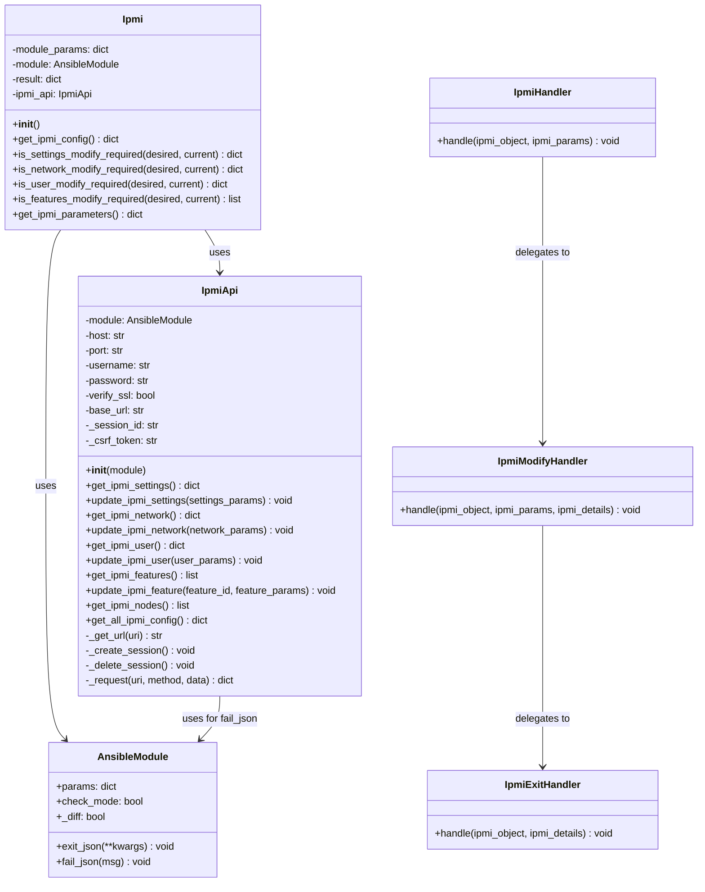
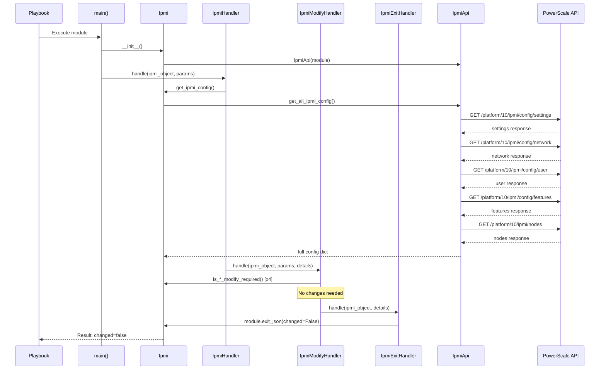
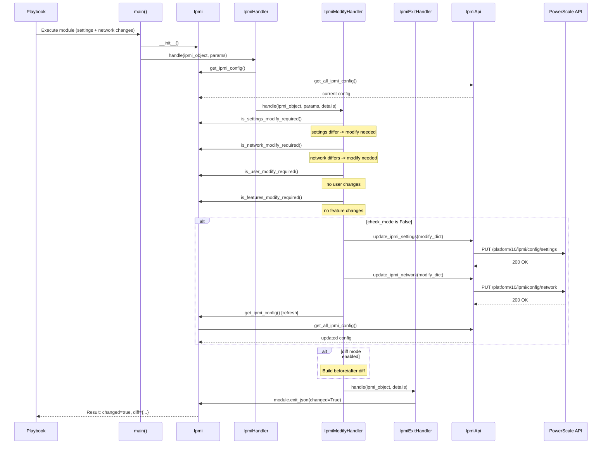
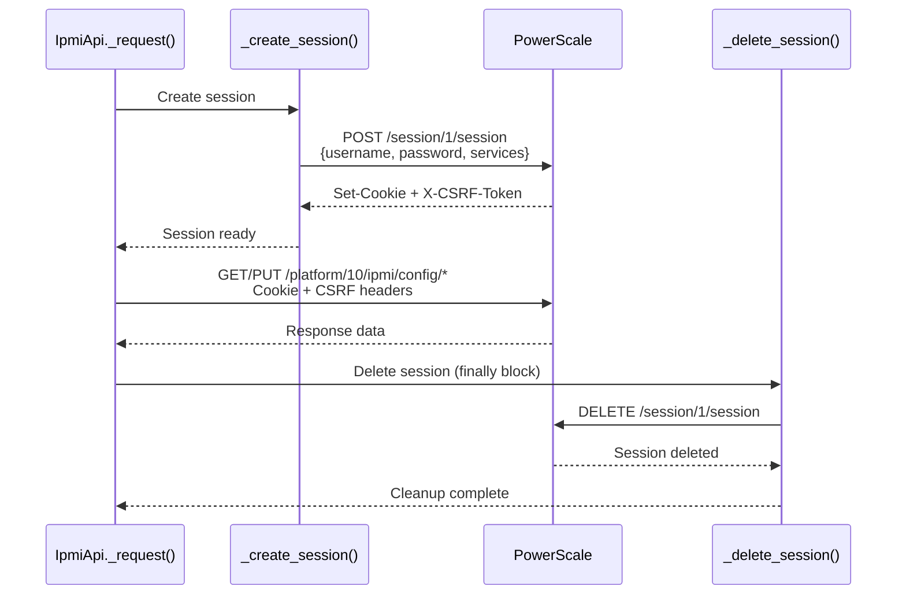
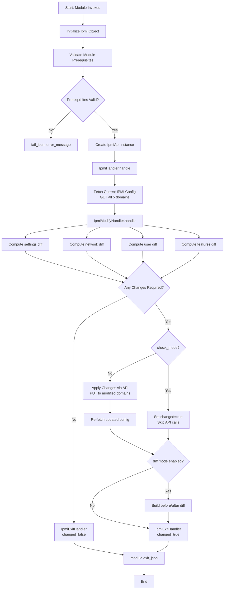
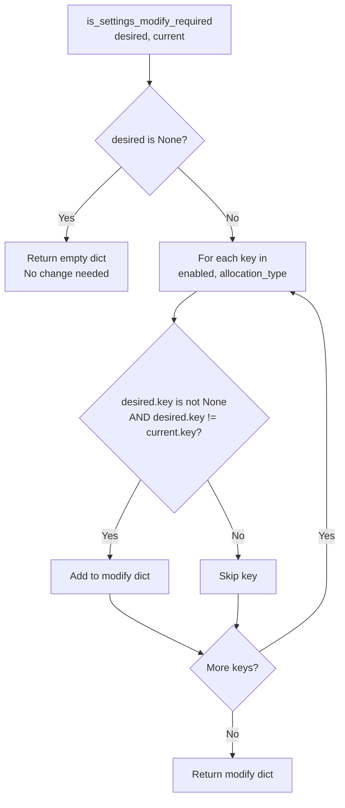
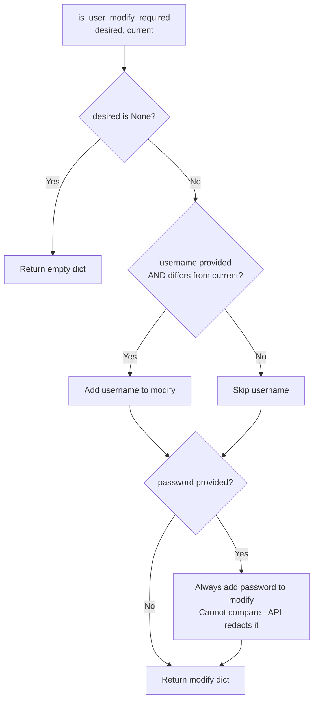

# Design Document: Dell PowerScale IPMI Ansible Module

**Module:** `dellemc.powerscale.ipmi`
**Version Added:** 3.10.0
**Author:** Shrinidhi Rao (@shrinidhirao)
**Jira:** ECS02C-824 (Story), ECS02-282 (Epic)
**Date:** 2026-03-31

---

## 1. Overview

The `ipmi` module provides Ansible-based management of IPMI (Intelligent Platform Management Interface) configuration on Dell PowerScale storage systems. IPMI enables lights-out management (power control and Serial-over-LAN) via the node BMC interface, external to OneFS.

### 1.1 Scope

The module manages four IPMI configuration domains:
- **Settings** - Enable/disable remote IPMI and set IP allocation type
- **Network** - Configure BMC network (gateway, prefix, IP ranges)
- **User** - Manage BMC user credentials
- **Features** - Enable/disable IPMI features (power_control, sol)

Additionally, it reads IPMI **Nodes** information (read-only).

### 1.2 Requirements

- OneFS 9.0 or later on Gen6/PowerScale nodes
- Ansible-core 2.17 or later
- Python 3.11, 3.12, or 3.13
- PowerScale platform API v10 (`/platform/10/ipmi/config/`)

---

## 2. Architecture

### 2.1 Class Diagram



### 2.2 Handler Chain Pattern

The module follows the handler-chain pattern used across the `dellemc.powerscale` collection:

```
main() --> Ipmi() --> IpmiHandler.handle()
                          |
                          v
                   IpmiModifyHandler.handle()
                          |
                          v
                   IpmiExitHandler.handle()
```

Each handler in the chain performs a specific responsibility:
1. **IpmiHandler** - Orchestrates: fetches current config, delegates to modify handler
2. **IpmiModifyHandler** - Computes diffs, applies changes (unless check_mode), builds diff output
3. **IpmiExitHandler** - Sets result and calls `module.exit_json()`

---

## 3. Sequence Diagrams

### 3.1 Module Execution Flow (No Changes Required)



### 3.2 Module Execution Flow (With Modifications)



### 3.3 REST API Session Lifecycle



---

## 4. Flow Diagrams

### 4.1 Overall Module Decision Flow



### 4.2 Idempotency Check Flow (Settings Example)



### 4.3 Password Handling Flow



---

## 5. API Endpoints

| Domain   | Method | Endpoint                                  | Purpose              |
|----------|--------|-------------------------------------------|----------------------|
| Settings | GET    | `/platform/10/ipmi/config/settings`       | Retrieve settings    |
| Settings | PUT    | `/platform/10/ipmi/config/settings`       | Update settings      |
| Network  | GET    | `/platform/10/ipmi/config/network`        | Retrieve network     |
| Network  | PUT    | `/platform/10/ipmi/config/network`        | Update network       |
| User     | GET    | `/platform/10/ipmi/config/user`           | Retrieve user        |
| User     | PUT    | `/platform/10/ipmi/config/user`           | Update user          |
| Features | GET    | `/platform/10/ipmi/config/features`       | Retrieve features    |
| Features | PUT    | `/platform/10/ipmi/config/features/{id}`  | Update single feature|
| Nodes    | GET    | `/platform/10/ipmi/nodes`                 | Retrieve nodes (RO)  |
| Session  | POST   | `/session/1/session`                      | Create auth session  |
| Session  | DELETE | `/session/1/session`                      | Destroy auth session |

### 5.1 Why Raw REST API?

The module uses raw REST API calls (`ansible.module_utils.urls.open_url`) instead of the `isilon_sdk` because:
- The `isilon_sdk` Python client does not include IPMI endpoints
- IPMI endpoints are in the `/platform/10/ipmi/` path, which is not covered by the SDK
- Session-based authentication provides proper CSRF protection matching OneFS security requirements

---

## 6. File Structure

```
plugins/
  modules/
    ipmi.py                          # Main Ansible module (handler chain)
  module_utils/
    storage/dell/shared_library/
      ipmi.py                        # IpmiApi REST helper class
tests/
  unit/
    plugins/
      modules/
        test_ipmi.py                 # 64 unit tests
      module_utils/
        mock_ipmi_api.py             # Mock API responses
playbooks/
  modules/
    ipmi.yml                         # Sample playbook (7 examples)
docs/
  Design-IPMI-Module.md             # This design document
```

---

## 7. Module Parameters

| Parameter                     | Type   | Required | Description                          |
|-------------------------------|--------|----------|--------------------------------------|
| `settings`                    | dict   | No       | IPMI settings configuration          |
| `settings.enabled`            | bool   | No       | Enable/disable remote IPMI           |
| `settings.allocation_type`    | str    | No       | IP allocation: dhcp, static, range   |
| `network`                     | dict   | No       | BMC network configuration            |
| `network.gateway`             | str    | No       | Gateway IP address                   |
| `network.prefixlen`           | int    | No       | Network prefix length                |
| `network.ip_ranges`           | list   | No       | List of {low, high} IP ranges        |
| `user`                        | dict   | No       | BMC user configuration               |
| `user.username`               | str    | No       | BMC username                         |
| `user.password`               | str    | No       | BMC password (no_log in arg_spec)    |
| `features`                    | list   | No       | List of {id, enabled} features       |
| `state`                       | str    | No       | Only 'present' (default)             |

---

## 8. Idempotency Design

The module is fully idempotent:

1. **Settings/Network**: Compared field-by-field against current state. Only differing fields are sent in the PUT request.
2. **User (username)**: Compared against current state. Only sent if different.
3. **User (password)**: Always treated as changed when provided, since the API never returns the current password for comparison.
4. **Features**: Each feature's `enabled` state is compared against the current feature map. Only changed features trigger API calls.

### 8.1 Check Mode

When `check_mode=True`:
- All diff calculations are performed
- `changed` is set to `True` if modifications would be needed
- No API PUT calls are made
- The returned `ipmi_details` reflects the pre-change state

### 8.2 Diff Mode

When `_diff=True` and changes are made:
- `before` state is captured before any API calls
- `after` state is captured after API calls (or equals `before` in check mode)
- Password fields are excluded from both before/after for security

---

## 9. Error Handling

| Layer     | Error Type     | Handling                                      |
|-----------|----------------|-----------------------------------------------|
| IpmiApi   | HTTPError      | Reads response body, raises descriptive error |
| IpmiApi   | URLError       | Raises connection error with reason           |
| IpmiApi   | Session errors | Silently ignored during cleanup               |
| IpmiApi   | "not configured"| Returns empty dict/list (graceful fallback)  |
| Ipmi      | API failures   | module.fail_json() with error message         |
| Ipmi      | Prerequisites  | module.fail_json() if packages missing        |

---

## 10. Test Coverage

### 10.1 Unit Test Summary

- **Total tests:** 64
- **Coverage for `plugins/modules/ipmi.py`:** 97% (4 uncovered lines: `main()` entry point)
- **Coverage for `module_utils/.../ipmi.py`:** 100%
- **Combined IPMI coverage:** 99%

### 10.2 Test Categories

| Category                | Count | Description                               |
|-------------------------|-------|-------------------------------------------|
| Get config              | 3     | Successful retrieval of IPMI config       |
| Settings modification   | 6     | Enable/disable, allocation type changes   |
| Network modification    | 6     | Gateway, prefixlen, IP ranges             |
| User modification       | 6     | Username, password, combined changes      |
| Features modification   | 6     | Enable/disable individual features        |
| Check mode              | 5     | Verify no API calls in check mode         |
| Diff mode               | 5     | Verify before/after diff generation       |
| Idempotency             | 5     | No changes when config matches desired    |
| Error handling           | 8     | API failures, session errors              |
| Edge cases              | 14    | Empty configs, partial params, etc.       |

---

## 11. Integration with `info` Module

The `info` module (`plugins/modules/info.py`) was extended with `ipmi_config` in the `gather_subset` parameter, allowing users to retrieve IPMI configuration as part of broader system information gathering:

```yaml
- name: Get IPMI info
  dellemc.powerscale.info:
    onefs_host: "{{ onefs_host }}"
    gather_subset:
      - ipmi_config
```

---

## 12. Security Considerations

1. **Password protection:** `no_log: True` in argument_spec ensures passwords are never logged by Ansible
2. **Session lifecycle:** Each API request creates and destroys its own session (no persistent sessions)
3. **CSRF protection:** X-CSRF-Token header is used for all PUT requests
4. **SSL verification:** Configurable via `verify_ssl` parameter
5. **Diff output:** Passwords are excluded from diff before/after states
