# Design Document: `dellemc.powerscale.job` Ansible Module

| Field | Value |
|------------------|-----------------------------------------------------------------------|
| **Version** | 1.0 |
| **Date** | 2026-04-07 |
| **Author** | Shrinidhi Rao |
| **Collection** | dellemc.powerscale v3.9.1 |
| **GitHub Issue** | https://github.com/dell/ansible-powerscale/issues/134 |

---

## Table of Contents

1. [Executive Summary](#1-executive-summary)
2. [Requirements](#2-requirements)
3. [Architecture Design](#3-architecture-design)
4. [Detailed Design](#4-detailed-design)
5. [Data Design](#5-data-design)
6. [Flow Charts](#6-flow-charts)
7. [Sequence Diagrams](#7-sequence-diagrams)
8. [Implementation Plan](#8-implementation-plan)
9. [Deployment Plan](#9-deployment-plan)
10. [Decision & Architecture Review (DAR)](#10-decision--architecture-review-dar)

---

## 1. Executive Summary

This document describes the design for the `dellemc.powerscale.job` Ansible module, which provides a complete CRUD interface for managing PowerScale OneFS Job Engine jobs. The module enables Ansible users to start new jobs by type (e.g., TreeDelete, FSAnalyze, SmartPools), pause, resume, and cancel running or paused jobs, and modify job attributes such as priority and impact policy -- all through a declarative, idempotent playbook interface.

The OneFS Job Engine is the cluster-wide framework for executing background maintenance and administrative tasks. Unlike most Ansible-managed resources that have a persistent desired state (present/absent), jobs are transient workloads with a lifecycle: they are started, they execute, and they complete or fail. This makes the `job` module fundamentally different from typical CRUD modules -- it must reason about **lifecycle state transitions** rather than simple existence checks.

Key design decisions include:
- **Dual identification**: Jobs can be targeted by `job_id` (for managing existing jobs) or by `job_type` (for starting new jobs with idempotency).
- **State-driven control**: A `job_state` parameter (`started`, `paused`, `running`, `cancelled`) drives transitions through the OneFS job state machine.
- **Full check mode and diff mode support**: The module previews all changes without executing them and reports structured before/after diffs.
- **Optional synchronous wait**: A `wait` parameter with configurable timeout allows playbooks to block until job completion.
- **Nested job-type-specific parameters**: A `job_params` dictionary encapsulates type-specific parameters (e.g., `treedelete_params`, `snaprevert_params`) to keep the module argument spec clean and extensible.

This is the most complex of the six modules in the Job Management epic due to the state machine logic, idempotency across multiple dimensions (state + attributes), wait/polling behavior, and the variety of job-type-specific parameters.

---

## 2. Requirements

### 2.1 Functional Requirements

#### 2.1.1 Job Start

| ID | Requirement | Priority |
|--------|--------------------------------------------------------------------|----------|
| FR-01 | Start a job by specifying a valid OneFS job type | Must |
| FR-02 | Accept job-type-specific parameters (e.g., TreeDelete path) | Must |
| FR-03 | Attach a priority (1-10) at job start time | Must |
| FR-04 | Attach an impact policy name at job start time | Must |
| FR-05 | Accept a list of paths for path-based job types | Must |
| FR-06 | Support `allow_dup` to allow duplicate job type instances | Should |

#### 2.1.2 Job Modification

| ID | Requirement | Priority |
|--------|--------------------------------------------------------------------|----------|
| FR-07 | Pause a running job | Must |
| FR-08 | Resume a paused job | Must |
| FR-09 | Cancel a running or paused job | Must |
| FR-10 | Modify priority of a running or paused job | Must |
| FR-11 | Modify impact policy of a running or paused job | Must |

#### 2.1.3 Job Retrieval

| ID | Requirement | Priority |
|--------|--------------------------------------------------------------------|----------|
| FR-12 | Retrieve full job details by job ID | Must |
| FR-13 | Find existing active job(s) by job type for idempotency | Must |

#### 2.1.4 Cross-Cutting

| ID | Requirement | Priority |
|--------|--------------------------------------------------------------------|----------|
| FR-14 | Full `check_mode` support: no API mutations, correct `changed` flag | Must |
| FR-15 | Full `diff` mode support: structured `before`/`after` output | Must |
| FR-16 | Optional synchronous wait for job completion with polling | Should |
| FR-17 | Structured outcome reporting (started, paused, resumed, canceled, noop) | Must |

#### 2.1.5 Out-of-Scope

| Item | Reason |
|-------------------------------|--------------------------------------------------------------|
| Job scheduling | Managed by OneFS job type configuration, not individual jobs |
| Job retries | Handled automatically by the Job Engine |
| Bulk job operations | Each job is managed individually per Ansible best practices |
| Job type configuration | Separate module (`job_type`) in future epic |

### 2.2 Acceptance Criteria

| ID | Criterion | Description | Verification |
|------|-----------|-------------|--------------|
| AC-1 | **Start Job (Idempotent)** | When `job_type` is specified and no active job of that type exists, the module starts a new job and returns `changed: true`. When an active job of the same type already exists (and `allow_dup` is false), the module returns the existing job details and `changed: false`. | Unit test + FT: start TreeDelete twice, second is noop |
| AC-2 | **Modify Job State** | Given a running job, setting `job_state: paused` pauses it. Given a paused job, setting `job_state: running` resumes it. Setting `job_state: cancelled` on running or paused cancels it. Transitions that are already satisfied are noops. | Unit test + FT: full lifecycle run->pause->run->cancel |
| AC-3 | **Modify Job Attributes** | When `priority` or `policy` differ from the current job values, the module updates them and returns `changed: true`. When they match, the module returns `changed: false`. | Unit test: set priority=3, verify update API call; set same priority, verify no call |
| AC-4 | **Check Mode** | When `check_mode: true`, the module makes zero API calls that mutate state. The output accurately reflects what *would* change (`changed: true/false`, correct `diff`). | Unit test: mock API, verify no `create`/`update` calls made; verify `changed` flag correct |
| AC-5 | **Diff Mode** | When diff mode is active, the module returns `result['diff'] = {'before': {...}, 'after': {...}}` showing old vs new values for `state`, `priority`, and `policy`. | Unit test: verify diff dict structure for state change, priority change, and combined change |
| AC-6 | **Safety** | The module never restarts a completed/succeeded/failed job. API errors surface via `module.fail_json()` with actionable error messages. No secrets (passwords, tokens) appear in log output. | Unit test: completed job + start -> fail_json; verify error messages; audit log statements |

---

## 3. Architecture Design

### 3.1 Component Architecture

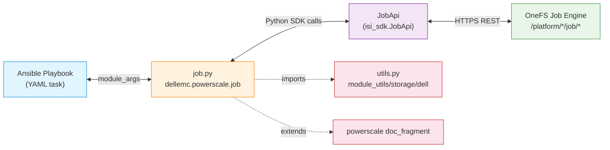

**Data flow:**
1. The Ansible controller invokes `job.py` with module arguments from the playbook task.
2. `job.py` instantiates the `Job` class, which initializes the SDK `JobApi` client via `utils.get_powerscale_connection()`.
3. The `Job` class calls SDK methods (`create_job_job`, `get_job_job`, `update_job_job`, `list_job_jobs`) which translate to REST calls against the OneFS `/platform/*/job/jobs` endpoints.
4. Responses flow back through the SDK into the module, which computes `changed`, `diff`, and `job_details` for the Ansible result.

### 3.2 Module Position Within Collection

```
dellemc/powerscale/
 plugins/
 modules/
 job.py <-- NEW: This module
 synciqjob.py <-- Existing: SyncIQ job management (reference)
 filepoolpolicy.py <-- Existing: File pool policy (pattern reference)
 ...
 module_utils/
 storage/dell/
 utils.py <-- Shared: SDK connection, logging, error handling
 logging_handler.py <-- Shared: Log rotation
 tests/
 unit/plugins/
 modules/
 test_job.py <-- NEW: Unit tests
 module_utils/
 mock_job_api.py <-- NEW: Mock API responses
 docs/
 modules/
 job.rst <-- NEW: Module documentation
 playbooks/
 modules/
 job.yml <-- NEW: Example playbook
```

---

## 4. Detailed Design

### 4.1 Class Diagram

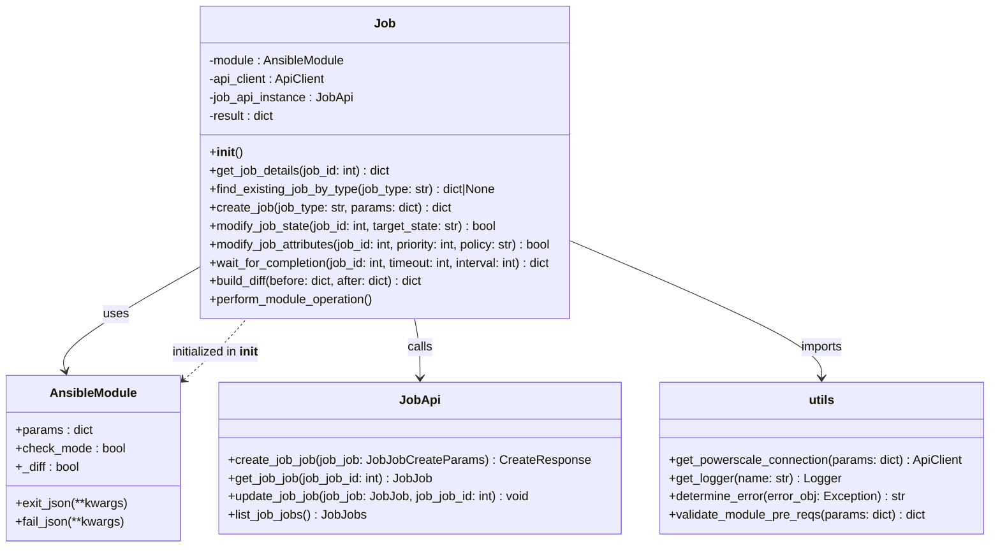

### 4.2 Input Parameters

| Parameter | Type | Required | Default | Choices / Constraints | Description |
|---------------|---------|----------|----------|-------------------------------------------|-------------|
| `job_id` | int | No* | - | Positive integer | The numeric ID of an existing job. Required for modify operations. Mutually exclusive with `job_type`. |
| `job_type` | str | No* | - | One of the 31 OneFS job types (e.g., `TreeDelete`, `FSAnalyze`, `SmartPools`, `AVScan`, `SnapRevert`, etc.) | The job type to start. Required for start operations. Mutually exclusive with `job_id`. |
| `job_state` | str | No | - | `started`, `paused`, `running`, `cancelled` | The desired lifecycle state. `started` = ensure a job of this type is running (for start). `paused` = pause a running job. `running` = resume a paused job. `cancelled` = cancel a running or paused job. |
| `paths` | list | No | - | List of `/ifs/...` paths | Filesystem paths for the job (e.g., TreeDelete target path). |
| `priority` | int | No | - | 1 (highest) to 10 (lowest) | Job execution priority. Lower number = higher priority. |
| `policy` | str | No | - | Policy name (e.g., `LOW`, `MEDIUM`, `HIGH`, `OFF_HOURS`, or custom) | Impact policy controlling resource consumption. |
| `allow_dup` | bool | No | `false` | `true` / `false` | Allow starting a duplicate job of the same type. If false (default), idempotency check prevents duplicates. |
| `job_params` | dict | No | - | Nested dict with type-specific sub-keys | Job-type-specific parameters. See Section 5.1.2 for sub-keys. |
| `wait` | bool | No | `false` | `true` / `false` | Wait for the job to complete before returning. |
| `wait_timeout`| int | No | 300 | Positive integer (seconds) | Maximum time (seconds) to wait for job completion. Only used when `wait: true`. |
| `wait_interval`| int | No | 10 | Positive integer (seconds) | Polling interval (seconds) when waiting for job completion. |
| `state` | str | Yes | - | `present` | Module-level state. For this module, only `present` is valid since jobs are transient (they self-complete; `absent` is not applicable). |

> \* One of `job_id` or `job_type` must be provided. They are mutually exclusive.

**Mutual Exclusivity & Dependencies:**

| Condition | Rule |
|-----------|------|
| `job_type` provided, no `job_id` | Start operation: `job_state` should be `started` or omitted (defaults to `started`) |
| `job_id` provided, no `job_type` | Modify operation: `job_state` drives state transition; `priority`/`policy` drive attribute changes |
| Both `job_id` and `job_type` provided | Error: mutually exclusive |
| Neither `job_id` nor `job_type` provided | Error: at least one required |
| `wait: true` | Only meaningful with `job_state: started` or after a resume |
| `job_params` | Only valid when `job_type` is specified (start operation) |

### 4.3 State Transition Diagram

This diagram represents the OneFS Job Engine state machine as observed during API validation, and the module's control over it:

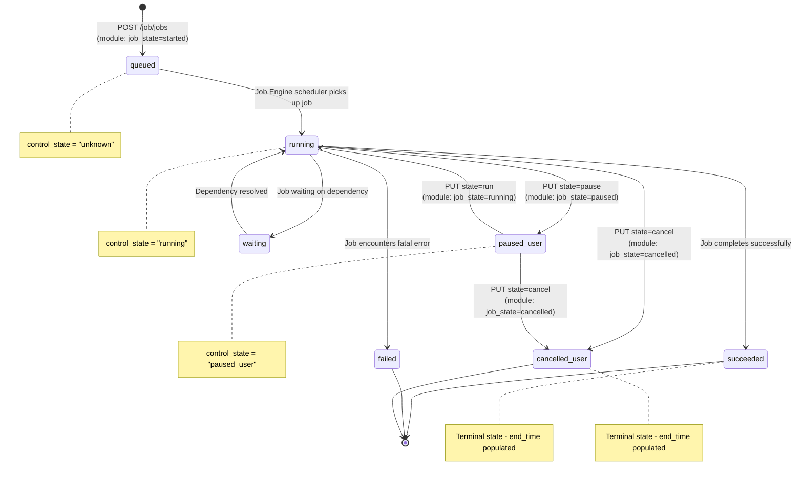

**Module-Controlled Transitions:**

| From State | Desired `job_state` | API Call | Result State |
|-----------------|---------------------|--------------------------------|------------------|
| *(none)* | `started` | `POST /job/jobs` | `queued`/`running` |
| `running` | `paused` | `PUT state=pause` | `paused_user` |
| `paused_user` | `running` | `PUT state=run` | `running` |
| `running` | `cancelled` | `PUT state=cancel` | `cancelled_user` |
| `paused_user` | `cancelled` | `PUT state=cancel` | `cancelled_user` |
| `running` | `started` | *(noop - already active)* | `running` |
| `running` | `running` | *(noop - already running)* | `running` |
| `paused_user` | `paused` | *(noop - already paused)* | `paused_user` |
| `succeeded` | `started` | **Error: refuse to restart completed job** | - |
| `failed` | `started` | **Error: refuse to restart completed job** | - |
| `cancelled_user`| `started` | **Error: refuse to restart completed job** | - |

### 4.4 Output Schema

The module returns the following result structure:

```yaml
changed: bool # Whether any modification was made
job_details: # Full job details after operation
 id: int # Job ID (e.g., 2653)
 type: str # Job type (e.g., "TreeDelete")
 state: str # Current state (e.g., "running", "paused_user")
 control_state: str # Control state (e.g., "running", "paused_user")
 create_time: int # Unix epoch when job was created
 start_time: int # Unix epoch when job started running
 end_time: int # Unix epoch when job completed (null if active)
 running_time: int # Total seconds of active execution
 current_phase: int # Current execution phase number
 total_phases: int # Total number of phases
 description: str # Job type description
 human_desc: str # Human-readable description
 impact: str # Current impact level (e.g., "Low")
 policy: str # Impact policy name (e.g., "LOW")
 priority: int # Priority (1-10)
 progress: str # Progress description
 retries_remaining: int # Retries remaining before failure
 participants: list[int] # Node IDs participating in job
 paths: list[str] # Paths associated with job
 waiting_on: list # Jobs this job is waiting on
outcome: str # Structured outcome label
 # "started" | "paused" | "resumed" |
 # "cancelled" | "modified" | "noop"
diff: # Only present in diff mode
 before:
 state: str
 priority: int
 policy: str
 after:
 state: str
 priority: int
 policy: str
```

### 4.5 API Endpoint Mapping

| Module Operation | HTTP Method | Endpoint | SDK Method | API Version |
|------------------------|-------------|----------------------------------|-----------------------|-------------|
| Start a new job | POST | `/platform/10/job/jobs` | `create_job_job()` | v10+ |
| Get job by ID | GET | `/platform/7/job/jobs/{JobId}` | `get_job_job(id)` | v7+ |
| Modify job (state/attrs)| PUT | `/platform/7/job/jobs/{JobId}` | `update_job_job(id)` | v7+ |
| List jobs (for idempotency)| GET | `/platform/10/job/jobs` | `list_job_jobs()` | v10+ |

> **Note:** The API validation report confirmed v19 endpoints are available, but the Python SDK may target v7/v10. The module will use whichever version the SDK's `JobApi` class targets. All tested responses are compatible.

---

## 5. Data Design

### 5.1 Input Data Model

#### 5.1.1 Core Parameters

```python
# AnsibleModule argument_spec
argument_spec = dict(
 # --- Identification (mutually exclusive) ---
 job_id=dict(type='int', required=False),
 job_type=dict(type='str', required=False),

 # --- Desired State ---
 job_state=dict(
 type='str',
 required=False,
 choices=['started', 'paused', 'running', 'cancelled']
 ),
 state=dict(
 type='str',
 required=True,
 choices=['present']
 ),

 # --- Job Configuration ---
 paths=dict(type='list', elements='str', required=False),
 priority=dict(type='int', required=False), # 1-10
 policy=dict(type='str', required=False),
 allow_dup=dict(type='bool', required=False, default=False),

 # --- Type-Specific Parameters ---
 job_params=dict(type='dict', required=False),

 # --- Wait/Polling ---
 wait=dict(type='bool', required=False, default=False),
 wait_timeout=dict(type='int', required=False, default=300),
 wait_interval=dict(type='int', required=False, default=10),
)

# Mutual exclusivity
mutually_exclusive = [['job_id', 'job_type']]
required_one_of = [['job_id', 'job_type']]
```

#### 5.1.2 Job-Type-Specific Parameters (`job_params`)

The `job_params` dict accepts nested sub-keys corresponding to OneFS job type parameters. Only the keys relevant to the specified `job_type` are sent to the API:

| Sub-Key | Job Type | Fields |
|-----------------------------|--------------------|---------------------------------------------|
| `avscan_params` | AVScan | `paths` (list), `policy` (str) |
| `changelistcreate_params` | ChangelistCreate | `newer_snapid` (int), `older_snapid` (int) |
| `domainmark_params` | DomainMark | `root` (str), `delete` (bool) |
| `esrsmftdownload_params` | EsrsMftDownload | `url` (str), `path` (str) |
| `filepolicy_params` | FilePolicy | `policy_name` (str), `deploy` (bool) |
| `prepair_params` | PermissionRepair | `mapping_type` (str), `template_path` (str) |
| `smartpoolstree_params` | SmartPoolsTree | `path` (str) |
| `snaprevert_params` | SnapRevert | `snapid` (int) |
| `treedelete_params` | TreeDelete | *(no additional fields -- uses `paths` top-level param)* |

**Example -- Start a TreeDelete job:**
```yaml
- name: Start TreeDelete job
 dellemc.powerscale.job:
 onefs_host: "{{ onefs_host }}"
 api_user: "{{ api_user }}"
 api_password: "{{ api_password }}"
 verify_ssl: "{{ verify_ssl }}"
 job_type: "TreeDelete"
 paths:
 - "/ifs/data/old_backup"
 priority: 4
 policy: "MEDIUM"
 state: "present"
 job_state: "started"
```

**Example -- Start a SnapRevert job with type-specific params:**
```yaml
- name: Revert a snapshot
 dellemc.powerscale.job:
 onefs_host: "{{ onefs_host }}"
 api_user: "{{ api_user }}"
 api_password: "{{ api_password }}"
 verify_ssl: "{{ verify_ssl }}"
 job_type: "SnapRevert"
 job_params:
 snaprevert_params:
 snapid: 42
 priority: 2
 policy: "HIGH"
 state: "present"
 job_state: "started"
```

### 5.2 Output Data Model

```python
result = dict(
 changed=False, # bool: whether the module made changes
 job_details=None, # dict|None: full job details from GET API
 outcome="noop", # str: structured outcome label
 diff=dict( # dict: only populated in diff mode
 before=dict(),
 after=dict()
 )
)
```

**Outcome Values:**

| Outcome | Trigger |
|--------------|----------------------------------------------------------------------|
| `started` | A new job was created via POST |
| `paused` | A running job was paused via PUT `state=pause` |
| `resumed` | A paused job was resumed via PUT `state=run` |
| `cancelled` | A job was cancelled via PUT `state=cancel` |
| `modified` | Job attributes (priority/policy) were updated but state unchanged |
| `noop` | No changes needed -- desired state matches current state |

### 5.3 State Machine

The internal state machine logic within the module's `perform_module_operation()` method:

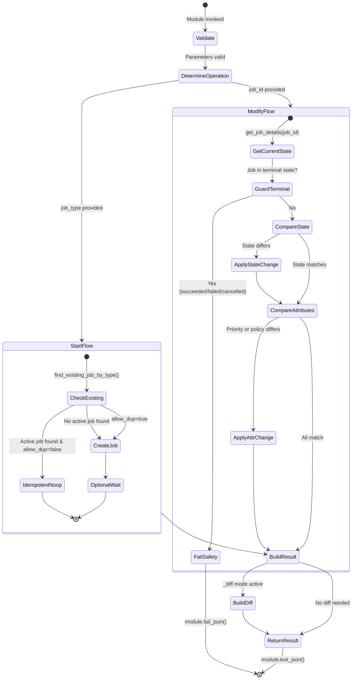

**Terminal State Guard Logic:**

OneFS job states that are terminal (the job has ended):
- `succeeded`
- `failed`
- `cancelled_user`
- `cancelled_system`

If a user attempts to operate on a job in a terminal state (except for simple GET), the module fails with a clear error message. This prevents accidental re-queueing of completed jobs (AC-6).

---

## 6. Flow Charts

### 6.1 Main Operation Flow

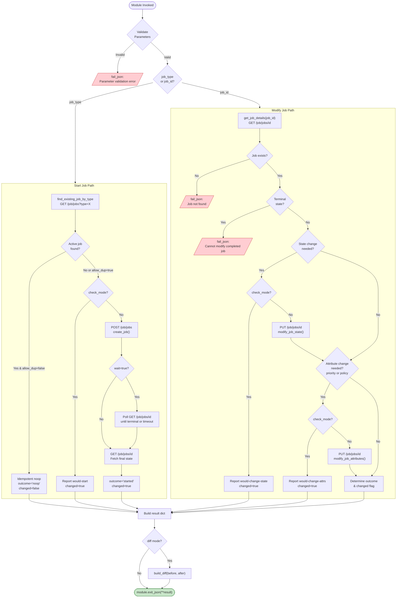

### 6.2 Idempotency Decision Logic (Start Path Detail)

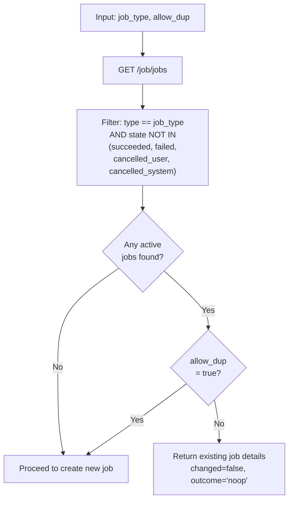

---

## 7. Sequence Diagrams

### 7.1 Scenario 1: Start a New TreeDelete Job

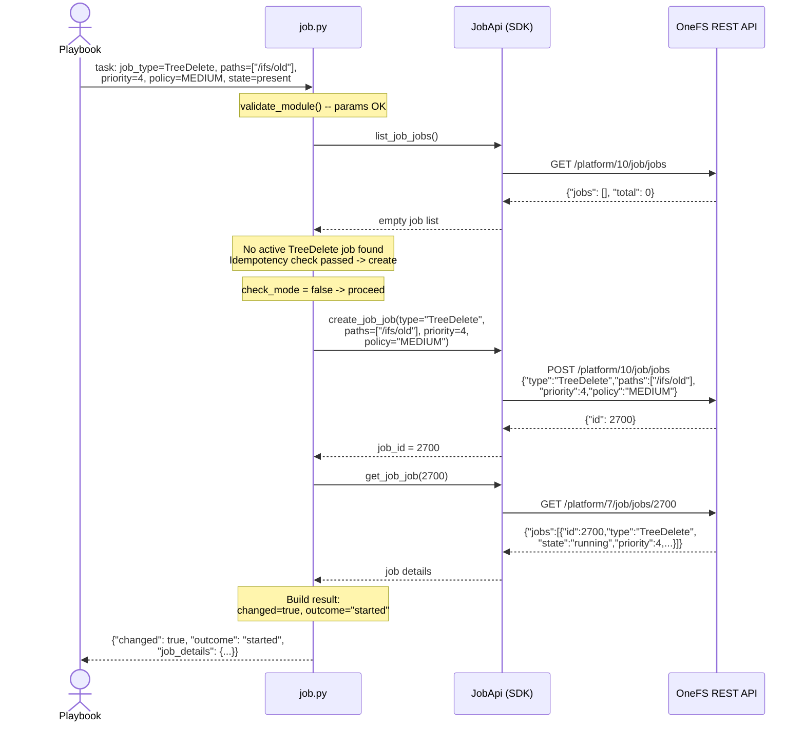

### 7.2 Scenario 2: Pause a Running Job

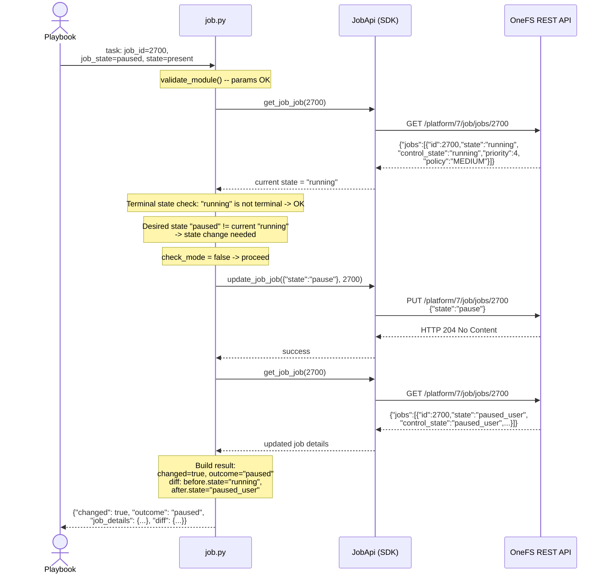

### 7.3 Scenario 3: Modify Priority of a Paused Job

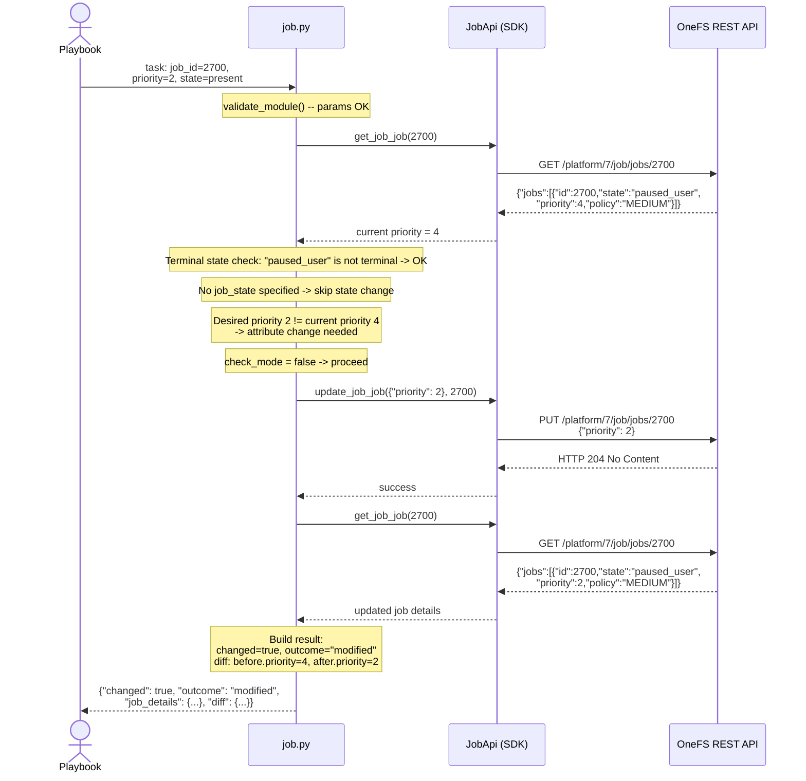

### 7.4 Scenario 4: Cancel a Job

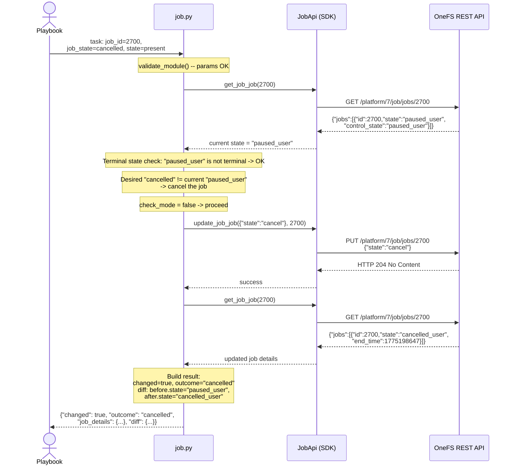

### 7.5 Scenario 5: Idempotent Start (Job Already Running)

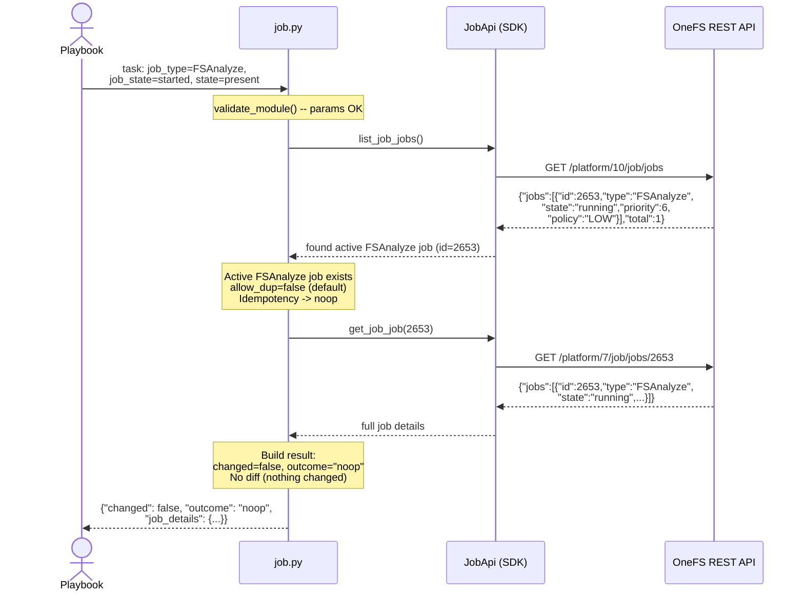

---

## 8. Implementation Plan

### 8.1 Files to Create/Modify

| File | Action | Description |
|------|--------|-------------|
| `plugins/modules/job.py` | **Create** | Main module implementation |
| `tests/unit/plugins/modules/test_job.py` | **Create** | Unit test suite |
| `tests/unit/plugins/module_utils/mock_job_api.py` | **Create** | Mock API responses and helper functions |
| `docs/modules/job.rst` | **Create** | Module documentation (auto-generated from DOCUMENTATION string + manual sections) |
| `playbooks/modules/job.yml` | **Create** | Example playbook demonstrating all operations |
| `plugins/modules/__init__.py` | No change | Module auto-discovery via collection metadata |
| `meta/runtime.yml` | **Modify** | Add `job` to action_groups and module list |

### 8.2 Dependencies

| Dependency | Version | Purpose |
|------------|---------|---------|
| `isilon_sdk` (or `powerscale_sdk`) | Current collection-pinned | SDK `JobApi` class for REST calls |
| `ansible.module_utils.basic.AnsibleModule` | Ansible core 2.14+ | Module framework |
| `dellemc.powerscale.plugins.module_utils.storage.dell.utils` | Collection internal | Connection setup, logging, error handling |

### 8.3 Check Mode Implementation

```python
def perform_module_operation(self):
 # ... determine changes needed ...

 if state_change_needed:
 if not self.module.check_mode:
 self.modify_job_state(job_id, target_api_state)
 result['changed'] = True
 result['outcome'] = outcome_label

 if attr_change_needed:
 if not self.module.check_mode:
 self.modify_job_attributes(job_id, priority, policy)
 result['changed'] = True
 if result['outcome'] == 'noop':
 result['outcome'] = 'modified'

 # In check mode, job_details reflects the CURRENT state (not predicted future)
 # The diff shows what WOULD change
```

Key check mode behaviors:
- `self.module.check_mode` is tested immediately before every API call that mutates state (`create_job_job`, `update_job_job`)
- Read-only calls (`get_job_job`, `list_job_jobs`) are always executed, even in check mode
- `changed` flag is set correctly based on whether a change *would* have been made
- `job_details` in check mode returns the **current** state (pre-change), since no actual change was made
- `diff['after']` in check mode reflects the **predicted** post-change state

### 8.4 Diff Mode Implementation

```python
def build_diff(self, before_state, after_state):
 """
 Build the diff dict for Ansible diff mode output.
 Only includes fields that are relevant to job management.
 """
 diff = {
 'before': {
 'state': before_state.get('state'),
 'priority': before_state.get('priority'),
 'policy': before_state.get('policy'),
 },
 'after': {
 'state': after_state.get('state'),
 'priority': after_state.get('priority'),
 'policy': after_state.get('policy'),
 }
 }
 return diff
```

The diff is attached to `result['diff']` when `self.module._diff` is true. For check mode with diff mode, the `after` section reflects the intended state, not the current state.

### 8.5 Error Handling Strategy

| Error Scenario | Detection | Response |
|----------------|-----------|----------|
| API connection failure | `utils.ApiException` on any SDK call | `fail_json(msg="Failed to connect to OneFS: {error}")` |
| Job not found (404) | `ApiException.status == 404` | `fail_json(msg="Job {id} does not exist")` |
| Invalid job type | POST returns 400 | `fail_json(msg="Invalid job type '{type}': {error}")` |
| Invalid state transition | PUT returns 400/409 | `fail_json(msg="Cannot transition job {id} from {current} to {desired}: {error}")` |
| Modify completed job | Module pre-check (terminal state guard) | `fail_json(msg="Job {id} is in terminal state '{state}'. Cannot modify completed jobs.")` |
| Wait timeout | Polling loop exceeds `wait_timeout` | `fail_json(msg="Timed out waiting for job {id} to complete after {timeout}s. Current state: {state}")` |
| Parameter validation | Ansible argument_spec + custom validation | `fail_json(msg=<specific validation error>)` |

Error message format follows the existing collection pattern using `utils.determine_error()`:

```python
try:
 api_response = self.job_api_instance.get_job_job(job_id)
except utils.ApiException as e:
 error_message = (
 'Get details of job %s failed with error: %s'
 % (job_id, utils.determine_error(error_obj=e))
 )
 LOG.error(error_message)
 self.module.fail_json(msg=error_message)
```

### 8.6 Wait/Polling Strategy

When `wait: true` is specified, the module polls the job status until it reaches a terminal state or the timeout expires:

```python
def wait_for_completion(self, job_id, timeout, interval):
 """
 Poll job status until completion or timeout.
 Returns final job details dict.
 Raises fail_json on timeout.
 """
 TERMINAL_STATES = {'succeeded', 'failed', 'cancelled_user', 'cancelled_system'}
 elapsed = 0

 while elapsed < timeout:
 job = self.get_job_details(job_id)
 if job and job.get('state') in TERMINAL_STATES:
 return job
 time.sleep(interval)
 elapsed += interval

 # Timeout reached
 current_state = job.get('state', 'unknown') if job else 'unknown'
 self.module.fail_json(
 msg="Timed out waiting for job %s to complete after %ss. "
 "Current state: %s" % (job_id, timeout, current_state)
 )
```

**Polling parameters:**

| Parameter | Default | Min | Max (recommended) | Description |
|-----------------|---------|-----|--------------------| ------------|
| `wait_timeout` | 300s | 10s | 86400s (24h) | Total wait time |
| `wait_interval` | 10s | 5s | 300s | Time between polls |

**Backoff**: For the initial implementation, a fixed interval is used (no exponential backoff). This keeps the implementation simple and predictable. If needed, exponential backoff can be added in a future iteration (see DAR Section 10).

### 8.7 Module Skeleton

```python
#!/usr/bin/python
# Copyright: (c) 2026, Dell Technologies

# GNU General Public License v3.0+ (see COPYING or https://www.gnu.org/licenses/gpl-3.0.txt)

"""Ansible module for managing OneFS jobs on PowerScale"""

from __future__ import absolute_import, division, print_function
__metaclass__ = type

import time
from ansible.module_utils.basic import AnsibleModule
from ansible_collections.dellemc.powerscale.plugins.module_utils.storage.dell \
 import utils

LOG = utils.get_logger('job')

TERMINAL_STATES = frozenset({
 'succeeded', 'failed', 'cancelled_user', 'cancelled_system'
})

# Maps module job_state param -> API PUT state value
STATE_TO_API = {
 'paused': 'pause',
 'running': 'run',
 'cancelled': 'cancel',
}

# Maps API state -> module job_state for comparison
API_STATE_TO_MODULE = {
 'running': 'running',
 'paused_user': 'paused',
 'cancelled_user': 'cancelled',
 'queued': 'started',
}


class Job(object):
 """Class with OneFS Job Engine operations"""

 def __init__(self):
 self.module_params = utils.get_powerscale_management_host_parameters()
 self.module_params.update(get_job_parameters())
 self.module = AnsibleModule(
 argument_spec=self.module_params,
 supports_check_mode=True,
 mutually_exclusive=[['job_id', 'job_type']],
 required_one_of=[['job_id', 'job_type']],
 )
 self.result = dict(changed=False, job_details=None, outcome='noop')
 # ... SDK init, validation ...

 def get_job_details(self, job_id):
 """GET /job/jobs/{id}"""
 ...

 def find_existing_job_by_type(self, job_type):
 """GET /job/jobs, filter by type and non-terminal state"""
 ...

 def create_job(self, job_type, params):
 """POST /job/jobs"""
 ...

 def modify_job_state(self, job_id, target_state):
 """PUT /job/jobs/{id} with state field"""
 ...

 def modify_job_attributes(self, job_id, priority=None, policy=None):
 """PUT /job/jobs/{id} with priority/policy fields"""
 ...

 def wait_for_completion(self, job_id, timeout, interval):
 """Poll until terminal state or timeout"""
 ...

 def build_diff(self, before, after):
 """Build diff dict for Ansible diff mode"""
 ...

 def perform_module_operation(self):
 """Main entry point: orchestrates the full operation flow"""
 ...


def get_job_parameters():
 return dict(
 job_id=dict(type='int', required=False),
 job_type=dict(type='str', required=False),
 job_state=dict(type='str', required=False,
 choices=['started', 'paused', 'running', 'cancelled']),
 paths=dict(type='list', elements='str', required=False),
 priority=dict(type='int', required=False),
 policy=dict(type='str', required=False),
 allow_dup=dict(type='bool', required=False, default=False),
 job_params=dict(type='dict', required=False),
 wait=dict(type='bool', required=False, default=False),
 wait_timeout=dict(type='int', required=False, default=300),
 wait_interval=dict(type='int', required=False, default=10),
 state=dict(type='str', required=True, choices=['present']),
 )


def main():
 obj = Job()
 obj.perform_module_operation()


if __name__ == '__main__':
 main()
```

---

## 9. Deployment Plan

### 9.1 Unit Tests

Unit tests will follow the existing collection pattern using `PowerScaleUnitBase` and mock SDK responses.

**Test file:** `tests/unit/plugins/modules/test_job.py`

| Test Case ID | Description | Mocks | Assertion |
|-------------|-------------|-------|-----------|
| `test_start_job_new` | Start TreeDelete job when no active job exists | `list_job_jobs` -> empty, `create_job_job` -> id=100, `get_job_job` -> running | `changed=True`, `outcome='started'`, create called |
| `test_start_job_idempotent` | Start FSAnalyze when one is already running | `list_job_jobs` -> active FSAnalyze | `changed=False`, `outcome='noop'`, create NOT called |
| `test_start_job_allow_dup` | Start FSAnalyze with `allow_dup=true` when one exists | `list_job_jobs` -> active FSAnalyze, `create_job_job` -> id=101 | `changed=True`, create called |
| `test_pause_running_job` | Pause a running job | `get_job_job` -> running, `update_job_job` -> success | `changed=True`, `outcome='paused'`, update called with `state=pause` |
| `test_pause_already_paused` | Pause an already-paused job (noop) | `get_job_job` -> paused_user | `changed=False`, `outcome='noop'`, update NOT called |
| `test_resume_paused_job` | Resume a paused job | `get_job_job` -> paused_user, `update_job_job` -> success | `changed=True`, `outcome='resumed'` |
| `test_cancel_running_job` | Cancel a running job | `get_job_job` -> running, `update_job_job` -> success | `changed=True`, `outcome='cancelled'` |
| `test_cancel_paused_job` | Cancel a paused job | `get_job_job` -> paused_user, `update_job_job` -> success | `changed=True`, `outcome='cancelled'` |
| `test_modify_priority` | Change priority from 4 to 2 | `get_job_job` -> priority=4, `update_job_job` -> success | `changed=True`, `outcome='modified'` |
| `test_modify_policy` | Change policy from LOW to HIGH | `get_job_job` -> policy=LOW, `update_job_job` -> success | `changed=True`, `outcome='modified'` |
| `test_modify_no_change` | Set same priority and policy (noop) | `get_job_job` -> priority=4, policy=LOW | `changed=False`, update NOT called |
| `test_modify_completed_job_fails` | Attempt to modify a succeeded job | `get_job_job` -> succeeded | `fail_json` called with terminal state message |
| `test_check_mode_start` | Start job in check mode | `list_job_jobs` -> empty | `changed=True`, create NOT called |
| `test_check_mode_pause` | Pause job in check mode | `get_job_job` -> running | `changed=True`, update NOT called |
| `test_diff_mode_state_change` | Diff output for pause operation | `get_job_job` -> running | `diff.before.state='running'`, `diff.after.state='paused_user'` |
| `test_diff_mode_priority_change` | Diff output for priority change | `get_job_job` -> priority=6 | `diff.before.priority=6`, `diff.after.priority=2` |
| `test_get_job_not_found` | Get nonexistent job | `get_job_job` -> 404 | `fail_json` with "does not exist" |
| `test_get_job_api_exception` | API error on get | `get_job_job` -> ApiException | `fail_json` with error message |
| `test_create_job_api_exception` | API error on create | `create_job_job` -> ApiException | `fail_json` with error message |
| `test_wait_for_completion_success` | Wait loop with job completing | `get_job_job` -> running, running, succeeded | Returns succeeded job details |
| `test_wait_for_completion_timeout` | Wait loop exceeding timeout | `get_job_job` -> running (always) | `fail_json` with timeout message |
| `test_mutual_exclusivity` | Both job_id and job_type provided | N/A (argument_spec) | Module initialization fails |
| `test_required_one_of` | Neither job_id nor job_type | N/A (argument_spec) | Module initialization fails |
| `test_start_with_job_params` | Start SnapRevert with snaprevert_params | `create_job_job` called with correct params | create called with snaprevert_params |
| `test_combined_state_and_attr_change` | Pause + change priority in one call | Two update calls or combined | `changed=True`, both state and priority changed |

**Mock file:** `tests/unit/plugins/module_utils/mock_job_api.py`

Contains:
- `JOB_DETAILS_RUNNING`: Sample running job response
- `JOB_DETAILS_PAUSED`: Sample paused_user job response
- `JOB_DETAILS_SUCCEEDED`: Sample succeeded job response
- `JOB_DETAILS_CANCELLED`: Sample cancelled_user job response
- `JOB_LIST_ACTIVE`: Sample list response with active jobs
- `JOB_LIST_EMPTY`: Sample empty list response
- `CREATE_JOB_RESPONSE`: Sample create response `{"id": 2700}`
- Error message helper functions following the `mock_synciqjob_api.py` pattern

### 9.2 Functional Tests (FT)

Functional tests run against a real OneFS cluster and validate end-to-end behavior.

**Test file:** `tests/functional/test_job_ft.py` (or integrated into FT framework)

| FT Case | Description | Pre-condition | Steps | Post-condition |
|---------|-------------|---------------|-------|----------------|
| FT-01 | Start TreeDelete job | `/ifs/test_dir` exists with files | Start job with paths=["/ifs/test_dir"] | Job created, state=running/queued |
| FT-02 | Pause and resume | FT-01 job still running | Pause, verify paused_user, resume, verify running | Job back to running |
| FT-03 | Modify priority | FT-01 job still running | Set priority=1 | Priority updated |
| FT-04 | Cancel job | FT-01 job still active | Cancel | state=cancelled_user |
| FT-05 | Idempotent start | Start FSAnalyze | Start FSAnalyze again | changed=false second time |
| FT-06 | Wait for completion | Start short job | wait=true, wait_timeout=120 | Module returns after job completes |
| FT-07 | Check mode | No active TreeDelete | Run with check_mode=true | changed=true but no job created |

### 9.3 Documentation

**RST documentation** (`docs/modules/job.rst`) will be auto-generated from the module's `DOCUMENTATION`, `EXAMPLES`, and `RETURN` docstrings following the existing collection pattern.

**EXAMPLES section** will include:
1. Start a TreeDelete job
2. Start a job with type-specific parameters
3. Pause a running job
4. Resume a paused job
5. Cancel a job
6. Modify job priority and policy
7. Start a job and wait for completion
8. Check mode example

---

## 10. Decision & Architecture Review (DAR)

### 10.1 DAR-1: Wait/Polling Implementation Strategy

**Decision:** How should the module implement optional waiting for job completion?

| Option | Description | Pros | Cons |
|--------|-------------|------|------|
| **A. Synchronous Blocking (Fixed Interval)** | Module polls in a `while` loop with `time.sleep(interval)`, returns when job completes or timeout expires | Simple to implement and understand; deterministic behavior; no external dependencies; follows Ansible convention (e.g., `wait_for` module) | Blocks the Ansible worker thread; long jobs may hit controller connection timeouts; no progress feedback during wait |
| **B. Synchronous Blocking (Exponential Backoff)** | Same as A but with exponentially increasing sleep intervals | Reduces API load for long-running jobs; still simple | Slightly more complex; harder to predict poll timing; may delay detection of completion |
| **C. Async Callback (fire-and-forget + `async`/`poll`)** | Module starts job and returns immediately with job_id; user uses Ansible `async`/`poll` at playbook level | Non-blocking; native Ansible async support; user controls polling | Requires user to understand async patterns; more complex playbook; module loses control of error handling |

**Evaluation Matrix:**

| Criterion (Weight) | A: Sync Fixed | B: Sync Backoff | C: Async |
|----------------------------|:---:|:---:|:---:|
| Implementation simplicity (30%) | 5 | 4 | 2 |
| User experience (25%) | 4 | 4 | 3 |
| API load efficiency (15%) | 3 | 5 | 4 |
| Consistency with collection (20%) | 5 | 4 | 2 |
| Flexibility (10%) | 3 | 3 | 5 |
| **Weighted Score** | **4.25** | **4.05** | **2.75** |

**Resolution:** **Option A -- Synchronous Blocking with Fixed Interval**

**Rationale:**
- Simplest implementation with deterministic behavior
- Consistent with how other Ansible modules handle waiting (e.g., `community.general.wait_for`)
- The existing `synciqjob.py` module does not implement wait, but the pattern is straightforward
- The `wait_interval` parameter gives users control over poll frequency
- For users who need async behavior, they can simply set `wait: false` (default) and use Ansible's native `async`/`poll` directives at the task level
- Exponential backoff can be added as a future enhancement without breaking the interface

---

### 10.2 DAR-2: Job-Type-Specific Parameters Structure

**Decision:** How should job-type-specific parameters (e.g., `treedelete_params`, `snaprevert_params`) be exposed in the module interface?

| Option | Description | Pros | Cons |
|--------|-------------|------|------|
| **A. Flat Parameters** | Each type-specific param is a top-level module parameter (e.g., `snaprevert_snapid`, `domainmark_root`) | Simple for users with single job type; discoverable in docs | Clutters argument_spec with 20+ params mostly unused; validation complexity; unclear which params apply to which type |
| **B. Nested Dict (`job_params`)** | A single `job_params` dict parameter containing type-specific sub-dicts (e.g., `job_params.snaprevert_params.snapid`) | Clean separation; extensible; mirrors API structure; clear which params belong to which type | Slightly deeper nesting in playbooks; sub-dict validation requires custom code |
| **C. Free-Form Dict** | A single `extra_params` dict with no schema enforcement | Maximum flexibility; minimal module code | No validation; error-prone; poor documentation; users must read API docs |

**Evaluation Matrix:**

| Criterion (Weight) | A: Flat | B: Nested Dict | C: Free-Form |
|----------------------------|:---:|:---:|:---:|
| User clarity (30%) | 3 | 5 | 2 |
| Extensibility (25%) | 2 | 5 | 4 |
| API alignment (20%) | 2 | 5 | 4 |
| Validation quality (15%) | 4 | 4 | 1 |
| Implementation effort (10%) | 3 | 3 | 5 |
| **Weighted Score** | **2.75** | **4.75** | **2.95** |

**Resolution:** **Option B -- Nested Dict (`job_params`)**

**Rationale:**
- Directly mirrors the OneFS REST API structure where type-specific params are nested objects (e.g., `treedelete_params`, `snaprevert_params`)
- Clean argument_spec: the `job_params` dict is the only additional parameter, keeping the top-level interface focused on universal job attributes
- Extensible: new job types with new parameters only require adding a new sub-key, no schema changes
- Clear documentation: each sub-key is explicitly associated with its job type
- The SDK's `JobJobCreateParams` model already uses this exact nested structure, so mapping is trivial

**Example mapping:**

```yaml
# Playbook # API POST body
job_params: # "snaprevert_params": {
 snaprevert_params: # "snapid": 42
 snapid: 42 # }
```

---

### 10.3 DAR-3: State Parameter Design

**Decision:** How should the module represent the desired job lifecycle state?

| Option | Description | Resolution |
|--------|-------------|------------|
| **A.** Use only `state: present/absent` like most modules | `present` = start/ensure, `absent` = cancel | Rejected: `absent` semantics don't map well to jobs (jobs aren't "deleted") |
| **B.** Use `state: present` + separate `job_state` for lifecycle | `state=present` is the module mode, `job_state` controls lifecycle (started/paused/running/cancelled) | **Selected**: Clean separation of concerns; `state` follows collection convention; `job_state` captures job-specific lifecycle semantics |
| **C.** Use only `job_state` with no `state` parameter | Simplest interface | Rejected: Breaks collection convention where `state` is always present |

**Resolution:** **Option B** -- `state: present` (always) + `job_state` for lifecycle transitions.

This aligns with the existing `synciqjob.py` pattern which uses `state` for module-level presence and `job_state` for the SyncIQ job lifecycle (`run`/`pause`/`cancel`).

---

*End of Design Document*
