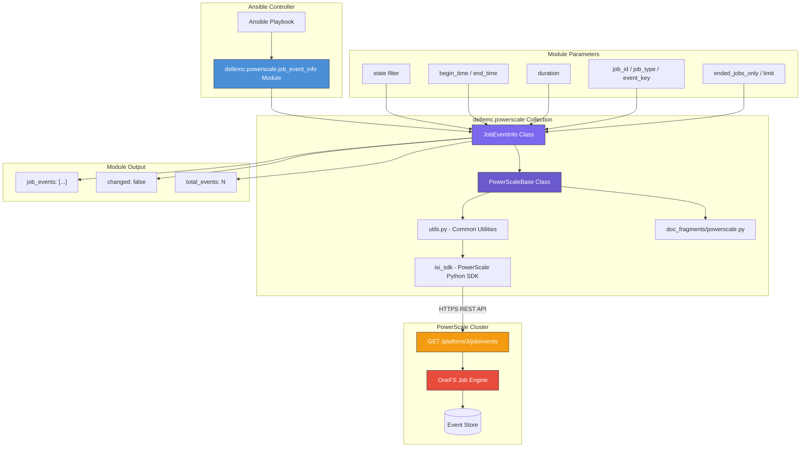
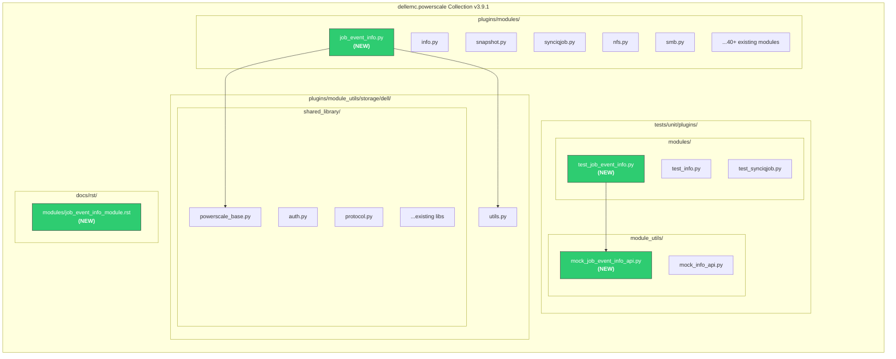
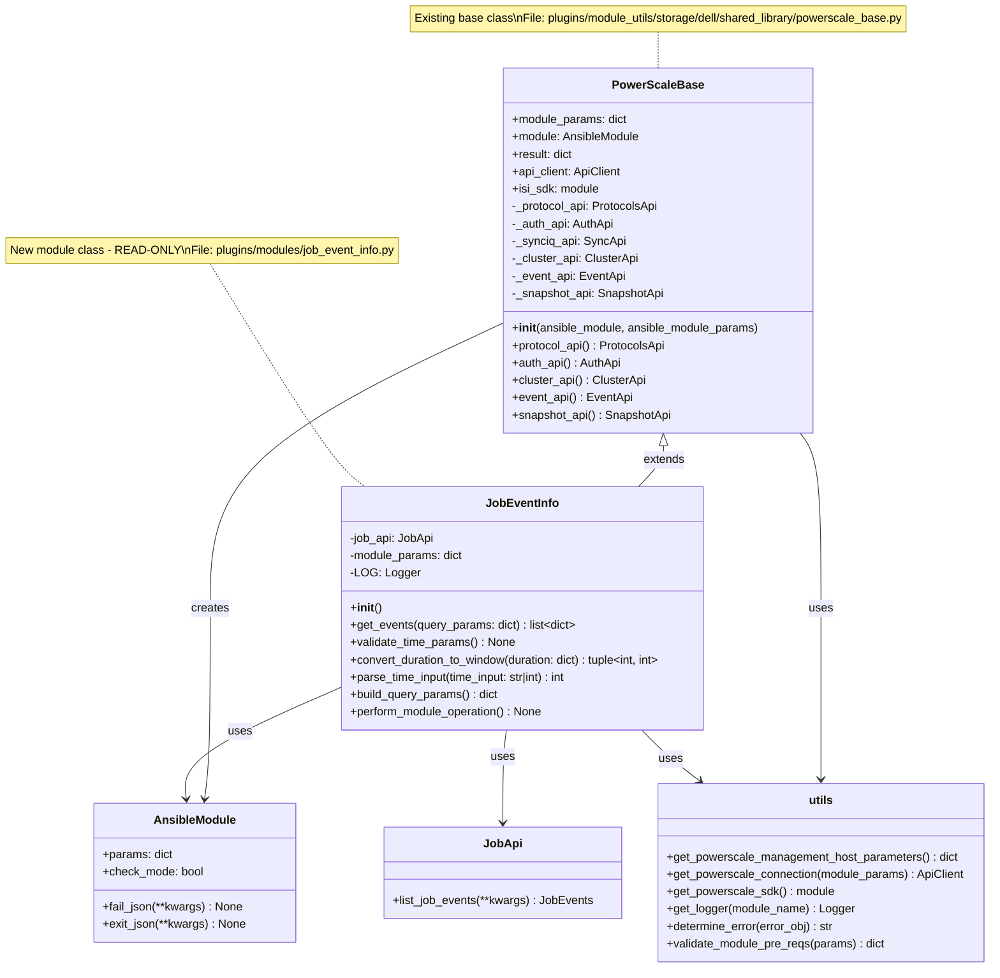
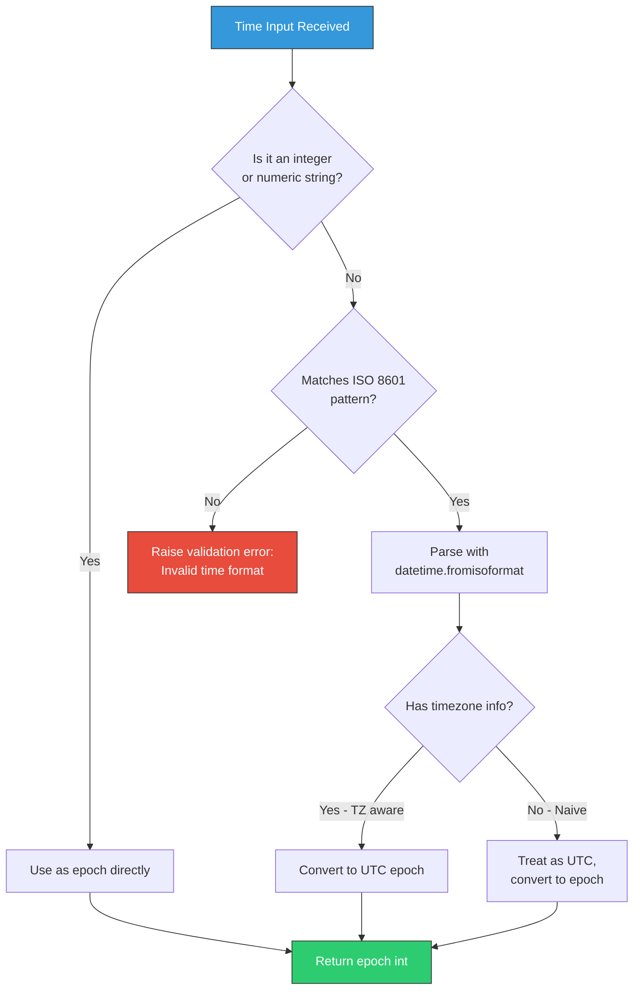
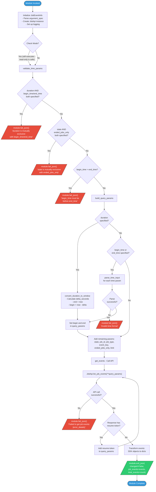
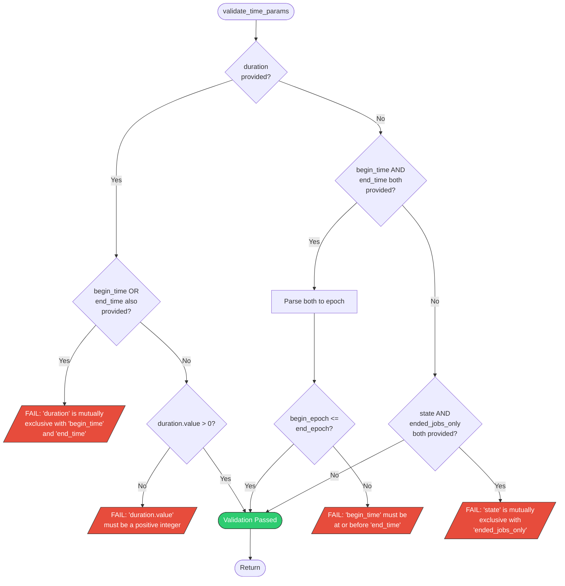
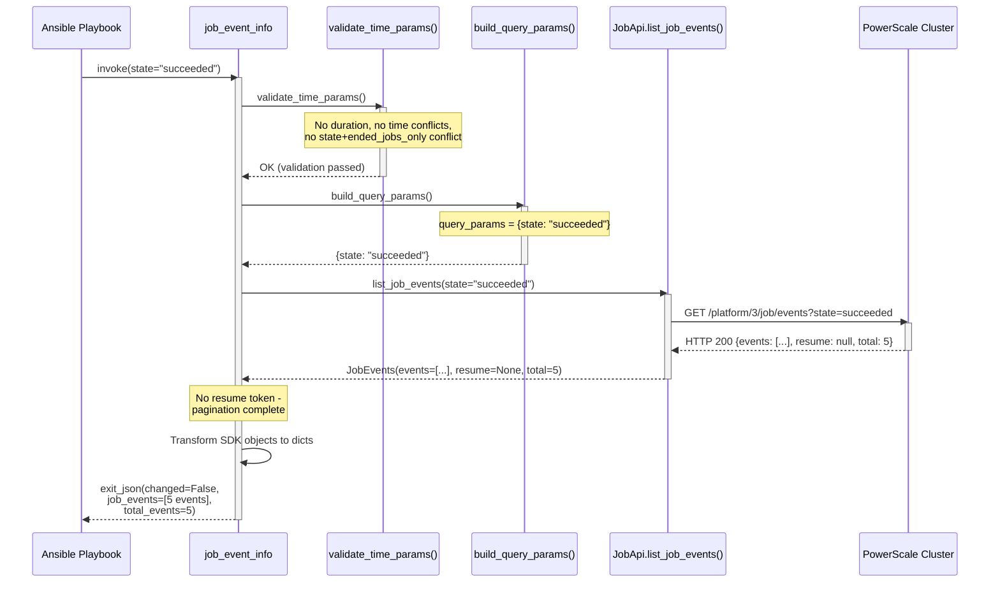
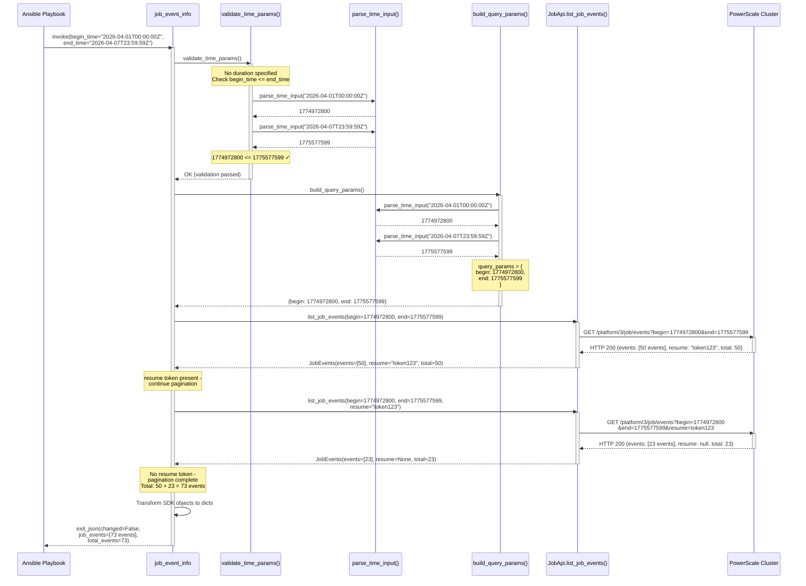
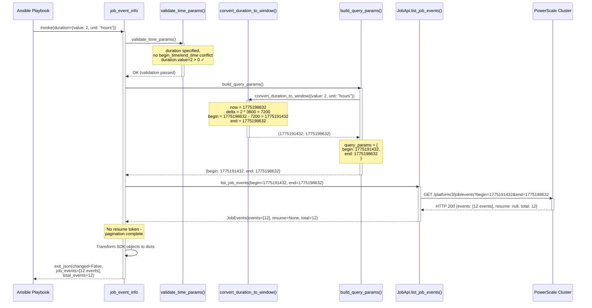
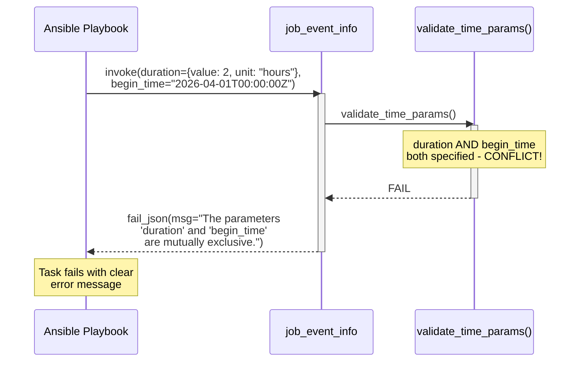

# Design Document: dellemc.powerscale.job_event_info Module

| Field            | Value                                                                 |
|------------------|-----------------------------------------------------------------------|
| **Document Title** | PowerScale Job Event Info Module - Detailed Design                  |
| **Version**      | 1.0                                                                   |
| **Date**         | 2026-04-07                                                            |
| **Author**       | Shrinidhi Rao                                                         |
| **JIRA Story**   | ECS02C-844 - "As an Ansible Developer, I want to create powerscale_job_event_info module to retrieve PowerScale job events" |
| **JIRA Epic**    | ECS02-77 - "Ansible - PowerScale - Deliver support for Job management" |
| **Collection**   | dellemc.powerscale (v3.9.1)                                          |
| **Module Name**  | `dellemc.powerscale.job_event_info`                                  |
| **Module Type**  | Info (READ-ONLY)                                                      |
| **API Version**  | Platform v3 (`/platform/3/job/events`)                               |

---

## Table of Contents

1. [Executive Summary](#1-executive-summary)
2. [Requirements](#2-requirements)
3. [Architecture Design](#3-architecture-design)
4. [Detailed Design](#4-detailed-design)
5. [Data Design](#5-data-design)
6. [Flow Charts](#6-flow-charts)
7. [Sequence Diagrams](#7-sequence-diagrams)
8. [Implementation Plan](#8-implementation-plan)
9. [Deployment Plan](#9-deployment-plan)
10. [DAR (Decision & Action Records)](#10-dar-decision--action-records)

---

## 1. Executive Summary

This document describes the detailed design for the `dellemc.powerscale.job_event_info` Ansible module, a **read-only info module** that retrieves PowerScale Job Engine events via the OneFS REST API endpoint `GET /platform/3/job/events`.

The module enables Ansible users to query, filter, and retrieve job events from the PowerScale Job Engine. It supports filtering by event state, time windows (begin/end time or duration), job ID, job type, and event key. The module is strictly read-only: it does not create, modify, or delete any resources on the cluster, and it fully supports Ansible check mode.

This module is part of the broader Job Management epic (ECS02-77) for the `dellemc.powerscale` Ansible collection and follows existing collection patterns, including the `PowerScaleBase` class architecture, SDK-based API interaction via `isi_sdk.JobApi`, standard error handling, and the `PowerScaleUnitBase` test framework.

**Key Design Decisions:**
- Accept both ISO 8601 strings and Unix epoch integers for time parameters, converting internally to epoch for the API
- Support a `duration` convenience parameter that computes a time window relative to the current cluster time
- Implement automatic pagination to return complete result sets
- Follow the existing handler/base-class pattern established by the collection

---

## 2. Requirements

### 2.1 Functional Requirements

| ID    | Requirement                                                                                      | Priority |
|-------|--------------------------------------------------------------------------------------------------|----------|
| FR-1  | Retrieve a list of job events from the PowerScale Job Engine via `GET /platform/3/job/events`   | Must     |
| FR-2  | Support filtering events by state (running, paused_user, paused_system, paused_policy, paused_priority, cancelled_user, cancelled_system, failed, succeeded, unknown, failed_not_retried) | Must     |
| FR-3  | Support filtering events by begin time (inclusive) using cluster timestamps                      | Must     |
| FR-4  | Support filtering events by end time (inclusive) using cluster timestamps                        | Must     |
| FR-5  | Support a `duration` parameter that derives begin and end times automatically                    | Must     |
| FR-6  | Support filtering events by job ID                                                               | Should   |
| FR-7  | Support filtering events by job type                                                             | Should   |
| FR-8  | Support filtering events by event key                                                            | Should   |
| FR-9  | Support `ended_jobs_only` boolean filter (mutually exclusive with `state`)                       | Should   |
| FR-10 | Support `limit` parameter to control maximum results per API call                                | Should   |
| FR-11 | Implement automatic pagination using `resume` token to retrieve all matching events              | Must     |
| FR-12 | Return events without modifying any cluster state                                                | Must     |
| FR-13 | Accept both ISO 8601 date strings and Unix epoch integers for time parameters                    | Must     |

### 2.2 Non-Functional Requirements

| ID     | Requirement                                                                 | Priority |
|--------|-----------------------------------------------------------------------------|----------|
| NFR-1  | Support Ansible check mode (module is inherently safe; check mode = normal) | Must     |
| NFR-2  | Follow existing `dellemc.powerscale` collection coding patterns             | Must     |
| NFR-3  | Provide comprehensive error messages for API failures                       | Must     |
| NFR-4  | Support logging via `utils.get_logger()`                                    | Must     |
| NFR-5  | Module execution should complete within a reasonable time for large event sets | Should |

### 2.3 Acceptance Criteria

| AC ID | Criteria                        | Description                                                                                                                                     | Verification                                            |
|-------|---------------------------------|-------------------------------------------------------------------------------------------------------------------------------------------------|---------------------------------------------------------|
| AC-1  | Event Listing                   | The module returns a list of job events from the cluster without modifying any state. Output includes all event fields from the API response.   | Unit test: verify events returned, `changed=False`      |
| AC-2  | State Filtering                 | When a `state` filter is provided, only events matching the specified state(s) are returned. Invalid states produce a clear error message.      | Unit test: mock API with state filter, verify results   |
| AC-3  | Time Window Filtering           | The module supports `begin_time`, `end_time`, and `duration` parameters. Time boundaries are inclusive. All timestamps use cluster time. `begin_time`/`end_time` and `duration` are mutually exclusive sets. | Unit test: verify epoch conversion and mutual exclusivity |
| AC-4  | Output Fields                   | Each event in the output contains: `id` (event_id), `job_id`, `job_type`, `key`, `value`, `time`, `phase`, `flags`, `fmt_type`, `raw_type`.    | Unit test: verify output schema completeness            |
| AC-5  | Check Mode Support              | The module supports `check_mode`. Since this is a read-only module, check mode produces the same output as normal mode.                        | Unit test: verify `supports_check_mode=True`            |

---

## 3. Architecture Design

### 3.1 Component Architecture



### 3.2 Module Position within Collection



---

## 4. Detailed Design

### 4.1 Class Diagram



### 4.2 Method Descriptions

| Method                        | Description                                                                                                                                                                |
|-------------------------------|----------------------------------------------------------------------------------------------------------------------------------------------------------------------------|
| `__init__()`                  | Initializes the module. Defines `argument_spec` with all input parameters, calls `super().__init__()` with `supports_check_mode=True`, creates `JobApi` instance.          |
| `get_events(query_params)`    | Calls `JobApi.list_job_events()` with the provided query parameters. Handles pagination via `resume` token. Returns a list of all event dictionaries.                     |
| `validate_time_params()`      | Validates mutual exclusivity: `duration` cannot be used with `begin_time`/`end_time`. Validates that `ended_jobs_only` and `state` are not both specified. Validates `begin_time <= end_time` if both provided. |
| `convert_duration_to_window(duration)` | Converts a duration dict `{value: N, unit: "hours"|"minutes"|"days"}` into a `(begin_epoch, end_epoch)` tuple. `end` = current time, `begin` = current time minus duration.  |
| `parse_time_input(time_input)` | Accepts a time value as ISO 8601 string (e.g., `"2026-04-01T00:00:00Z"`) or Unix epoch integer. Returns a Unix epoch integer. Raises an error for invalid formats.         |
| `build_query_params()`        | Reads module params, applies `parse_time_input()` for times, applies `convert_duration_to_window()` if duration is set, and constructs the API query parameter dictionary. |
| `perform_module_operation()`  | Entry point. Calls `validate_time_params()`, `build_query_params()`, `get_events()`, then calls `module.exit_json()` with results and `changed=False`.                   |

### 4.3 Input Parameters

| Parameter         | Type               | Required | Default | Description                                                                                                                                          |
|-------------------|--------------------|----------|---------|------------------------------------------------------------------------------------------------------------------------------------------------------|
| `state`           | `str`              | No       | `None`  | Filter events by state. Valid values: `running`, `paused_user`, `paused_system`, `paused_policy`, `paused_priority`, `cancelled_user`, `cancelled_system`, `failed`, `succeeded`, `unknown`, `failed_not_retried`. Mutually exclusive with `ended_jobs_only`. |
| `begin_time`      | `str`              | No       | `None`  | Return events at or after this time (inclusive). Accepts ISO 8601 format (e.g., `"2026-04-01T00:00:00Z"`) or Unix epoch as a string (e.g., `"1775196875"`). Mutually exclusive with `duration`. |
| `end_time`        | `str`              | No       | `None`  | Return events before this time (inclusive from the user's perspective). Accepts ISO 8601 format or Unix epoch as a string. Mutually exclusive with `duration`. |
| `duration`        | `dict`             | No       | `None`  | Convenience parameter to specify a time window as a duration from the current time. Contains `value` (int) and `unit` (str: `minutes`, `hours`, `days`). Mutually exclusive with `begin_time`/`end_time`. |
| `duration.value`  | `int`              | Yes*     | -       | The numeric duration value. Required when `duration` is specified.                                                                                   |
| `duration.unit`   | `str`              | Yes*     | -       | The duration unit. Required when `duration` is specified. Choices: `minutes`, `hours`, `days`.                                                       |
| `job_id`          | `int`              | No       | `None`  | Filter events by a specific job ID.                                                                                                                  |
| `job_type`        | `str`              | No       | `None`  | Filter events by job type (e.g., `FSAnalyze`, `TreeDelete`, `FlexProtect`).                                                                         |
| `event_key`       | `str`              | No       | `None`  | Filter events by event key (e.g., `"State change"`, `"Begin phase"`, `"End phase"`).                                                                |
| `ended_jobs_only` | `bool`             | No       | `None`  | If `true`, return only events for ended jobs. Mutually exclusive with `state`.                                                                       |
| `limit`           | `int`              | No       | `None`  | Maximum number of events to return per API page. If not specified, the API default is used. The module paginates automatically to return all results. |

> **Note:** Standard connection parameters (`onefs_host`, `port_no`, `api_user`, `api_password`, `verify_ssl`) are inherited from `utils.get_powerscale_management_host_parameters()` via `PowerScaleBase`.

### 4.4 Output Schema

The module returns the following structure:

```yaml
changed: false    # Always false for info modules
job_events:       # List of event objects
  - id: 220917
    job_id: 2650
    job_type: "DomainTag"
    key: "State change"
    value: "Succeeded"
    time: 1775196876
    phase: 1
    flags: "(0x00000001) RF_CONTROL"
    fmt_type: "STRING"
    raw_type: 1
total_events: 3   # Total number of events returned
```

**Output Fields Table:**

| Field       | Type        | Description                                                                                     |
|-------------|-------------|-------------------------------------------------------------------------------------------------|
| `changed`   | `bool`      | Always `false`. This is a read-only module.                                                     |
| `job_events`| `list[dict]`| List of event objects retrieved from the cluster.                                               |
| `job_events[].id`       | `int`    | Unique event identifier.                                                              |
| `job_events[].job_id`   | `int`    | ID of the job that generated the event.                                               |
| `job_events[].job_type` | `str`    | Type of the job (e.g., `FSAnalyze`, `DomainTag`, `TreeDelete`).                      |
| `job_events[].key`      | `str`    | Event key describing the event type (e.g., `"State change"`, `"Begin phase"`).        |
| `job_events[].value`    | `str|int`| Event value; content depends on the `key` and `fmt_type`.                             |
| `job_events[].time`     | `int`    | Unix epoch timestamp when the event occurred (cluster time).                          |
| `job_events[].phase`    | `int`    | Job phase number during which the event occurred.                                     |
| `job_events[].flags`    | `str`    | Event flags describing the event category (e.g., `"(0x00000001) RF_CONTROL"`).        |
| `job_events[].fmt_type` | `str`    | Format type of the event value (e.g., `"STRING"`, `"INT"`).                           |
| `job_events[].raw_type` | `int`    | Raw numeric type identifier for the event.                                            |
| `total_events`          | `int`    | Total count of events in the response.                                                |

### 4.5 API Endpoint Mapping

| Module Parameter   | API Query Parameter | Type    | Mapping Logic                                                                 |
|--------------------|---------------------|---------|-------------------------------------------------------------------------------|
| `state`            | `state`             | `str`   | Direct pass-through. Value validated against allowed enum.                    |
| `begin_time`       | `begin`             | `int`   | Parsed from ISO 8601 or epoch string to integer epoch via `parse_time_input()`. |
| `end_time`         | `end`               | `int`   | Parsed from ISO 8601 or epoch string to integer epoch via `parse_time_input()`. |
| `duration`         | `begin` + `end`     | `int`   | Converted via `convert_duration_to_window()`: `end = now`, `begin = now - delta`. |
| `job_id`           | `job_id`            | `int`   | Direct pass-through.                                                          |
| `job_type`         | `job_type`          | `str`   | Direct pass-through.                                                          |
| `event_key`        | `key`               | `str`   | Direct pass-through.                                                          |
| `ended_jobs_only`  | `ended_jobs_only`   | `bool`  | Direct pass-through. Mutually exclusive with `state`.                         |
| `limit`            | `limit`             | `int`   | Direct pass-through. Controls page size; pagination handled by module.        |
| _(pagination)_     | `resume`            | `str`   | Managed internally by `get_events()` method. Not exposed to the user.         |

---

## 5. Data Design

### 5.1 Input Data Model

#### 5.1.1 Ansible Module Argument Spec

```python
argument_spec = dict(
    state=dict(
        type='str',
        required=False,
        choices=[
            'running', 'paused_user', 'paused_system',
            'paused_policy', 'paused_priority',
            'cancelled_user', 'cancelled_system',
            'failed', 'succeeded', 'unknown', 'failed_not_retried'
        ]
    ),
    begin_time=dict(type='str', required=False),
    end_time=dict(type='str', required=False),
    duration=dict(
        type='dict',
        required=False,
        options=dict(
            value=dict(type='int', required=True),
            unit=dict(
                type='str',
                required=True,
                choices=['minutes', 'hours', 'days']
            )
        )
    ),
    job_id=dict(type='int', required=False),
    job_type=dict(type='str', required=False),
    event_key=dict(type='str', required=False),
    ended_jobs_only=dict(type='bool', required=False),
    limit=dict(type='int', required=False)
)

mutually_exclusive = [
    ['state', 'ended_jobs_only'],
    ['duration', 'begin_time'],
    ['duration', 'end_time']
]
```

#### 5.1.2 Duration Conversion Logic

When the user specifies `duration`, the module converts it to an absolute time window:

```
Input:  duration = { value: 2, unit: "hours" }

Conversion:
  import time
  now = int(time.time())             # e.g., 1775198632
  delta_seconds = 2 * 3600           # 7200 seconds
  begin_epoch = now - delta_seconds  # 1775191432
  end_epoch = now                    # 1775198632

Output: begin=1775191432, end=1775198632
```

**Unit Conversion Table:**

| Unit      | Multiplier (seconds)  | Example: `value=2`      |
|-----------|-----------------------|--------------------------|
| `minutes` | `value * 60`          | `2 * 60 = 120`          |
| `hours`   | `value * 3600`        | `2 * 3600 = 7200`       |
| `days`    | `value * 86400`       | `2 * 86400 = 172800`    |

### 5.2 Output Data Model

#### 5.2.1 API Response Structure

The `GET /platform/3/job/events` endpoint returns:

```json
{
    "events": [
        {
            "id": 220917,
            "job_id": 2650,
            "job_type": "DomainTag",
            "key": "State change",
            "value": "Succeeded",
            "time": 1775196876,
            "phase": 1,
            "flags": "(0x00000001) RF_CONTROL",
            "fmt_type": "STRING",
            "raw_type": 1
        }
    ],
    "resume": "1-1-MAAA1-MAAA1-MwAA1...",
    "total": 3
}
```

> **Reference:** Sample data from validated API endpoint (see [Job_Management_API_Validation_Report.md](../job_mgmt_api_validation/Job_Management_API_Validation_Report.md), Endpoint 5).

#### 5.2.2 Module Output Transformation

The module transforms the API response to the Ansible output format:

```python
# Internal transformation logic
def _transform_response(self, api_events):
    """Transform SDK response objects to plain dictionaries."""
    events = []
    for event in api_events:
        events.append(event.to_dict() if hasattr(event, 'to_dict') else event)
    return events
```

The final `module.exit_json()` call:

```python
self.module.exit_json(
    changed=False,
    job_events=all_events,
    total_events=len(all_events)
)
```

### 5.3 Time Handling Strategy

#### 5.3.1 Input Time Parsing

The module must handle multiple time input formats and convert them to Unix epoch integers for the API:



**Supported Input Formats:**

| Format                        | Example                        | Parsing Method                                     |
|-------------------------------|--------------------------------|----------------------------------------------------|
| Unix epoch (int)              | `1775196875`                   | Direct use                                         |
| Unix epoch (string)           | `"1775196875"`                 | `int()` conversion                                 |
| ISO 8601 with timezone        | `"2026-04-01T00:00:00Z"`      | `datetime.fromisoformat()` -> `calendar.timegm()`  |
| ISO 8601 with offset          | `"2026-04-01T00:00:00+05:30"` | `datetime.fromisoformat()` -> convert to UTC epoch  |
| ISO 8601 no timezone (naive)  | `"2026-04-01T00:00:00"`       | Treat as UTC, `calendar.timegm()`                  |

#### 5.3.2 Cluster Timezone Considerations

- The PowerScale API uses **cluster-local timestamps** (Unix epoch) for the `begin` and `end` query parameters
- All `time` fields in event responses are Unix epoch integers in **cluster time**
- The module converts all user-provided times to epoch before sending to the API
- **Important:** When a user provides ISO 8601 with a timezone offset, the module converts to UTC epoch. The cluster interprets epoch values in its own timezone context. Users should be aware that the cluster's timezone setting affects the semantic meaning of the returned timestamps

---

## 6. Flow Charts

### 6.1 Main Execution Flow



### 6.2 Time Parameter Validation Flow



---

## 7. Sequence Diagrams

### 7.1 Scenario 1: Filter Events by State

A user retrieves all job events in the `succeeded` state.

**Playbook:**
```yaml
- name: Get succeeded job events
  dellemc.powerscale.job_event_info:
    onefs_host: "10.230.24.246"
    port_no: "8080"
    api_user: "root"
    api_password: "password"
    verify_ssl: false
    state: "succeeded"
```



### 7.2 Scenario 2: Filter Events by Time Window (begin + end)

A user retrieves events within a specific time window using ISO 8601 timestamps.

**Playbook:**
```yaml
- name: Get events in a time window
  dellemc.powerscale.job_event_info:
    onefs_host: "10.230.24.246"
    port_no: "8080"
    api_user: "root"
    api_password: "password"
    verify_ssl: false
    begin_time: "2026-04-01T00:00:00Z"
    end_time: "2026-04-07T23:59:59Z"
```



### 7.3 Scenario 3: Filter Events by Duration

A user retrieves events from the last 2 hours.

**Playbook:**
```yaml
- name: Get events from last 2 hours
  dellemc.powerscale.job_event_info:
    onefs_host: "10.230.24.246"
    port_no: "8080"
    api_user: "root"
    api_password: "password"
    verify_ssl: false
    duration:
      value: 2
      unit: "hours"
```



### 7.4 Scenario 4: Error Handling - Mutually Exclusive Parameters

A user incorrectly specifies both `duration` and `begin_time`.



---

## 8. Implementation Plan

### 8.1 Files to Create/Modify

| File                                                                                  | Action   | Description                                                       |
|---------------------------------------------------------------------------------------|----------|-------------------------------------------------------------------|
| `plugins/modules/job_event_info.py`                                                   | **NEW**  | Main module implementation with `JobEventInfo` class.             |
| `tests/unit/plugins/modules/test_job_event_info.py`                                   | **NEW**  | Unit test class extending `PowerScaleUnitBase`.                   |
| `tests/unit/plugins/module_utils/mock_job_event_info_api.py`                          | **NEW**  | Mock API data and error messages for unit tests.                  |
| `plugins/module_utils/storage/dell/shared_library/powerscale_base.py`                 | **MODIFY** | Add `job_api` lazy property for `isi_sdk.JobApi`.               |

### 8.2 Dependencies

| Dependency                 | Version       | Usage                                               |
|----------------------------|---------------|-----------------------------------------------------|
| `ansible-core`             | >= 2.15       | Ansible framework                                   |
| `isilon_sdk` (isi_sdk)     | >= 0.7.0      | PowerScale Python SDK - `JobApi.list_job_events()`  |
| `python`                   | >= 3.9        | Runtime                                             |
| `datetime` (stdlib)        | N/A           | ISO 8601 parsing                                    |
| `calendar` (stdlib)        | N/A           | `timegm()` for UTC epoch conversion                 |
| `time` (stdlib)            | N/A           | `time.time()` for current epoch (duration)          |

### 8.3 Check Mode Support

```python
# In __init__():
ansible_module_params = dict(
    argument_spec=argument_spec,
    supports_check_mode=True,
    mutually_exclusive=mutually_exclusive
)
```

Since this is a **read-only** module:
- `check_mode=True` produces **identical behavior** to `check_mode=False`
- The module **never** modifies cluster state
- `changed` is **always** `False`
- No special check_mode branching is required in `perform_module_operation()`

### 8.4 Error Handling Strategy

| Error Scenario                              | Handling                                                                                    |
|---------------------------------------------|---------------------------------------------------------------------------------------------|
| SDK not installed                           | `PowerScaleBase.__init__()` calls `validate_module_pre_reqs()` -> `fail_json()`            |
| Connection failure                          | `try/except ApiException` in `get_events()` -> `fail_json()` with `determine_error()`      |
| Invalid time format                         | `parse_time_input()` raises `ValueError` -> `fail_json()` with format guidance              |
| Mutually exclusive params                   | Ansible's built-in `mutually_exclusive` validation + custom `validate_time_params()`        |
| `begin_time` after `end_time`               | Custom validation in `validate_time_params()` -> `fail_json()`                              |
| API timeout                                 | `try/except ApiException` in `get_events()` -> `fail_json()` with timeout message           |
| Invalid state value                         | Ansible `choices` validation in `argument_spec` -> automatic `fail_json()`                  |
| Negative or zero duration value             | Custom validation in `validate_time_params()` -> `fail_json()`                              |
| Pagination failure (mid-stream)             | `try/except ApiException` in pagination loop -> `fail_json()` with events retrieved so far  |

**Error Message Format (consistent with collection patterns):**

```python
except utils.ApiException as e:
    error_msg = utils.determine_error(error_obj=e)
    self.module.fail_json(
        msg="Failed to retrieve job events from PowerScale cluster: {0}".format(error_msg)
    )
```

### 8.5 Pagination Strategy

```python
def get_events(self, query_params):
    """Retrieve all job events with automatic pagination."""
    all_events = []
    resume = None

    while True:
        try:
            if resume:
                query_params['resume'] = resume
            api_response = self.job_api.list_job_events(**query_params)
            events = api_response.events or []
            all_events.extend(events)

            resume = api_response.resume
            if not resume:
                break
        except utils.ApiException as e:
            error_msg = utils.determine_error(error_obj=e)
            self.module.fail_json(
                msg="Failed to retrieve job events: {0}".format(error_msg)
            )

    return all_events
```

---

## 9. Deployment Plan

### 9.1 Unit Tests

Unit tests will follow the existing `PowerScaleUnitBase` pattern.

**Test File:** `tests/unit/plugins/modules/test_job_event_info.py`

| Test Case ID | Test Case                                      | Description                                                                    |
|--------------|-------------------------------------------------|--------------------------------------------------------------------------------|
| UT-01        | `test_get_all_events`                           | Retrieve all events with no filters. Verify `changed=False` and events list.  |
| UT-02        | `test_get_events_by_state`                      | Filter by `state="succeeded"`. Verify correct API param passed.               |
| UT-03        | `test_get_events_by_begin_time_iso`             | Filter by `begin_time` in ISO 8601 format. Verify epoch conversion.           |
| UT-04        | `test_get_events_by_end_time_epoch`             | Filter by `end_time` as epoch string. Verify direct pass-through.             |
| UT-05        | `test_get_events_by_time_window`                | Filter by both `begin_time` and `end_time`. Verify both params sent.          |
| UT-06        | `test_get_events_by_duration_hours`             | Filter by `duration={value: 2, unit: "hours"}`. Verify time window computed.  |
| UT-07        | `test_get_events_by_duration_days`              | Filter by `duration={value: 1, unit: "days"}`. Verify 86400s delta.           |
| UT-08        | `test_get_events_by_job_id`                     | Filter by `job_id=2650`. Verify correct API param.                            |
| UT-09        | `test_get_events_by_job_type`                   | Filter by `job_type="FSAnalyze"`. Verify correct API param.                   |
| UT-10        | `test_get_events_by_event_key`                  | Filter by `event_key="State change"`. Verify correct API param.               |
| UT-11        | `test_get_events_ended_jobs_only`               | Filter by `ended_jobs_only=true`. Verify correct API param.                   |
| UT-12        | `test_get_events_with_limit`                    | Set `limit=10`. Verify limit passed to API.                                   |
| UT-13        | `test_get_events_with_pagination`               | Mock paginated response. Verify all pages aggregated.                          |
| UT-14        | `test_fail_mutually_exclusive_duration_begin`   | Provide both `duration` and `begin_time`. Expect `fail_json()`.               |
| UT-15        | `test_fail_mutually_exclusive_duration_end`     | Provide both `duration` and `end_time`. Expect `fail_json()`.                 |
| UT-16        | `test_fail_mutually_exclusive_state_ended`      | Provide both `state` and `ended_jobs_only`. Expect `fail_json()`.             |
| UT-17        | `test_fail_begin_after_end`                     | Set `begin_time` after `end_time`. Expect `fail_json()`.                      |
| UT-18        | `test_fail_invalid_time_format`                 | Provide invalid time string. Expect `fail_json()`.                            |
| UT-19        | `test_fail_api_exception`                       | Mock API exception. Expect `fail_json()` with error message.                  |
| UT-20        | `test_fail_negative_duration`                   | Set `duration.value` to negative. Expect `fail_json()`.                       |
| UT-21        | `test_check_mode`                               | Run with `check_mode=True`. Verify same output as normal mode.                |
| UT-22        | `test_empty_events_list`                        | Mock empty response. Verify `job_events=[]` and `total_events=0`.             |
| UT-23        | `test_combined_filters`                         | Combine `state`, `job_type`, and `begin_time`. Verify all params passed.      |

**Mock Data File:** `tests/unit/plugins/module_utils/mock_job_event_info_api.py`

```python
class MockJobEventInfoApi:
    MODULE_NAME = "dellemc_powerscale_job_event_info"

    COMMON_ARGS = {
        "onefs_host": "10.230.24.246",
        "api_user": "root",
        "api_password": "password",
        "verify_ssl": False,
        "port_no": "8080"
    }

    GET_EVENTS_RESPONSE = {
        "events": [
            {
                "id": 220917,
                "job_id": 2650,
                "job_type": "DomainTag",
                "key": "State change",
                "value": "Succeeded",
                "time": 1775196876,
                "phase": 1,
                "flags": "(0x00000001) RF_CONTROL",
                "fmt_type": "STRING",
                "raw_type": 1
            }
        ],
        "resume": None,
        "total": 1
    }
    # ... additional mock data
```

### 9.2 Functional Tests (FT)

**Test File:** `tests/functional/test_job_event_info.py` (or integration test playbook)

| FT Case | Description                                              | Pre-condition                                    |
|---------|----------------------------------------------------------|--------------------------------------------------|
| FT-01   | Get all events from live cluster                        | Cluster accessible, events exist                 |
| FT-02   | Filter by state on live cluster                         | Events in various states exist                   |
| FT-03   | Filter by time window on live cluster                   | Events within time window exist                  |
| FT-04   | Filter by duration on live cluster                      | Recent events exist                              |
| FT-05   | Filter by job_id on live cluster                        | Known job with events exists                     |
| FT-06   | Verify idempotency (multiple runs, same result)         | Stable event set                                 |
| FT-07   | Verify check mode produces same output                  | Any state                                        |

### 9.3 Documentation

**File:** `docs/rst/modules/job_event_info_module.rst` (auto-generated from DOCUMENTATION string)

The module's `DOCUMENTATION`, `EXAMPLES`, and `RETURN` strings will be embedded in the Python module file following Ansible documentation standards:

```python
DOCUMENTATION = r'''
---
module: job_event_info
version_added: '3.10.0'
short_description: Retrieve PowerScale Job Engine events
description:
  - This module retrieves job events from the PowerScale Job Engine.
  - Supports filtering by state, time window, duration, job ID, job type, and event key.
  - This is a read-only module that does not modify any cluster state.
extends_documentation_fragment:
  - dellemc.powerscale.powerscale
author:
  - Shrinidhi Rao (@shrinidhirao) <ansible.team@dell.com>
options:
  ...
'''

EXAMPLES = r'''
- name: Get all job events
  dellemc.powerscale.job_event_info:
    onefs_host: "{{ onefs_host }}"
    api_user: "{{ api_user }}"
    api_password: "{{ api_password }}"
    verify_ssl: "{{ verify_ssl }}"

- name: Get succeeded events
  dellemc.powerscale.job_event_info:
    onefs_host: "{{ onefs_host }}"
    api_user: "{{ api_user }}"
    api_password: "{{ api_password }}"
    verify_ssl: "{{ verify_ssl }}"
    state: "succeeded"

- name: Get events from last 2 hours
  dellemc.powerscale.job_event_info:
    onefs_host: "{{ onefs_host }}"
    api_user: "{{ api_user }}"
    api_password: "{{ api_password }}"
    verify_ssl: "{{ verify_ssl }}"
    duration:
      value: 2
      unit: "hours"
'''

RETURN = r'''
changed:
  description: Whether any change was made on the cluster.
  type: bool
  returned: always
  sample: false
job_events:
  description: List of job events retrieved from the cluster.
  type: list
  returned: always
  sample: [...]
total_events:
  description: Total number of events returned.
  type: int
  returned: always
  sample: 12
'''
```

---

## 10. DAR (Decision & Action Records)

### DAR-1: Time Input Format

| Field          | Value                                                                                                          |
|----------------|----------------------------------------------------------------------------------------------------------------|
| **Decision**   | What format should `begin_time` and `end_time` accept?                                                        |
| **Options**    | **Option A:** Accept only Unix epoch integers. **Option B:** Accept only ISO 8601 strings. **Option C:** Accept both ISO 8601 strings and Unix epoch integers, converting internally. |
| **Resolution** | **Option C: Accept both ISO 8601 and epoch, convert internally.**                                             |
| **Rationale**  | - Epoch-only (Option A) is unfriendly for playbook authors who think in human-readable dates. - ISO-only (Option B) excludes programmatic use cases where epoch values are already available. - Both formats (Option C) maximizes usability. The conversion overhead is negligible (single `datetime.fromisoformat()` call). The API requires epoch integers, so internal conversion is trivial. This follows the principle of being "liberal in what you accept." |
| **Impact**     | `parse_time_input()` method must detect format (numeric vs. string) and convert accordingly. Unit tests must cover both formats. |
| **Date**       | 2026-04-07                                                                                                     |

### DAR-2: Duration vs. Absolute Time Parameters

| Field          | Value                                                                                                          |
|----------------|----------------------------------------------------------------------------------------------------------------|
| **Decision**   | Should the module support a `duration` convenience parameter in addition to `begin_time`/`end_time`?          |
| **Options**    | **Option A:** Only `begin_time`/`end_time`. **Option B:** Add `duration` as a convenience parameter.          |
| **Resolution** | **Option B: Add `duration` parameter.**                                                                        |
| **Rationale**  | - Common use case: "show me events from the last N hours." Without `duration`, users must compute epoch values manually. - `duration` is mutually exclusive with `begin_time`/`end_time` to avoid ambiguity. - Conversion is simple: `end=now`, `begin=now-delta`. - This matches patterns in other monitoring/observability tools. |
| **Impact**     | Additional parameter in `argument_spec`, `convert_duration_to_window()` method, and mutual exclusivity validation. |
| **Date**       | 2026-04-07                                                                                                     |

### DAR-3: Pagination Strategy

| Field          | Value                                                                                                          |
|----------------|----------------------------------------------------------------------------------------------------------------|
| **Decision**   | How should the module handle paginated API responses?                                                          |
| **Options**    | **Option A:** Return only the first page; expose `resume` token to user. **Option B:** Automatically paginate and return all results. **Option C:** Let user control via a `max_pages` parameter. |
| **Resolution** | **Option B: Automatic pagination.**                                                                             |
| **Rationale**  | - Info modules should return complete datasets by default. - Exposing pagination tokens to Ansible users adds unnecessary complexity. - The `limit` parameter still controls page size for API-level efficiency. - If the event set is extremely large, users can narrow results with filters (state, time, job_id). |
| **Impact**     | `get_events()` implements a `while` loop with `resume` token. No `resume` parameter exposed to users.          |
| **Date**       | 2026-04-07                                                                                                     |

### DAR-4: Module Architecture Pattern

| Field          | Value                                                                                                          |
|----------------|----------------------------------------------------------------------------------------------------------------|
| **Decision**   | Should the module use the `PowerScaleBase` class or standalone `AnsibleModule` initialization?                 |
| **Options**    | **Option A:** Standalone `AnsibleModule` (like some older modules). **Option B:** Extend `PowerScaleBase` (current recommended pattern). |
| **Resolution** | **Option B: Extend `PowerScaleBase`.**                                                                          |
| **Rationale**  | - `PowerScaleBase` provides standardized connection setup, SDK initialization, prerequisite validation, and lazy API property patterns. - Following the established pattern ensures consistency and reduces boilerplate. - The `PowerScaleUnitBase` test framework is designed to work with `PowerScaleBase`-derived modules. - A `job_api` lazy property will be added to `PowerScaleBase` for reuse by future Job Management modules (e.g., `job_info`, `job`). |
| **Impact**     | Module extends `PowerScaleBase`. A `_job_api` / `job_api` property pair will be added to `powerscale_base.py`. |
| **Date**       | 2026-04-07                                                                                                     |

### DAR-5: `state` Parameter - Single Value vs. List

| Field          | Value                                                                                                          |
|----------------|----------------------------------------------------------------------------------------------------------------|
| **Decision**   | Should the `state` parameter accept a single value or a list of values?                                       |
| **Options**    | **Option A:** Single `str` value (matching API's single `state` query parameter). **Option B:** List of `str` values (module makes multiple API calls or client-side filters). |
| **Resolution** | **Option A: Single string value.**                                                                              |
| **Rationale**  | - The OneFS API `GET /platform/3/job/events` accepts only a single `state` query parameter, not a list. - Implementing multi-state filtering would require either multiple API calls (inefficient) or client-side filtering (inconsistent with API behavior). - Users needing multiple states can invoke the module multiple times or use `ended_jobs_only` for a broader filter. - Keeping a 1:1 mapping with the API is simpler and more predictable. |
| **Impact**     | `state` parameter type is `str` with `choices` validation, not `list`.                                         |
| **Date**       | 2026-04-07                                                                                                     |

---

## Appendix A: Sample Playbooks

### A.1 Get All Job Events

```yaml
---
- name: Retrieve all PowerScale job events
  hosts: localhost
  connection: local
  gather_facts: false

  tasks:
    - name: Get all job events
      dellemc.powerscale.job_event_info:
        onefs_host: "10.230.24.246"
        port_no: "8080"
        api_user: "root"
        api_password: "{{ vault_password }}"
        verify_ssl: false
      register: result

    - name: Display events
      ansible.builtin.debug:
        var: result.job_events
```

### A.2 Get Events for a Specific Job

```yaml
---
- name: Get events for job ID 2650
  hosts: localhost
  connection: local
  gather_facts: false

  tasks:
    - name: Get events by job ID
      dellemc.powerscale.job_event_info:
        onefs_host: "10.230.24.246"
        port_no: "8080"
        api_user: "root"
        api_password: "{{ vault_password }}"
        verify_ssl: false
        job_id: 2650
        job_type: "DomainTag"
      register: result

    - name: Show event count
      ansible.builtin.debug:
        msg: "Found {{ result.total_events }} events for job 2650"
```

### A.3 Get Failed Events from Last 24 Hours

```yaml
---
- name: Monitor failed job events
  hosts: localhost
  connection: local
  gather_facts: false

  tasks:
    - name: Get failed events from last 24 hours
      dellemc.powerscale.job_event_info:
        onefs_host: "10.230.24.246"
        port_no: "8080"
        api_user: "root"
        api_password: "{{ vault_password }}"
        verify_ssl: false
        state: "failed"
        duration:
          value: 24
          unit: "hours"
      register: result

    - name: Alert if failures found
      ansible.builtin.debug:
        msg: "WARNING: {{ result.total_events }} failed job events in the last 24 hours!"
      when: result.total_events > 0
```

---

## Appendix B: API Reference

### B.1 GET /platform/3/job/events

**Full Query Parameters:**

| Parameter         | Type   | Description                                                   |
|-------------------|--------|---------------------------------------------------------------|
| `begin`           | int    | Events at or after this time (Unix epoch, inclusive).          |
| `end`             | int    | Events before this time (Unix epoch).                         |
| `job_id`          | int    | Filter by job ID.                                             |
| `job_type`        | string | Filter by job type.                                           |
| `key`             | string | Filter by event key.                                          |
| `state`           | enum   | Filter by event state. See valid values below.                |
| `ended_jobs_only` | bool   | Only ended jobs (mutually exclusive with `state`).            |
| `limit`           | int    | Max results per page.                                         |
| `resume`          | string | Pagination token from previous response.                      |
| `timeout_ms`      | int    | Query timeout in milliseconds.                                |

**Valid `state` values:**
`running`, `paused_user`, `paused_system`, `paused_policy`, `paused_priority`, `cancelled_user`, `cancelled_system`, `failed`, `succeeded`, `unknown`, `failed_not_retried`

**Response Model - JobEvent:**

| Field      | Type      | Required | Description                                          |
|------------|-----------|----------|------------------------------------------------------|
| `id`       | int       | Yes      | Unique event identifier.                             |
| `job_id`   | int       | Yes      | Associated job ID.                                   |
| `job_type` | string    | Yes      | Job type name.                                       |
| `key`      | string    | Yes      | Event key (e.g., "State change", "Begin phase").     |
| `value`    | string/int| Yes      | Event value; type depends on `fmt_type`.             |
| `time`     | int       | Yes      | Unix epoch timestamp of the event.                   |
| `phase`    | int       | Yes      | Job phase number.                                    |
| `flags`    | string    | Yes      | Event flags (e.g., "(0x00000001) RF_CONTROL").       |
| `fmt_type` | string    | Yes      | Value format type (e.g., "STRING", "INT").           |
| `raw_type` | int       | Yes      | Raw numeric type identifier.                         |

**Response Wrapper:**

```json
{
    "events": [ /* array of JobEvent objects */ ],
    "resume": "pagination_token_or_null",
    "total": 123
}
```

---

*End of Design Document*
