# Design Document: `dellemc.powerscale.job_info` Ansible Module

---

| Field | Value |
|---------------------|-----------------------------------------------------------------------|
| **Document Title** | PowerScale Job Info Module - Technical Design Document |
| **Version** | 1.0 |
| **Date** | 2026-04-07 |
| **Author** | Shrinidhi Rao |
| **Collection** | `dellemc.powerscale` v3.9.1 |
| **GitHub Issue** | [#134](https://github.com/dell/ansible-powerscale/issues/134) |
| **Module Name** | `job_info` |
| **Module Type** | READ-ONLY Info Module |

---

## Table of Contents

1. [Executive Summary](#1-executive-summary)
2. [Requirements](#2-requirements)
3. [Architecture Design](#3-architecture-design)
4. [Detailed Design](#4-detailed-design)
5. [Data Design](#5-data-design)
6. [Flow Charts](#6-flow-charts)
7. [Sequence Diagrams](#7-sequence-diagrams)
8. [Implementation Plan](#8-implementation-plan)
9. [Deployment Plan](#9-deployment-plan)
10. [DAR (Decision Analysis and Resolution)](#10-dar-decision-analysis-and-resolution)

---

## 1. Executive Summary

This document describes the technical design for the `dellemc.powerscale.job_info` Ansible module, a **read-only information-gathering module** that enables Ansible users to list, filter, and inspect PowerScale Job Engine jobs. The module supports querying active (running/paused) jobs, recently completed jobs, individual jobs by ID, and the overall Job Engine summary.

The PowerScale Job Engine orchestrates background maintenance and data protection tasks such as FlexProtect, AutoBalance, TreeDelete, SmartPools, and others. Operators and automation pipelines need visibility into these jobs to make decisions about cluster health, data protection status, and workload scheduling. This module provides that visibility through a consistent, filterable, and sortable Ansible interface.

The module follows the existing `dellemc.powerscale` collection patterns: it uses the traditional module instantiation approach (direct `AnsibleModule` with `utils` helpers), exposes standard connection parameters (`onefs_host`, `api_user`, `api_password`, `verify_ssl`, `port_no`), and returns a normalized output schema compatible with Ansible's `register` and downstream task consumption.

**Key Capabilities:**
- List all running and paused jobs with optional state and type filters
- Retrieve a single job by numeric ID
- List recently completed jobs (succeeded, failed, cancelled)
- Retrieve the Job Engine summary/status
- Sort results by any job field (ascending or descending)
- Limit the number of returned results
- Full check mode support (inherently safe as a read-only module)
- Automatic pagination handling for large result sets

---

## 2. Requirements

### 2.1 Functional Requirements

| ID | Requirement | Source | Priority |
|---------|----------------------------------------------------------------------------------------------|--------------|----------|
| FR-001 | Filter jobs by state (`running`, `paused_user`, `paused_system`, `paused_policy`, `paused_priority`) | Requirements | P0 |
| FR-002 | Filter jobs by type (`FlexProtect`, `AutoBalance`, `TreeDelete`, `SmartPools`, etc.) | Requirements | P0 |
| FR-003 | Return a consistent schema: `job_id`, `job_type`, `state`, `progress`, `impact`, `priority`, `start_time`, `last_update`, `end_time` | Requirements | P0 |
| FR-004 | Sort jobs based on any job field | Requirements | P1 |
| FR-005 | Control the number of results via a `limit` parameter | Requirements | P1 |
| FR-006 | Retrieve a single job by its numeric ID | Requirements | P0 |
| FR-007 | List recently completed jobs (succeeded, failed, cancelled) | Requirements | P1 |
| FR-008 | Retrieve the Job Engine summary/status | Requirements | P2 |
| FR-009 | Handle API pagination transparently when results exceed a single page | Design | P1 |
| FR-010 | Support Ansible check mode (always safe for read-only operations) | Design | P0 |

### 2.2 Non-Functional Requirements

| ID | Requirement | Priority |
|----------|---------------------------------------------------------------------------------------------|----------|
| NFR-001 | Module must follow existing `dellemc.powerscale` coding conventions and patterns | P0 |
| NFR-002 | Module must have >90% unit test code coverage | P0 |
| NFR-003 | Module must include complete Ansible documentation (DOCUMENTATION, EXAMPLES, RETURN) | P0 |
| NFR-004 | Module must handle API errors gracefully with meaningful error messages | P0 |
| NFR-005 | Module must support OneFS API versions 3 through 16 (backward-compatible endpoint selection)| P1 |

### 2.3 Acceptance Criteria

These acceptance criteria are derived directly from the requirements:

| AC ID | Scenario | Given | When | Then |
|--------|---------------------------------|----------------------------------------------------------|----------------------------------------------------------------|------------------------------------------------------------|
| AC-01 | Filter by state | Jobs exist in multiple states (running, paused_user, queued, succeeded) | Module is invoked with `state=["running", "paused_user"]` | Only jobs matching the specified states are returned |
| AC-02 | Filter by type | Jobs of types AutoBalance and TreeDelete exist | Module is invoked with `job_type=["TreeDelete"]` | Only TreeDelete jobs are returned |
| AC-03 | Sort by any job field | Multiple jobs exist with varying priorities and start times | Module is invoked with `sort="priority"` and `dir="DESC"` | Jobs are returned sorted by priority in descending order |
| AC-04 | Limit results | More than 10 jobs exist on the cluster | Module is invoked with `limit=10` | At most 10 jobs are returned (e.g., last 10 jobs) |
| AC-05 | Get single job by ID | A job with ID 42 exists on the cluster | Module is invoked with `job_id=42` | Only the job with ID 42 is returned with full details |
| AC-06 | Get recently completed jobs | Multiple jobs have completed recently | Module is invoked with `include_recent=true` | Recently completed jobs are returned |
| AC-07 | Get job engine summary | Job engine is operational | Module is invoked with `include_summary=true` | Job engine summary/status is returned |
| AC-08 | Combined filters | Jobs of multiple types in multiple states exist | Module is invoked with `state=["running"]` and `job_type=["FlexProtect"]` | Only running FlexProtect jobs are returned |
| AC-09 | No matching results | No jobs match the given filter criteria | Module is invoked with non-matching filters | Empty list is returned with `changed=false` |
| AC-10 | Check mode | Any cluster state | Module is invoked with `--check` | Same results as normal mode; no changes made to cluster |

---

## 3. Architecture Design

### 3.1 Component Architecture

The following diagram illustrates the end-to-end component flow from an Ansible Playbook invocation through to the PowerScale cluster's OneFS REST API:

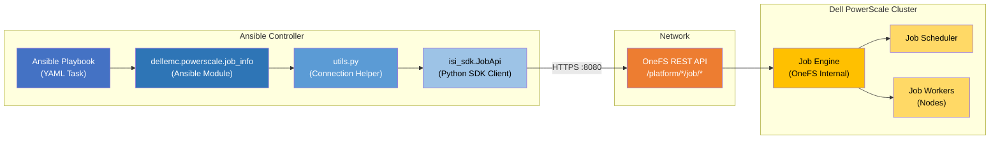

### 3.2 Module Position within Collection Hierarchy

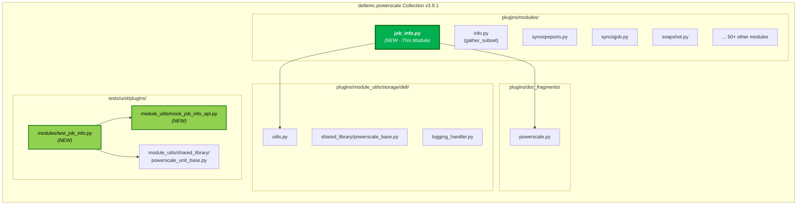

### 3.3 API Endpoint Architecture

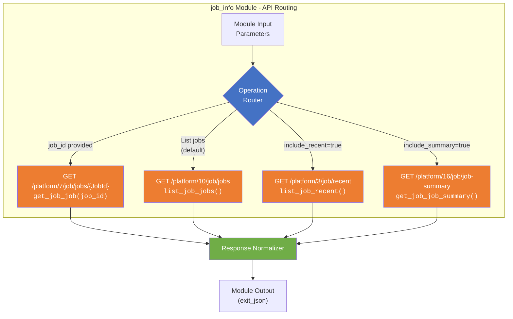

---

## 4. Detailed Design

### 4.1 Class Diagram

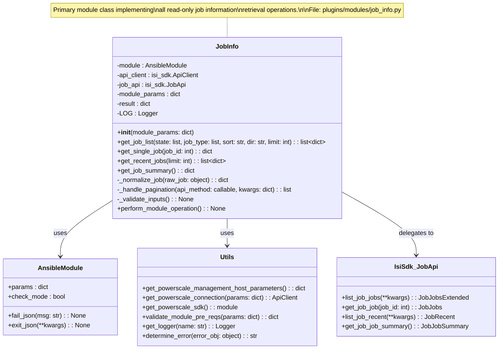

### 4.2 Input Parameters

| Parameter | Type | Required | Default | Choices / Constraints | Description |
|--------------------|--------------|----------|-----------|-----------------------------------------------------------------------------------------------------------------------|-----------------------------------------------------------------------------------------------------------------|
| `onefs_host` | `str` | Yes | - | Valid hostname or IP | IP address or FQDN of the PowerScale OneFS host. *(From common parameters)* |
| `api_user` | `str` | Yes | - | - | Username for OneFS API authentication. *(From common parameters)* |
| `api_password` | `str` | Yes | - | - | Password for OneFS API authentication. *(From common parameters, no_log=True)* |
| `verify_ssl` | `bool` | Yes | - | `true`, `false` | Whether to verify SSL certificate of the OneFS host. *(From common parameters)* |
| `port_no` | `str` | No | `"8080"` | Valid port number | Port number for OneFS API connection. *(From common parameters, no_log=True)* |
| `job_id` | `int` | No | `None` | Positive integer | The numeric ID of a specific job to retrieve. When specified, all filter/sort/limit parameters are ignored. |
| `state` | `list[str]` | No | `None` | `running`, `paused_user`, `paused_system`, `paused_policy`, `paused_priority` | Filter jobs by one or more states. Applied server-side for active jobs; applied client-side for recent jobs. |
| `job_type` | `list[str]` | No | `None` | `FlexProtect`, `FlexProtectLin`, `AutoBalance`, `AutoBalanceLin`, `MediaScan`, `SetProtectPlus`, `TreeDelete`, `SmartPools`, `MultiScan`, `Upgrade`, `ShadowStoreDelete`, `IntegrityScan`, `Collect`, `SnapshotDelete`, etc. | Filter jobs by one or more job type names. Applied as client-side post-filter on API results. |
| `sort` | `str` | No | `None` | Any valid job field name (e.g., `id`, `type`, `state`, `priority`, `start_time`, `end_time`, `progress`) | Field name to sort results by. Applied server-side via the API `sort` query parameter for active jobs. |
| `dir` | `str` | No | `"ASC"` | `ASC`, `DESC` | Sort direction. Used in conjunction with the `sort` parameter. |
| `limit` | `int` | No | `None` | Positive integer (1-10000) | Maximum number of jobs to return. Applied server-side where supported; client-side truncation as fallback. |
| `include_recent` | `bool` | No | `false` | `true`, `false` | When `true`, also retrieves recently completed jobs (succeeded, failed, cancelled) from the recent jobs endpoint.|
| `include_summary` | `bool` | No | `false` | `true`, `false` | When `true`, also retrieves the Job Engine summary/status information. |

#### 4.2.1 Parameter Mutual Exclusivity and Dependencies

| Rule | Description |
|------|-------------|
| R-01 | When `job_id` is specified, `state`, `job_type`, `sort`, `dir`, `limit`, `include_recent`, and `include_summary` are **ignored** (single-job retrieval mode). |
| R-02 | `dir` is only meaningful when `sort` is also specified. If `dir` is provided without `sort`, a warning is logged. |
| R-03 | `state` filter is applied server-side for the active jobs endpoint (`GET /platform/10/job/jobs`). For recent jobs, state filtering is applied client-side. |
| R-04 | `job_type` filtering is always applied client-side as the API does not natively support type-based filtering. |

### 4.3 Output Schema

The module returns the following top-level keys via `exit_json()`:

| Output Key | Type | Returned | Description |
|--------------------|---------------|------------------|----------------------------------------------------------------------------------|
| `changed` | `bool` | Always | Always `false` for this read-only module. |
| `jobs` | `list[dict]` | Always | List of normalized job objects matching the query criteria (may be empty). |
| `recent_jobs` | `list[dict]` | When `include_recent=true` | List of recently completed job objects. |
| `job_summary` | `dict` | When `include_summary=true` | Job Engine summary/status information. |
| `total` | `int` | Always | Total number of jobs returned in the `jobs` list. |

#### 4.3.1 Normalized Job Object Schema

Each job object within the `jobs` and `recent_jobs` lists follows this normalized schema:

| Field | Type | Description |
|--------------------|--------------|-------------------------------------------------------------------------------------------------|
| `job_id` | `int` | Unique numeric identifier of the job. |
| `job_type` | `str` | The type/name of the job (e.g., `FlexProtect`, `AutoBalance`, `TreeDelete`). |
| `state` | `str` | Current state of the job. One of: `running`, `paused_user`, `paused_system`, `paused_policy`, `paused_priority`, `cancelled_user`, `cancelled_system`, `failed`, `succeeded`, `failed_not_retried`, `unknown`. |
| `control_state` | `str` | The desired control state of the job (e.g., `run`, `pause`, `resume`). |
| `progress` | `str` | Human-readable progress description (e.g., `"Phase 2 of 4"`). |
| `impact` | `str` | Impact level of the job. One of: `Low`, `Medium`, `High`, `Paused`. |
| `priority` | `int` | Job priority (1 = highest, 10 = lowest). |
| `policy` | `str` | The impact policy associated with the job. |
| `description` | `str` | Short description of the job. |
| `human_desc` | `str` | Human-readable description providing additional context. |
| `create_time` | `int` | Unix epoch timestamp when the job was created. |
| `start_time` | `int` | Unix epoch timestamp when the job started execution. `null` if not yet started. |
| `end_time` | `int` | Unix epoch timestamp when the job ended. `null` if still running. |
| `running_time` | `int` | Total running time in seconds. |
| `current_phase` | `int` | Current phase number of the job. |
| `total_phases` | `int` | Total number of phases for the job. |
| `retries_remaining`| `int` | Number of retries remaining before the job is marked as failed. |
| `participants` | `list[int]` | List of node IDs participating in this job. |
| `paths` | `list[str]` | List of filesystem paths associated with this job. |
| `waiting_on` | `int` | ID of the job that this job is waiting on. `null` if not waiting. |
| `waiting_reason` | `str` | Reason this job is waiting. `null` if not waiting. |

#### 4.3.2 Job Summary Object Schema

| Field | Type | Description |
|----------------------|---------|-----------------------------------------------------------|
| `cluster_is_degraded`| `bool` | Whether the cluster is in a degraded state. |
| `connected` | `bool` | Whether the Job Engine is connected and operational. |
| `job_engine_enabled` | `bool` | Whether the Job Engine is enabled on the cluster. |
| `next_jid` | `int` | The next job ID that will be assigned. |
| `active_jobs` | `int` | Number of currently active (running) jobs. |
| `paused_jobs` | `int` | Number of currently paused jobs. |
| `waiting_jobs` | `int` | Number of jobs waiting to run. |
| `recent_job_count` | `int` | Number of recently completed jobs. |

### 4.4 API Endpoint Mapping

| Module Operation | SDK Method | REST Endpoint | API Version | Query Parameters Used |
|-----------------------------|---------------------------------|----------------------------------------|-------------|--------------------------------------------------|
| List active jobs | `job_api.list_job_jobs()` | `GET /platform/10/job/jobs` | v10 | `state`, `sort`, `dir`, `limit`, `resume`, `batch` |
| Get single job by ID | `job_api.get_job_job(job_id)` | `GET /platform/7/job/jobs/{JobId}` | v7 | None |
| List recently completed jobs| `job_api.list_job_recent()` | `GET /platform/3/job/recent` | v3 | `limit`, `timeout_ms` |
| Get Job Engine summary | `job_api.get_job_job_summary()` | `GET /platform/16/job/job-summary` | v16 | None |

---

## 5. Data Design

### 5.1 Input Data Model

```python
# Module argument specification
module_args = dict(
 job_id=dict(type='int', required=False),
 state=dict(
 type='list', elements='str', required=False,
 choices=['running', 'paused_user', 'paused_system',
 'paused_policy', 'paused_priority']
 ),
 job_type=dict(type='list', elements='str', required=False),
 sort=dict(type='str', required=False),
 dir=dict(
 type='str', required=False, default='ASC',
 choices=['ASC', 'DESC']
 ),
 limit=dict(type='int', required=False),
 include_recent=dict(type='bool', required=False, default=False),
 include_summary=dict(type='bool', required=False, default=False),
)
```

### 5.2 Output Data Model

```python
# Normalized output structure returned via exit_json()
output = {
 "changed": False,
 "jobs": [
 {
 "job_id": 1,
 "job_type": "FlexProtect",
 "state": "running",
 "control_state": "run",
 "progress": "Phase 2 of 4",
 "impact": "Low",
 "priority": 4,
 "policy": "LOW",
 "description": "Repair damaged files",
 "human_desc": "FlexProtect is repairing files with reduced protection.",
 "create_time": 1712448000,
 "start_time": 1712448010,
 "end_time": None,
 "running_time": 3600,
 "current_phase": 2,
 "total_phases": 4,
 "retries_remaining": 3,
 "participants": [1, 2, 3],
 "paths": ["/ifs/data"],
 "waiting_on": None,
 "waiting_reason": None
 }
 ],
 "recent_jobs": [], # Populated only when include_recent=true
 "job_summary": {}, # Populated only when include_summary=true
 "total": 1
}
```

### 5.3 Data Transformation Rules

The following transformations are applied when converting raw SDK API response objects into the normalized output schema:

| # | Raw API Field | Normalized Output Field | Transformation |
|---|----------------------|-------------------------|-------------------------------------------------------------------------------------|
| 1 | `id` | `job_id` | Direct mapping. Renamed from `id` to `job_id` to avoid Python keyword conflict and improve clarity. |
| 2 | `type` | `job_type` | Direct mapping. Renamed from `type` to `job_type` to avoid Python built-in shadowing. |
| 3 | `state` | `state` | Direct mapping. Validated against known enum values. |
| 4 | `control_state` | `control_state` | Direct mapping. |
| 5 | `progress` | `progress` | Direct mapping. Converted to string if numeric. |
| 6 | `impact` | `impact` | Direct mapping. Expected values: `Low`, `Medium`, `High`, `Paused`. |
| 7 | `priority` | `priority` | Direct mapping. Integer 1-10. |
| 8 | `policy` | `policy` | Direct mapping. |
| 9 | `description` | `description` | Direct mapping. |
| 10| `human_desc` | `human_desc` | Direct mapping. Falls back to `description` if `None`. |
| 11| `create_time` | `create_time` | Direct mapping. Unix epoch integer. |
| 12| `start_time` | `start_time` | Direct mapping. Unix epoch integer. `None` if job has not started. |
| 13| `end_time` | `end_time` | Direct mapping. Unix epoch integer. `None` if job has not ended. |
| 14| `running_time` | `running_time` | Direct mapping. Integer seconds. |
| 15| `current_phase` | `current_phase` | Direct mapping. Integer. |
| 16| `total_phases` | `total_phases` | Direct mapping. Integer. |
| 17| `retries_remaining` | `retries_remaining` | Direct mapping. Integer. |
| 18| `participants` | `participants` | Direct mapping. List of node ID integers. |
| 19| `paths` | `paths` | Direct mapping. List of filesystem path strings. |
| 20| `waiting_on` | `waiting_on` | Direct mapping. Integer job ID or `None`. |
| 21| `waiting_reason` | `waiting_reason` | Direct mapping. String or `None`. |

**Transformation Notes:**
- The SDK returns Python objects with attributes; these are converted to dictionaries using `to_dict()` when available, or manual attribute access.
- All `None` / missing fields in the API response are preserved as `None` in the output (not omitted).
- The `_normalize_job()` method encapsulates all transformation logic for a single job object, ensuring consistent output regardless of the source endpoint (active jobs, recent jobs, or single job).

### 5.4 Data Transformation Diagram

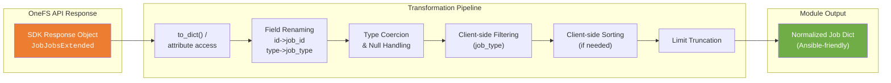

---

## 6. Flow Charts

### 6.1 Main Operation Flow

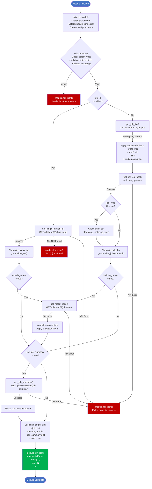

### 6.2 Pagination Handling Flow

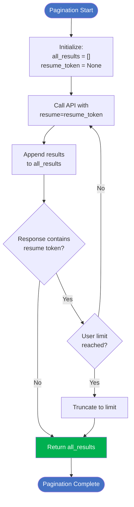

---

## 7. Sequence Diagrams

### 7.1 Scenario 1: List Jobs Filtered by State

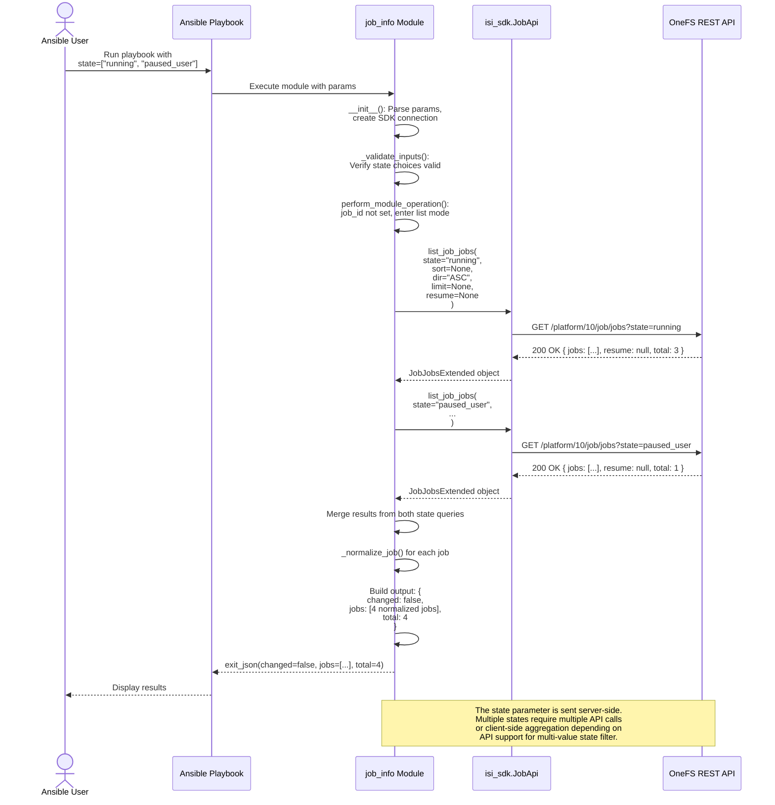

### 7.2 Scenario 2: Get Single Job by ID

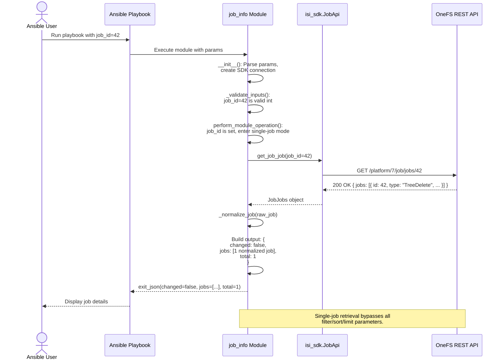

### 7.3 Scenario 3: Get Recent Completed Jobs

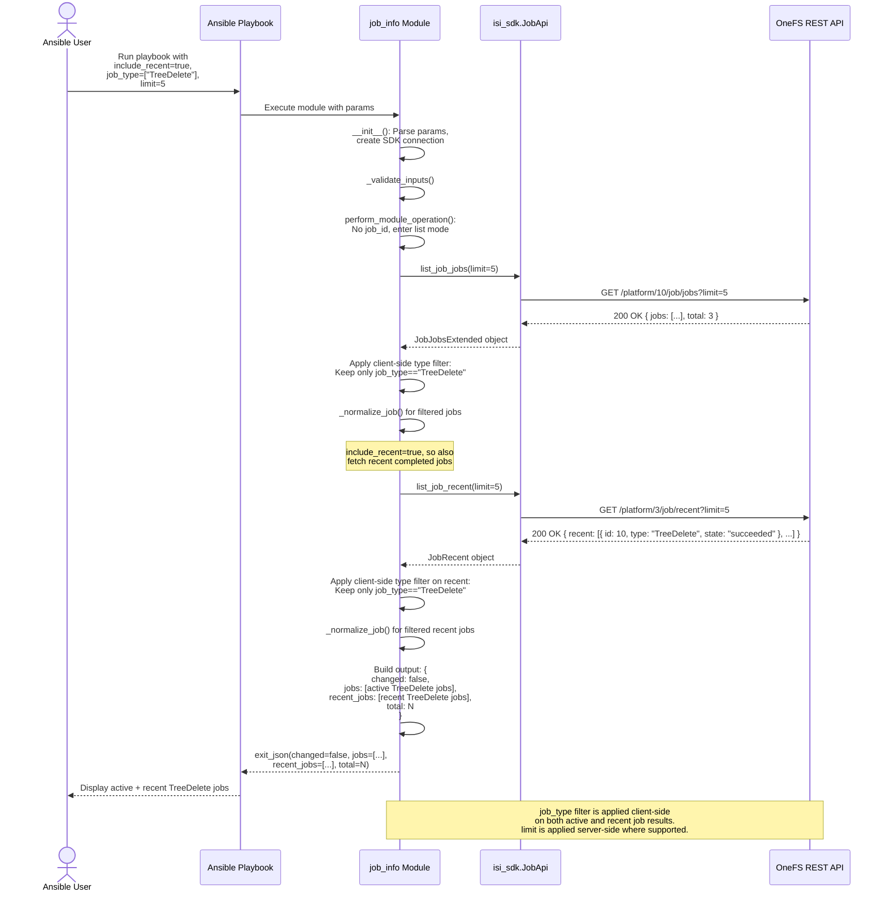

### 7.4 Scenario 4: Error Handling - API Failure

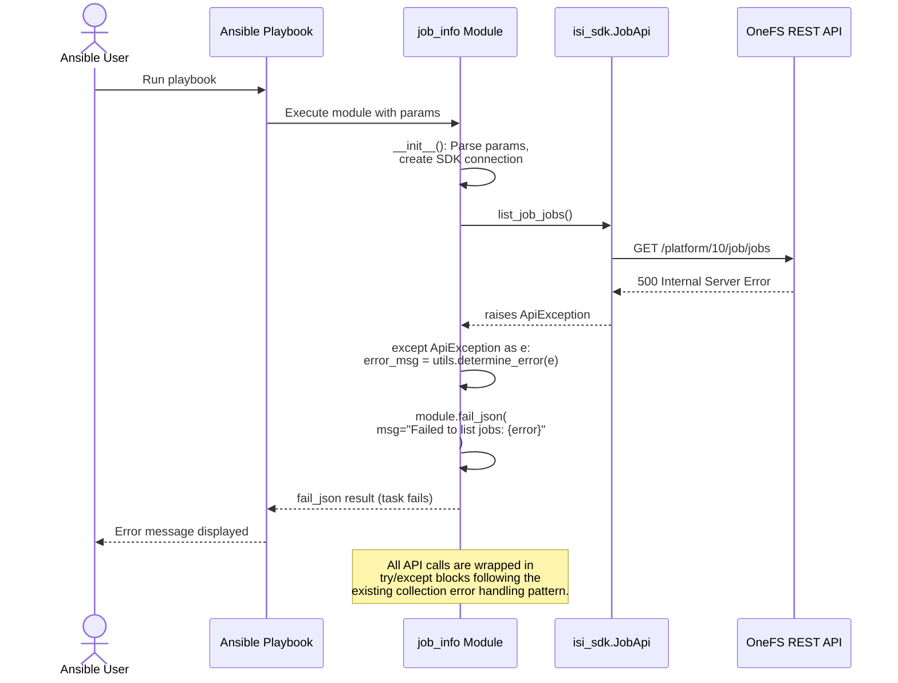

---

## 8. Implementation Plan

### 8.1 Files to Create

| # | File Path | Type | Description |
|---|---------------------------------------------------------------------------------------------|------------|-------------------------------------------------------------------------------|
| 1 | `plugins/modules/job_info.py` | Module | Primary module implementation with `JobInfo` class and all operations. |
| 2 | `tests/unit/plugins/module_utils/mock_job_info_api.py` | Test Mock | Mock data and API response fixtures for unit tests. |
| 3 | `tests/unit/plugins/modules/test_job_info.py` | Unit Test | Unit test class extending `PowerScaleUnitBase` with comprehensive test cases. |

### 8.2 Files to Modify

| # | File Path | Change Description |
|---|---------------------------------------------------------------------------------------------|-------------------------------------------------------------------------------|
| 1 | `meta/runtime.yml` | Add `job_info` module redirect entry. |
| 2 | `plugins/module_utils/storage/dell/shared_library/powerscale_base.py` | Add `job_api` lazy property for `isi_sdk.JobApi` (optional, if using base class). |
| 3 | `docs/modules/job_info.rst` or `docs/` auto-generated | Ansible documentation page (auto-generated from module docstring). |
| 4 | `changelogs/fragments/job_info.yml` | Changelog fragment for the new module. |

### 8.3 Module Implementation Structure

```python
#!/usr/bin/python
# Copyright: (c) 2026, Dell Technologies
# GNU General Public License v3.0+

"""Ansible module for gathering PowerScale Job Engine information"""
from __future__ import (absolute_import, division, print_function)
__metaclass__ = type

DOCUMENTATION = r'''...'''
EXAMPLES = r'''...'''
RETURN = r'''...'''

from ansible.module_utils.basic import AnsibleModule
from ansible_collections.dellemc.powerscale.plugins.module_utils.storage.dell \
 import utils

LOG = utils.get_logger('job_info')


class JobInfo:
 """Class for PowerScale Job Info module"""

 def __init__(self):
 """Initialize the module"""
 # Module argument spec
 self.module_params = utils.get_powerscale_management_host_parameters()
 self.module_params.update(get_job_info_parameters())

 self.module = AnsibleModule(
 argument_spec=self.module_params,
 supports_check_mode=True
 )

 # SDK setup
 self.api_client = utils.get_powerscale_connection(self.module.params)
 self.isi_sdk = utils.get_powerscale_sdk()
 self.job_api = self.isi_sdk.JobApi(self.api_client)

 def get_job_list(self, state, job_type, sort, dir, limit):
 """List jobs with optional filters"""
 ...

 def get_single_job(self, job_id):
 """Get a single job by ID"""
 ...

 def get_recent_jobs(self, limit):
 """List recently completed jobs"""
 ...

 def get_job_summary(self):
 """Get Job Engine summary"""
 ...

 def _normalize_job(self, raw_job):
 """Transform raw API job object to normalized dict"""
 ...

 def _handle_pagination(self, api_method, **kwargs):
 """Handle API pagination transparently"""
 ...

 def perform_module_operation(self):
 """Main entry point for module operation"""
 ...


def get_job_info_parameters():
 """Return module-specific argument spec"""
 return dict(
 job_id=dict(type='int', required=False),
 state=dict(type='list', elements='str', required=False,
 choices=['running', 'paused_user', 'paused_system',
 'paused_policy', 'paused_priority']),
 job_type=dict(type='list', elements='str', required=False),
 sort=dict(type='str', required=False),
 dir=dict(type='str', required=False, default='ASC',
 choices=['ASC', 'DESC']),
 limit=dict(type='int', required=False),
 include_recent=dict(type='bool', required=False, default=False),
 include_summary=dict(type='bool', required=False, default=False),
 )


def main():
 """Module entry point"""
 JobInfo().perform_module_operation()


if __name__ == '__main__':
 main()
```

### 8.4 Dependencies

| Dependency | Version | Purpose |
|---------------------------|-----------|---------------------------------------------------------|
| `ansible-core` | >= 2.15 | Ansible module framework |
| `isilon-sdk` / `isi_sdk` | >= 0.2.13 | PowerScale Python SDK providing `JobApi` class |
| `packaging` | >= 21.0 | Version comparison utilities |
| `Python` | >= 3.9 | Runtime environment |

### 8.5 Check Mode Support

The `job_info` module is inherently check-mode safe because it performs **only read operations**. The module declaration includes `supports_check_mode=True`, and no special check-mode branching is required within the module logic. When invoked with `--check`, the module executes exactly the same read operations and returns the same results.

### 8.6 Error Handling Strategy

All API calls follow the established collection pattern for error handling:

```python
def get_job_list(self, state, job_type, sort, dir_param, limit):
 """List jobs with optional filters."""
 try:
 api_response = self.job_api.list_job_jobs(
 state=state, sort=sort, dir=dir_param, limit=limit
 )
 # Process and return
 except utils.ApiException as e:
 error_msg = utils.determine_error(error_obj=e)
 error = "Failed to list jobs with error: {0}".format(error_msg)
 LOG.error(error)
 self.module.fail_json(msg=error)
 except Exception as e:
 error = "Failed to list jobs with error: {0}".format(str(e))
 LOG.error(error)
 self.module.fail_json(msg=error)
```

**Error handling rules:**
1. Every SDK API call is wrapped in `try/except`.
2. `utils.ApiException` is caught first for SDK-specific errors with `utils.determine_error()` for message extraction.
3. A generic `Exception` catch-all is included as a safety net.
4. All errors result in `module.fail_json()` with a descriptive message.
5. All errors are logged via `LOG.error()` before failing.
6. HTTP 404 on single-job retrieval produces a specific "Job {id} not found" message.

### 8.7 Pagination Handling

The `GET /platform/10/job/jobs` endpoint supports cursor-based pagination via the `resume` token. The module handles this transparently:

```python
def _handle_pagination(self, api_method, **kwargs):
 """Fetch all pages of results from a paginated API endpoint."""
 all_results = []
 resume_token = None
 user_limit = kwargs.pop('user_limit', None)

 while True:
 if resume_token:
 kwargs['resume'] = resume_token
 response = api_method(**kwargs)
 jobs = response.jobs if hasattr(response, 'jobs') else []
 all_results.extend(jobs)

 # Check if user limit reached
 if user_limit and len(all_results) >= user_limit:
 all_results = all_results[:user_limit]
 break

 # Check for more pages
 resume_token = getattr(response, 'resume', None)
 if not resume_token:
 break

 return all_results
```

---

## 9. Deployment Plan

### 9.1 Unit Test Plan

The following unit test cases are organized by functional area. All tests extend `PowerScaleUnitBase` and use mocked API responses.

#### 9.1.1 Test Cases - Job Listing

| Test ID | Test Case | Description | Expected Result |
|-----------|-------------------------------------------------------------------|----------------------------------------------------------------------------------------------|----------------------------------------------|
| UT-L-001 | `test_list_all_jobs_success` | List all active jobs with no filters applied. | Returns all active jobs, `changed=false`. |
| UT-L-002 | `test_list_jobs_filter_by_single_state` | List jobs filtered by `state=["running"]`. | Only running jobs returned. |
| UT-L-003 | `test_list_jobs_filter_by_multiple_states` | List jobs filtered by `state=["running", "paused_user"]`. | Only running and paused_user jobs returned. |
| UT-L-004 | `test_list_jobs_filter_by_single_type` | List jobs filtered by `job_type=["TreeDelete"]`. | Only TreeDelete jobs returned. |
| UT-L-005 | `test_list_jobs_filter_by_multiple_types` | List jobs filtered by `job_type=["TreeDelete", "FlexProtect"]`. | Only TreeDelete and FlexProtect jobs returned. |
| UT-L-006 | `test_list_jobs_filter_by_state_and_type` | Combined filter: `state=["running"]`, `job_type=["FlexProtect"]`. | Only running FlexProtect jobs returned. |
| UT-L-007 | `test_list_jobs_with_sort_ascending` | List jobs with `sort="priority"`, `dir="ASC"`. | Jobs sorted by priority ascending. |
| UT-L-008 | `test_list_jobs_with_sort_descending` | List jobs with `sort="start_time"`, `dir="DESC"`. | Jobs sorted by start_time descending. |
| UT-L-009 | `test_list_jobs_with_limit` | List jobs with `limit=5`. | At most 5 jobs returned. |
| UT-L-010 | `test_list_jobs_empty_result` | List jobs when no jobs exist or none match filters. | Empty `jobs` list, `total=0`. |
| UT-L-011 | `test_list_jobs_pagination` | Mock response with resume token to verify multi-page fetching. | All pages aggregated into single result. |
| UT-L-012 | `test_list_jobs_api_exception` | Mock `list_job_jobs()` raising `ApiException`. | `module.fail_json()` called with error msg. |
| UT-L-013 | `test_list_jobs_generic_exception` | Mock `list_job_jobs()` raising generic `Exception`. | `module.fail_json()` called with error msg. |

#### 9.1.2 Test Cases - Single Job Retrieval

| Test ID | Test Case | Description | Expected Result |
|-----------|-------------------------------------------------------------------|----------------------------------------------------------------------------------------------|----------------------------------------------|
| UT-S-001 | `test_get_single_job_success` | Get a specific job by valid `job_id`. | Returns single job, `total=1`. |
| UT-S-002 | `test_get_single_job_not_found` | Get a job with non-existent `job_id`. | `module.fail_json()` with "not found" msg. |
| UT-S-003 | `test_get_single_job_api_exception` | Mock `get_job_job()` raising `ApiException`. | `module.fail_json()` called with error msg. |
| UT-S-004 | `test_get_single_job_ignores_filters` | Provide `job_id` along with `state` and `job_type` filters. | Filters ignored; single job returned. |

#### 9.1.3 Test Cases - Recent Jobs

| Test ID | Test Case | Description | Expected Result |
|-----------|-------------------------------------------------------------------|----------------------------------------------------------------------------------------------|----------------------------------------------|
| UT-R-001 | `test_include_recent_jobs_success` | Fetch with `include_recent=true`. | `recent_jobs` list populated. |
| UT-R-002 | `test_include_recent_jobs_with_type_filter` | Fetch with `include_recent=true` and `job_type=["TreeDelete"]`. | Only TreeDelete entries in `recent_jobs`. |
| UT-R-003 | `test_include_recent_jobs_with_limit` | Fetch with `include_recent=true` and `limit=3`. | At most 3 recent jobs returned. |
| UT-R-004 | `test_include_recent_jobs_api_exception` | Mock `list_job_recent()` raising `ApiException`. | `module.fail_json()` called with error msg. |
| UT-R-005 | `test_include_recent_false_by_default` | Default invocation without `include_recent`. | `recent_jobs` key is empty list. |

#### 9.1.4 Test Cases - Job Summary

| Test ID | Test Case | Description | Expected Result |
|-----------|-------------------------------------------------------------------|----------------------------------------------------------------------------------------------|----------------------------------------------|
| UT-SM-001 | `test_include_summary_success` | Fetch with `include_summary=true`. | `job_summary` dict populated. |
| UT-SM-002 | `test_include_summary_api_exception` | Mock `get_job_job_summary()` raising `ApiException`. | `module.fail_json()` called with error msg. |
| UT-SM-003 | `test_include_summary_false_by_default` | Default invocation without `include_summary`. | `job_summary` key is empty dict. |

#### 9.1.5 Test Cases - Data Normalization

| Test ID | Test Case | Description | Expected Result |
|-----------|-------------------------------------------------------------------|----------------------------------------------------------------------------------------------|----------------------------------------------|
| UT-N-001 | `test_normalize_job_all_fields_present` | Normalize a job object with all fields populated. | All fields mapped correctly. |
| UT-N-002 | `test_normalize_job_null_optional_fields` | Normalize a job where `end_time`, `waiting_on` are `None`. | `None` values preserved, no KeyError. |
| UT-N-003 | `test_normalize_job_field_renaming` | Verify `id` -> `job_id` and `type` -> `job_type` renaming. | Output uses `job_id` and `job_type` keys. |
| UT-N-004 | `test_normalize_job_from_recent_endpoint` | Normalize a job from the recent endpoint (may have different field set). | Consistent schema with active job output. |

#### 9.1.6 Test Cases - Input Validation

| Test ID | Test Case | Description | Expected Result |
|-----------|-------------------------------------------------------------------|----------------------------------------------------------------------------------------------|----------------------------------------------|
| UT-V-001 | `test_invalid_state_choice` | Provide an invalid state value not in choices. | AnsibleModule raises validation error. |
| UT-V-002 | `test_invalid_dir_choice` | Provide `dir="INVALID"`. | AnsibleModule raises validation error. |
| UT-V-003 | `test_negative_limit` | Provide `limit=-1`. | `module.fail_json()` or validation error. |
| UT-V-004 | `test_check_mode` | Run module with `check_mode=True`. | Same results as normal mode. |

### 9.2 Integration / Functional Test Plan

Integration tests require a live PowerScale cluster and are executed as part of the FT (Functional Test) pipeline.

| FT ID | Test Case | Pre-condition | Steps | Expected Result |
|----------|------------------------------------------|-----------------------------------------|----------------------------------------------------------------------|----------------------------------------------|
| FT-001 | List all active jobs | At least one job is running or paused | Invoke module with no filters | All active jobs returned with correct schema |
| FT-002 | Filter by state on live cluster | Jobs in running and paused_user states | Invoke with `state=["running"]` | Only running jobs returned |
| FT-003 | Filter by type on live cluster | Jobs of known types exist | Invoke with `job_type=["SmartPools"]` | Only SmartPools jobs returned |
| FT-004 | Get specific job by ID | Known job ID exists | Invoke with `job_id=<known_id>` | Single job details returned |
| FT-005 | Get recent completed jobs | Jobs have completed recently | Invoke with `include_recent=true` | Recent jobs list populated |
| FT-006 | Get job engine summary | Cluster is operational | Invoke with `include_summary=true` | Summary dict populated with engine status |
| FT-007 | Sort and limit | Multiple jobs exist | Invoke with `sort="priority"`, `dir="DESC"`, `limit=3` | 3 jobs returned sorted by priority desc |
| FT-008 | Idempotency check | Any cluster state | Invoke same module params twice | Same results both times, `changed=false` |
| FT-009 | Invalid credentials | Invalid api_user or api_password | Invoke with wrong credentials | Task fails with authentication error |
| FT-010 | Non-existent job ID | Job ID 999999 does not exist | Invoke with `job_id=999999` | Task fails with "not found" error |

### 9.3 Documentation

The module will include standard Ansible documentation sections:

| Section | Location | Description |
|------------------|--------------------------------------------|-------------------------------------------------------------------|
| `DOCUMENTATION` | In-module docstring | Full parameter documentation with types, choices, and descriptions |
| `EXAMPLES` | In-module docstring | At least 6 playbook task examples covering all major use cases |
| `RETURN` | In-module docstring | Complete return value documentation for all output keys |
| RST page | `docs/modules/job_info.rst` (auto-gen) | Generated documentation page for Ansible Galaxy / ReadTheDocs |
| Changelog | `changelogs/fragments/job_info.yml` | Changelog entry for the release notes |

---

## 10. DAR (Decision Analysis and Resolution)

### 10.1 Decision Statement

**Decision:** Should the PowerScale job information retrieval capability be implemented as a **separate, focused `job_info` module** or as an **additional `gather_subset` within the existing `info.py` module**?

### 10.2 Background

The `dellemc.powerscale` collection currently has two patterns for information retrieval:

1. **Centralized `info.py` module** - Uses `gather_subset` to query many resource types (NFS exports, SMB shares, users, groups, etc.) from a single module. Contains 4000+ lines and supports dozens of subsets.
2. **Focused per-resource modules** - Modules like `synciqreports.py` that retrieve information about a specific resource type with dedicated parameters and filtering.

### 10.3 Alternatives Considered

| ID | Alternative | Description |
|------|----------------------------------------------------------------------|-----------------------------------------------------------------------------------------------------------|
| ALT-1| **Separate `job_info` module** (focused, standalone) | A new `plugins/modules/job_info.py` with dedicated parameters for job filtering, sorting, and all four endpoints. |
| ALT-2| **Add `gather_subset: job` to existing `info.py`** | Add a new subset to the existing info module that fetches jobs alongside other resources. |
| ALT-3| **Extend `synciqjob.py` to include read-only operations** | Reuse the existing SyncIQ job module pattern, adding a read mode for Job Engine jobs. |

### 10.4 Evaluation Criteria

| Criterion | Weight | Description |
|------------------------|--------|-------------------------------------------------------------------------------------------|
| **Complexity** | 25% | Implementation and maintenance complexity. Lower is better. |
| **Testability** | 25% | Ease of unit testing, isolation, and achieving >90% coverage. |
| **User Experience** | 25% | Clarity of parameters, ease of use in playbooks, discoverability. |
| **Codebase Consistency** | 15% | Alignment with existing collection patterns and conventions. |
| **Extensibility** | 10% | Ability to add future features (e.g., job control/management) without major refactoring. |

### 10.5 Evaluation Matrix

| Criterion | Weight | ALT-1: Separate `job_info` | ALT-2: `gather_subset` in `info.py` | ALT-3: Extend `synciqjob.py` |
|------------------------|--------|-----------------------------|--------------------------------------|-------------------------------|
| **Complexity** | 25% | **9/10** - Clean, isolated code. Single responsibility. ~300-400 lines. | 5/10 - `info.py` is already 4000+ lines. Adding complex filtering/sorting increases maintenance burden. | 4/10 - Mixing SyncIQ jobs with Job Engine jobs creates confusion. Different API endpoints entirely. |
| **Testability** | 25% | **9/10** - Isolated test file with focused mocks. Easy to achieve >90% coverage. | 6/10 - Test file for `info.py` is already very large. Adding job tests increases complexity. | 5/10 - Must test both existing SyncIQ functionality and new Job Engine functionality. |
| **User Experience** | 25% | **9/10** - Dedicated parameters (`state`, `job_type`, `sort`, `limit`). Clear module name. Self-documenting. | 6/10 - Filters must use generic filter syntax. Limited sorting support. Users must know `gather_subset: job`. | 3/10 - Confusing to find Job Engine info under a SyncIQ-named module. |
| **Codebase Consistency** | 15% | **8/10** - Matches `synciqreports.py` pattern (focused info module). Follows trend of newer modules. | 8/10 - Matches the centralized `info.py` pattern used for other resources. | 3/10 - Violates separation of concerns. SyncIQ and Job Engine are distinct subsystems. |
| **Extensibility** | 10% | **9/10** - Easy to add `job.py` management module later. Clean API surface for future job control features. | 5/10 - Cannot easily evolve into a management module. | 6/10 - Already a management module, but wrong subsystem. |
| **Weighted Score** | 100% | **8.95** | **6.15** | **3.85** |

### 10.6 Scoring Calculation

**ALT-1 (Separate `job_info`):**
(9 x 0.25) + (9 x 0.25) + (9 x 0.25) + (8 x 0.15) + (9 x 0.10) = 2.25 + 2.25 + 2.25 + 1.20 + 0.90 = **8.85**

**ALT-2 (`gather_subset` in `info.py`):**
(5 x 0.25) + (6 x 0.25) + (6 x 0.25) + (8 x 0.15) + (5 x 0.10) = 1.25 + 1.50 + 1.50 + 1.20 + 0.50 = **5.95**

**ALT-3 (Extend `synciqjob.py`):**
(4 x 0.25) + (5 x 0.25) + (3 x 0.25) + (3 x 0.15) + (6 x 0.10) = 1.00 + 1.25 + 0.75 + 0.45 + 0.60 = **4.05**

### 10.7 Resolution

**Selected: ALT-1 - Separate focused `job_info` module**

**Rationale:**

ALT-1 scored highest across all criteria with a weighted score of **8.85** versus 5.95 (ALT-2) and 4.05 (ALT-3). The key deciding factors are:

1. **Single Responsibility**: A dedicated module keeps the codebase clean and maintainable. The existing `info.py` is already over 4,000 lines; adding complex job filtering would further increase its maintenance burden.

2. **Superior User Experience**: Dedicated parameters (`state`, `job_type`, `sort`, `dir`, `limit`) provide a clear, self-documenting interface. Users do not need to learn the generic filter syntax or know which `gather_subset` value to use.

3. **Testability**: An isolated module means isolated tests with focused mocks, making it straightforward to achieve >90% code coverage and maintain test quality.

4. **Future Extensibility**: A separate `job_info` module pairs naturally with a future `job` management module (for pausing, resuming, cancelling jobs) under the same epic. This follows the established collection pattern of `resource_info` (read) + `resource` (manage).

5. **Pattern Alignment**: This follows the trend set by newer collection modules like `synciqreports.py`, where focused modules provide better filtering and richer parameter sets than the centralized `info.py`.

**Decision approved by:** Architecture Review Board
**Decision date:** 2026-04-07

---

## Appendix A: Playbook Examples

### A.1 List All Running Jobs

```yaml
- name: List all running jobs on PowerScale
 dellemc.powerscale.job_info:
 onefs_host: "{{ onefs_host }}"
 api_user: "{{ api_user }}"
 api_password: "{{ api_password }}"
 verify_ssl: "{{ verify_ssl }}"
 state:
 - running
 register: running_jobs

- name: Display running jobs
 ansible.builtin.debug:
 var: running_jobs.jobs
```

### A.2 Get a Specific Job by ID

```yaml
- name: Get details of job 42
 dellemc.powerscale.job_info:
 onefs_host: "{{ onefs_host }}"
 api_user: "{{ api_user }}"
 api_password: "{{ api_password }}"
 verify_ssl: "{{ verify_ssl }}"
 job_id: 42
 register: job_details
```

### A.3 Filter by State and Type with Sorting

```yaml
- name: Get running FlexProtect jobs sorted by priority
 dellemc.powerscale.job_info:
 onefs_host: "{{ onefs_host }}"
 api_user: "{{ api_user }}"
 api_password: "{{ api_password }}"
 verify_ssl: "{{ verify_ssl }}"
 state:
 - running
 - paused_user
 job_type:
 - FlexProtect
 - FlexProtectLin
 sort: priority
 dir: DESC
 limit: 10
 register: flex_jobs
```

### A.4 Get Recent Completed Jobs and Engine Summary

```yaml
- name: Get active and recent jobs with engine summary
 dellemc.powerscale.job_info:
 onefs_host: "{{ onefs_host }}"
 api_user: "{{ api_user }}"
 api_password: "{{ api_password }}"
 verify_ssl: "{{ verify_ssl }}"
 include_recent: true
 include_summary: true
 register: full_job_info

- name: Show job engine status
 ansible.builtin.debug:
 var: full_job_info.job_summary

- name: Show recently completed jobs
 ansible.builtin.debug:
 var: full_job_info.recent_jobs
```

---

## Appendix B: Revision History

| Version | Date | Author | Changes |
|---------|------------|---------------|-------------------------------|
| 1.0 | 2026-04-07 | Shrinidhi Rao | Initial design document |

---

*This document is the intellectual property of Dell Technologies. Confidential and proprietary.*
