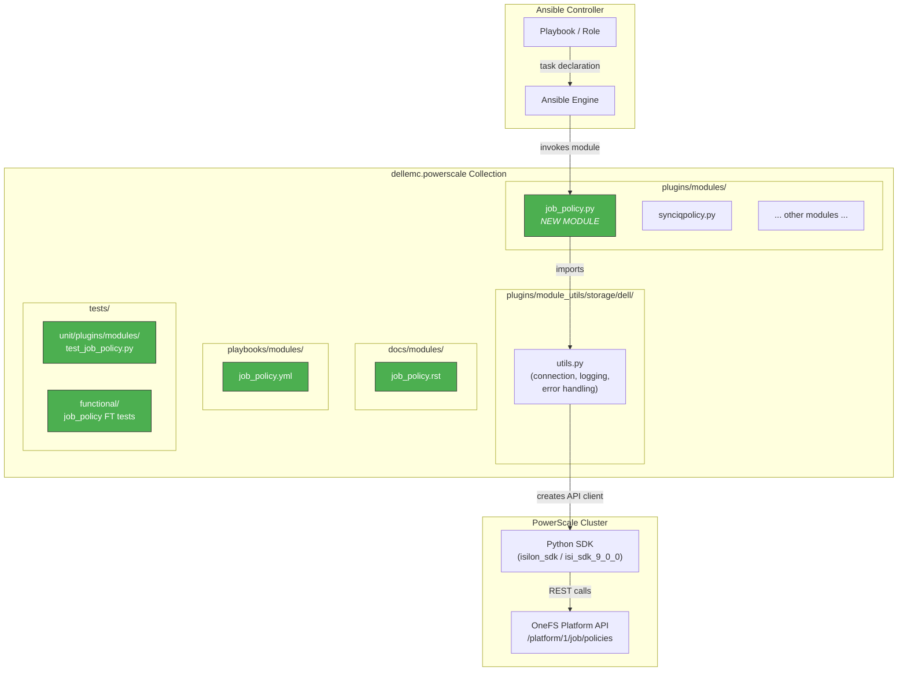
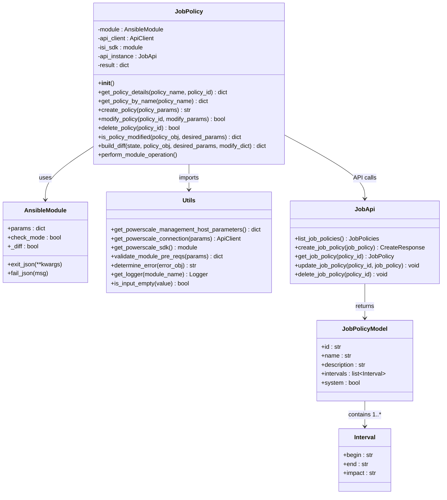
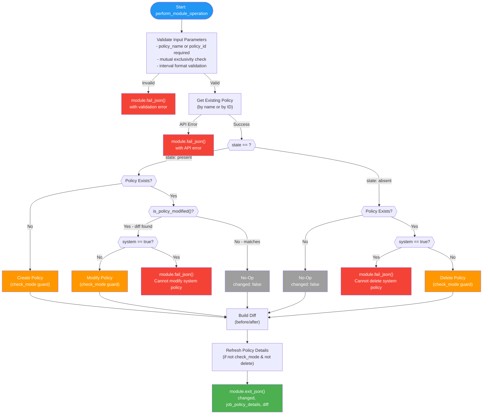
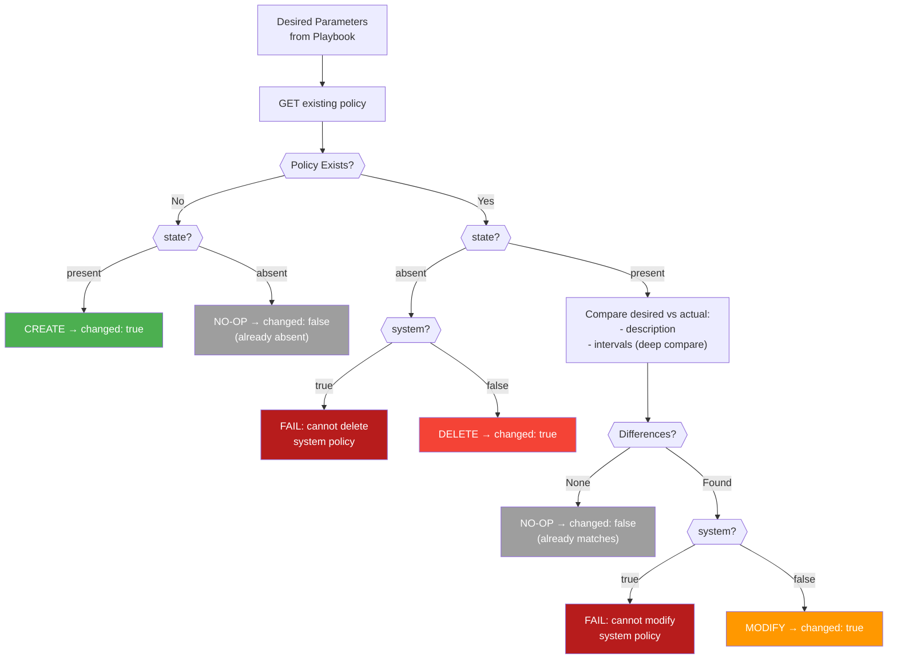
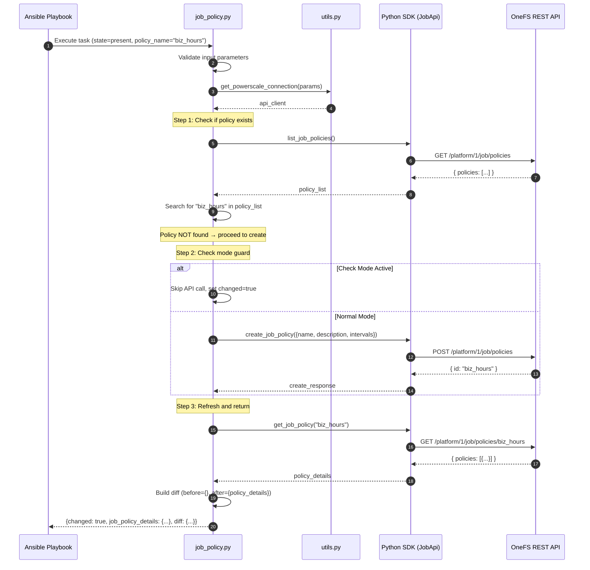
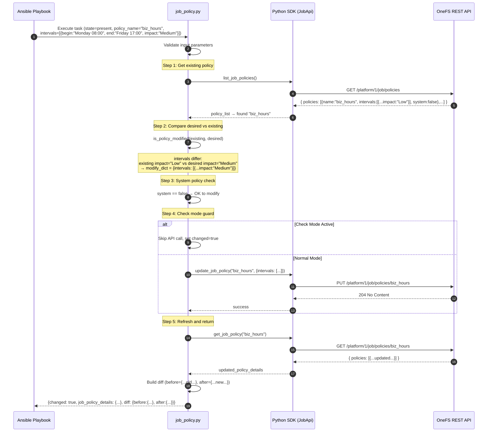
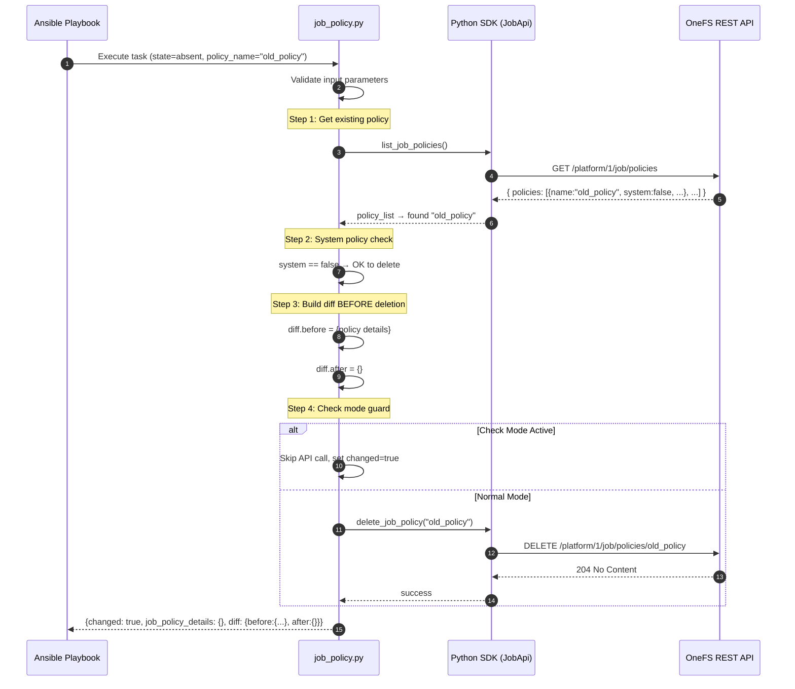
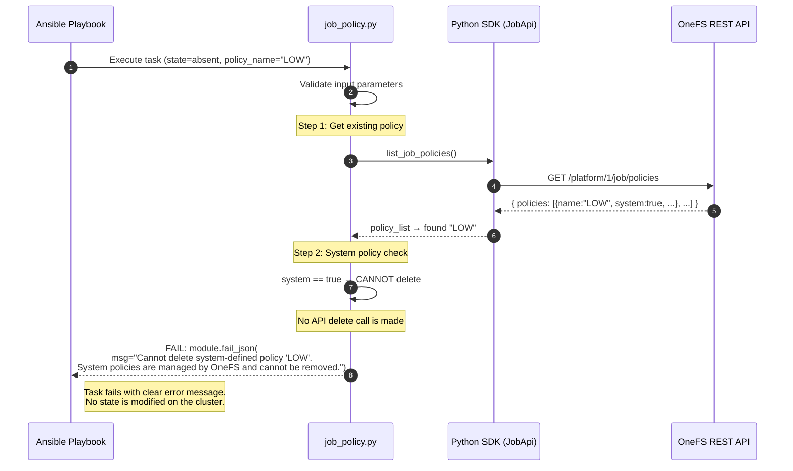
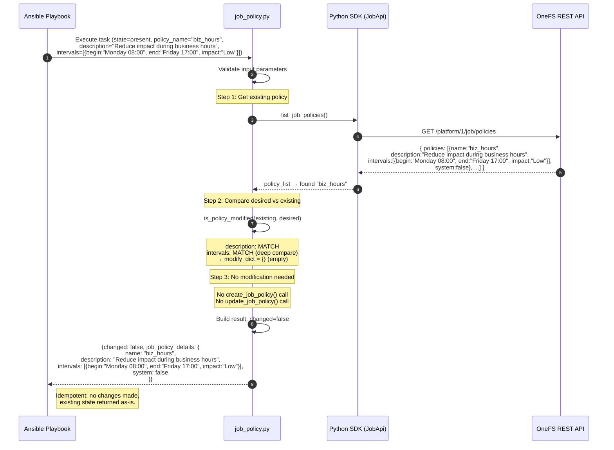

# Design Document: `dellemc.powerscale.job_policy` Ansible Module

| Field | Value |
|------------------|-----------------------------------------------------------------------|
| **Version** | 1.0 |
| **Date** | 2026-04-07 |
| **Author** | Shrinidhi Rao |
| **Collection** | `dellemc.powerscale` v3.9.1 |
| **Module Name** | `job_policy` |

---

## Table of Contents

1. [Executive Summary](#1-executive-summary)
2. [Requirements](#2-requirements)
3. [Architecture Design](#3-architecture-design)
4. [Detailed Design](#4-detailed-design)
5. [Data Design](#5-data-design)
6. [Flow Charts](#6-flow-charts)
7. [Sequence Diagrams](#7-sequence-diagrams)
8. [Implementation Plan](#8-implementation-plan)
9. [Deployment Plan](#9-deployment-plan)
10. [Decision & Assumption Record (DAR)](#10-decision--assumption-record-dar)

---

## 1. Executive Summary

This document describes the design of the `dellemc.powerscale.job_policy` Ansible module, which provides declarative CRUD (Create, Read, Update, Delete) management of **job impact policies** on Dell PowerScale OneFS clusters.

Job impact policies define time-based schedules that control the performance impact level (Low, Medium, High, or Paused) of background system jobs (e.g., FlexProtect, SmartPools, Deduplication). Each policy contains one or more **intervals** specifying a day-of-week/time window and an associated impact level. By managing these policies through Ansible, administrators gain infrastructure-as-code control over how aggressively background jobs consume cluster resources across different time periods.

This module follows the established patterns of the `dellemc.powerscale` collection (v3.9.1), including full support for idempotency, check mode, and diff mode. The closest existing module in terms of design pattern is `synciqpolicy.py`, which serves as the reference implementation for CRUD lifecycle, error handling, and diff/check-mode behavior.

### Key Capabilities

- **List/Get** all configured job impact policies or a specific policy by name or ID
- **Create** a new job impact policy with named intervals
- **Modify** an existing policy's description and/or intervals
- **Delete** a user-defined policy (system policies are protected)
- Full **idempotency** -- no changes when desired state matches current state
- Full **check mode** -- report what would change without making API calls
- Full **diff mode** -- structured before/after output for change auditing

### Out of Scope

- Job instance control (starting, stopping, or monitoring individual job runs)
- Job scheduling (assigning policies to specific job types)
- Bulk policy assignment across multiple job types
- Historical job reporting or analytics

---

## 2. Requirements

### 2.1 Functional Requirements

| ID | Requirement | Description |
|------|----------------------------|------------------------------------------------------------------------------------------------------------------|
| FR-1 | Policy Discovery | List all configured job impact policies on the target PowerScale cluster. No state is modified. |
| FR-2 | Policy Creation | Create a new job impact policy with a unique name, optional description, and one or more impact intervals. |
| FR-3 | Policy Modification | Modify an existing policy's description and/or intervals. Support partial updates. |
| FR-4 | Policy Deletion | Delete a user-defined impact policy by name or ID. System-defined policies must not be deletable. |
| FR-5 | Idempotent Operations | All create/modify/delete operations must be idempotent. Repeated runs with the same parameters produce no change.|
| FR-6 | Check Mode Support | When Ansible check mode is active, report intended changes without executing any API mutations. |
| FR-7 | Diff Mode Support | When Ansible diff mode is active, return structured `before` and `after` dicts showing exact attribute changes. |
| FR-8 | System Policy Protection | Prevent deletion or modification of system-defined policies. Fail gracefully with a descriptive error message. |

### 2.2 Acceptance Criteria

| ID | Criterion | Description |
|------|------------------------------------|----------------------------------------------------------------------------------------------------------------------------------------------------------|
| AC-1 | **List Policies** | When `state: present` is used with only connection params (no `policy_name` or `policy_id`), the module returns all configured policies. No state is modified. `changed: false`. |
| AC-2 | **Create (Idempotent)** | When `state: present` and the policy does not exist, the module creates it. If the policy already exists with identical attributes, the module reports `changed: false` (no-op). |
| AC-3 | **Modify** | When `state: present` and the policy exists but attributes differ from the desired state, the module updates the policy. If all attributes already match, `changed: false`. |
| AC-4 | **Delete** | When `state: absent` and the policy exists, the module deletes it. If the policy does not exist, the module reports `changed: false` (no-op). |
| AC-5 | **Check Mode** | In check mode (`--check`), no changes are applied to the cluster. The module output reflects the intended change with correct `changed` status. |
| AC-6 | **Diff Mode** | In diff mode (`--diff`), the module output includes a `diff` key with `before` and `after` dictionaries clearly showing attribute changes. |

### 2.3 Non-Functional Requirements

| ID | Requirement | Description |
|-------|--------------------|-------------------------------------------------------------------------------------------------------|
| NFR-1 | Performance | Single API call for get, create, update, or delete. No unnecessary list-all calls. |
| NFR-2 | Error Handling | All API errors surfaced via `module.fail_json()` with human-readable messages. |
| NFR-3 | Logging | Debug and info-level logging via the collection's `utils.get_logger()` framework. |
| NFR-4 | Compatibility | Support OneFS API platform version 1 (`/platform/1/job/policies`). |
| NFR-5 | Security | No sensitive data in logs or module output. Connection parameters handled by the collection framework.|

---

## 3. Architecture Design

### 3.1 Component Architecture

The following diagram shows where the `job_policy` module sits within the `dellemc.powerscale` collection architecture:



### 3.2 Module Position within Collection

```
dellemc/powerscale/
├── plugins/
│ ├── modules/
│ │ ├── job_policy.py ← NEW: Main module file
│ │ ├── synciqpolicy.py ← Reference pattern
│ │ └── ...
│ └── module_utils/
│ └── storage/dell/
│ └── utils.py ← Shared utilities (connection, logging, error)
├── docs/
│ └── modules/
│ └── job_policy.rst ← NEW: Auto-generated documentation
├── playbooks/
│ └── modules/
│ └── job_policy.yml ← NEW: Example playbook
├── tests/
│ └── unit/
│ └── plugins/
│ └── modules/
│ └── test_job_policy.py ← NEW: Unit tests
└── ...
```

---

## 4. Detailed Design

### 4.1 Class Diagram



### 4.2 Input Parameters

| Parameter | Type | Required | Choices / Format | Default | Description |
|----------------|-------------|-----------------------------|---------------------------------------------|-----------|--------------------------------------------------------------------------------------------------------------|
| `policy_name` | `str` | Yes (create/modify by name) | — | — | The unique name of the job impact policy. Required for creation. For modify/delete, either `policy_name` or `policy_id` is required. Mutually exclusive with `policy_id`. |
| `policy_id` | `str` | No (modify/delete by ID) | — | — | The system-assigned ID of the policy. Used for targeted modify/delete operations. Mutually exclusive with `policy_name`. |
| `description` | `str` | No | — | `""` | Human-readable description of the policy's purpose. |
| `intervals` | `list[dict]`| No | See [Interval Sub-options](#interval-sub-options) | — | List of time-based impact intervals. Each interval defines a window and its impact level. |
| `state` | `str` | Yes | `present`, `absent` | — | Desired state. `present` = create or modify. `absent` = delete. |

#### Interval Sub-options

Each element in the `intervals` list is a dictionary with the following keys:

| Sub-parameter | Type | Required | Choices / Format | Description |
|---------------|--------|----------|-------------------------------------------------------|-------------------------------------------------------------------|
| `begin` | `str` | Yes | `"WWWW HH:MM"` (e.g., `"Monday 08:00"`) | Start of the impact window. Day-of-week (full name) + 24h time. |
| `end` | `str` | Yes | `"WWWW HH:MM"` (e.g., `"Friday 17:00"`) | End of the impact window. Day-of-week (full name) + 24h time. |
| `impact` | `str` | Yes | `Low`, `Medium`, `High`, `Paused` | The impact level for jobs running during this interval. |

#### Connection Parameters (inherited from `powerscale` fragment)

| Parameter | Type | Required | Description |
|-----------------|--------|----------|----------------------------------------------|
| `onefs_host` | `str` | Yes | IP address or FQDN of the PowerScale cluster |
| `api_user` | `str` | Yes | Username for OneFS API authentication |
| `api_password` | `str` | Yes | Password for OneFS API authentication |
| `verify_ssl` | `bool` | No | Whether to verify SSL certificates |
| `port_no` | `int` | No | Port number for the OneFS API (default: 8080)|

#### Module Attributes

```yaml
attributes:
 check_mode:
 description: Supports check mode. Reports changes without applying them.
 support: full
 diff_mode:
 description: Supports diff mode. Returns before/after state dictionaries.
 support: full
```

### 4.3 Output Schema

```yaml
# Return values
changed:
 description: Whether the module made any changes to the cluster.
 type: bool
 returned: always
 sample: true

job_policy_details:
 description: Details of the job impact policy after the operation.
 type: dict
 returned: When policy exists (state=present) or was just deleted (state=absent, empty dict)
 contains:
 id:
 description: The unique system-assigned policy ID.
 type: str
 sample: "my_custom_policy"
 name:
 description: The name of the policy.
 type: str
 sample: "Business Hours Low Impact"
 description:
 description: Description of the policy.
 type: str
 sample: "Reduce job impact during business hours"
 intervals:
 description: List of impact intervals.
 type: list
 elements: dict
 contains:
 begin:
 description: Start of the interval window.
 type: str
 sample: "Monday 08:00"
 end:
 description: End of the interval window.
 type: str
 sample: "Friday 17:00"
 impact:
 description: Impact level during this interval.
 type: str
 sample: "Low"
 system:
 description: Whether this is a system-defined (built-in) policy.
 type: bool
 sample: false

diff:
 description: Difference between before and after states (only in diff mode).
 type: dict
 returned: When diff mode is active
 contains:
 before:
 description: Policy state before the operation.
 type: dict
 after:
 description: Policy state after the operation.
 type: dict
```

### 4.4 API Endpoint Mapping

| Module Operation | HTTP Method | API Endpoint | SDK Method | Request Body | Response |
|------------------------|-------------|----------------------------------------|-------------------------|---------------------------------------|------------------------------|
| Get all policies | `GET` | `/platform/1/job/policies` | `list_job_policies()` | — | `{ policies: [...] }` |
| Get single policy | `GET` | `/platform/1/job/policies/{PolicyId}` | `get_job_policy(id)` | — | `{ policies: [{...}] }` |
| Create policy | `POST` | `/platform/1/job/policies` | `create_job_policy()` | `{ name, description, intervals[] }` | `{ id: "<string>" }` |
| Modify policy | `PUT` | `/platform/1/job/policies/{PolicyId}` | `update_job_policy(id)` | `{ description, intervals[] }` | — (204 No Content) |
| Delete policy | `DELETE` | `/platform/1/job/policies/{PolicyId}` | `delete_job_policy(id)` | — | — (204 No Content) |

### 4.5 Playbook Examples

#### Create a Job Impact Policy

```yaml
- name: Create job impact policy for business hours
 dellemc.powerscale.job_policy:
 onefs_host: "{{ onefs_host }}"
 verify_ssl: "{{ verify_ssl }}"
 api_user: "{{ api_user }}"
 api_password: "{{ api_password }}"
 policy_name: "business_hours_low_impact"
 description: "Reduce job impact during business hours Mon-Fri"
 intervals:
 - begin: "Monday 08:00"
 end: "Friday 17:00"
 impact: "Low"
 state: "present"
```

#### Modify a Policy's Intervals

```yaml
- name: Update policy to add weekend high-impact window
 dellemc.powerscale.job_policy:
 onefs_host: "{{ onefs_host }}"
 verify_ssl: "{{ verify_ssl }}"
 api_user: "{{ api_user }}"
 api_password: "{{ api_password }}"
 policy_name: "business_hours_low_impact"
 intervals:
 - begin: "Monday 08:00"
 end: "Friday 17:00"
 impact: "Low"
 - begin: "Saturday 00:00"
 end: "Sunday 23:59"
 impact: "High"
 state: "present"
```

#### Delete a Policy

```yaml
- name: Remove obsolete job impact policy
 dellemc.powerscale.job_policy:
 onefs_host: "{{ onefs_host }}"
 verify_ssl: "{{ verify_ssl }}"
 api_user: "{{ api_user }}"
 api_password: "{{ api_password }}"
 policy_name: "old_maintenance_window"
 state: "absent"
```

#### Get Policy Details

```yaml
- name: Get details of a specific policy
 dellemc.powerscale.job_policy:
 onefs_host: "{{ onefs_host }}"
 verify_ssl: "{{ verify_ssl }}"
 api_user: "{{ api_user }}"
 api_password: "{{ api_password }}"
 policy_name: "business_hours_low_impact"
 state: "present"
 register: policy_result

- name: Display policy details
 ansible.builtin.debug:
 var: policy_result.job_policy_details
```

#### Delete by Policy ID

```yaml
- name: Delete policy by ID
 dellemc.powerscale.job_policy:
 onefs_host: "{{ onefs_host }}"
 verify_ssl: "{{ verify_ssl }}"
 api_user: "{{ api_user }}"
 api_password: "{{ api_password }}"
 policy_id: "custom_policy_123"
 state: "absent"
```

---

## 5. Data Design

### 5.1 Input Data Model

#### Intervals Format

The `intervals` parameter accepts a list of dictionaries, each representing a time-based impact window:

```yaml
intervals:
 - begin: "Monday 08:00" # Day-of-week (full name) + space + HH:MM (24-hour)
 end: "Friday 17:00" # Same format
 impact: "Low" # One of: Low, Medium, High, Paused
 - begin: "Saturday 00:00"
 end: "Sunday 23:59"
 impact: "High"
```

#### API Wire Format (JSON)

The intervals are sent to the OneFS API in the following format:

```json
{
 "name": "business_hours_low_impact",
 "description": "Reduce job impact during business hours Mon-Fri",
 "intervals": [
 {
 "begin": "Monday 08:00",
 "end": "Friday 17:00",
 "impact": "Low"
 },
 {
 "begin": "Saturday 00:00",
 "end": "Sunday 23:59",
 "impact": "High"
 }
 ]
}
```

### 5.2 Output Data Model

#### Successful Create/Modify/Get

```json
{
 "changed": true,
 "job_policy_details": {
 "id": "business_hours_low_impact",
 "name": "business_hours_low_impact",
 "description": "Reduce job impact during business hours Mon-Fri",
 "intervals": [
 {
 "begin": "Monday 08:00",
 "end": "Friday 17:00",
 "impact": "Low"
 },
 {
 "begin": "Saturday 00:00",
 "end": "Sunday 23:59",
 "impact": "High"
 }
 ],
 "system": false
 },
 "diff": {
 "before": {},
 "after": {
 "id": "business_hours_low_impact",
 "name": "business_hours_low_impact",
 "description": "Reduce job impact during business hours Mon-Fri",
 "intervals": [
 {
 "begin": "Monday 08:00",
 "end": "Friday 17:00",
 "impact": "Low"
 }
 ],
 "system": false
 }
 }
}
```

#### Successful Delete

```json
{
 "changed": true,
 "job_policy_details": {},
 "diff": {
 "before": {
 "id": "business_hours_low_impact",
 "name": "business_hours_low_impact",
 "description": "Reduce job impact during business hours Mon-Fri",
 "intervals": [
 {
 "begin": "Monday 08:00",
 "end": "Friday 17:00",
 "impact": "Low"
 }
 ],
 "system": false
 },
 "after": {}
 }
}
```

#### No Change (Idempotent)

```json
{
 "changed": false,
 "job_policy_details": {
 "id": "business_hours_low_impact",
 "name": "business_hours_low_impact",
 "description": "Reduce job impact during business hours Mon-Fri",
 "intervals": [
 {
 "begin": "Monday 08:00",
 "end": "Friday 17:00",
 "impact": "Low"
 }
 ],
 "system": false
 }
}
```

### 5.3 Interval Validation Rules

| Rule ID | Validation | Description | Error Message |
|---------|----------------------------------------|------------------------------------------------------------------------------------------------------|-----------------------------------------------------------------------------------------------|
| IV-1 | Day-of-week format | `begin` and `end` must start with a valid full day name: `Sunday`, `Monday`, `Tuesday`, `Wednesday`, `Thursday`, `Friday`, `Saturday` | `"Invalid day-of-week in interval begin/end: '<value>'. Expected format: 'DayName HH:MM'"` |
| IV-2 | Time format | Time component must be `HH:MM` in 24-hour format (00:00 - 23:59) | `"Invalid time format in interval begin/end: '<value>'. Expected HH:MM in 24-hour format"` |
| IV-3 | Impact value | `impact` must be one of: `Low`, `Medium`, `High`, `Paused` | Handled by Ansible `choices` validation at the argument_spec level |
| IV-4 | Required sub-fields | Each interval dict must contain `begin`, `end`, and `impact` | Handled by Ansible `required` validation at the argument_spec level |
| IV-5 | Non-empty intervals list on create | When creating a policy, at least one interval should be provided (API may accept empty, but warn) | `"At least one interval is recommended when creating a job impact policy"` |

### 5.4 System Policy Protection

System-defined policies (where `system: true`) are built-in to OneFS and **cannot be deleted or modified** by user operations. The module must enforce this constraint:

```python
# In delete_policy():
if policy_obj.get('system', False):
 self.module.fail_json(
 msg="Cannot delete system-defined policy '%s'. "
 "System policies are managed by OneFS and cannot be removed."
 % policy_obj['name']
 )

# In modify_policy():
if policy_obj.get('system', False):
 self.module.fail_json(
 msg="Cannot modify system-defined policy '%s'. "
 "System policies are managed by OneFS and cannot be changed."
 % policy_obj['name']
 )
```

---

## 6. Flow Charts

### 6.1 Main Operation Flow



### 6.2 Idempotency Decision Flow



---

## 7. Sequence Diagrams

### 7.1 Scenario 1: Create New Policy



### 7.2 Scenario 2: Modify Existing Policy Intervals



### 7.3 Scenario 3: Delete Policy



### 7.4 Scenario 4: Attempt Delete System Policy (Error)



### 7.5 Scenario 5: Idempotent Create (Already Exists with Same Attributes)



---

## 8. Implementation Plan

### 8.1 Files to Create/Modify

| File | Action | Description |
|------------------------------------------------------------------|---------|-------------------------------------------------------|
| `plugins/modules/job_policy.py` | Create | Main module implementation |
| `docs/modules/job_policy.rst` | Create | Auto-generated RST documentation |
| `playbooks/modules/job_policy.yml` | Create | Example playbook for all operations |
| `tests/unit/plugins/modules/test_job_policy.py` | Create | Unit tests with full coverage |
| `tests/unit/plugins/modules/mock_job_policy_api.py` | Create | Mock API responses for unit tests |

### 8.2 Dependencies

| Dependency | Version | Purpose |
|---------------------------------|------------|------------------------------------------------------|
| `ansible-core` | >= 2.15 | Ansible framework |
| `dellemc.powerscale` collection | 3.9.1 | Parent collection (connection utils, shared patterns) |
| `isilon_sdk` / `isi_sdk_9_0_0` | Latest | Python SDK for OneFS API calls |

### 8.3 Module Structure (Pseudocode)

```python
#!/usr/bin/python
# Copyright: (c) 2026, Dell Technologies
# GNU General Public License v3.0+

"""Ansible module for managing Job Impact Policies on PowerScale"""

from __future__ import (absolute_import, division, print_function)
__metaclass__ = type

# DOCUMENTATION, EXAMPLES, RETURN strings (omitted for brevity)

from ansible.module_utils.basic import AnsibleModule
from ansible_collections.dellemc.powerscale.plugins.module_utils.storage.dell import utils
import copy

LOG = utils.get_logger('job_policy')


class JobPolicy(object):
 """Class with Job Impact Policy operations"""

 def __init__(self):
 """Define all parameters required by this module"""
 self.result = {
 "changed": False,
 "job_policy_details": {},
 "diff": {}
 }
 self.module_params = utils.get_powerscale_management_host_parameters()
 self.module_params.update(get_job_policy_parameters())
 mutually_exclusive = [['policy_name', 'policy_id']]

 self.module = AnsibleModule(
 argument_spec=self.module_params,
 supports_check_mode=True,
 mutually_exclusive=mutually_exclusive
 )

 PREREQS_VALIDATE = utils.validate_module_pre_reqs(self.module.params)
 if PREREQS_VALIDATE and not PREREQS_VALIDATE["all_packages_found"]:
 self.module.fail_json(msg=PREREQS_VALIDATE["error_message"])

 self.api_client = utils.get_powerscale_connection(self.module.params)
 self.isi_sdk = utils.get_powerscale_sdk()
 self.api_instance = utils.isi_sdk.JobApi(self.api_client)
 LOG.info('Got python SDK instance for provisioning on PowerScale')

 def get_policy_details(self, policy_name=None, policy_id=None):
 """
 Get details of a job impact policy by name or ID.
 Returns policy dict or None if not found.
 """
 # If policy_id is provided, use get_job_policy(id) directly
 # If policy_name is provided, list all and search by name
 # Return policy dict or None
 ...

 def get_policy_by_name(self, policy_name):
 """
 Search for a policy by name in the list of all policies.
 Returns policy dict or None.
 """
 try:
 policies = self.api_instance.list_job_policies()
 for policy in policies.policies:
 if policy.name == policy_name:
 return policy.to_dict()
 return None
 except Exception as e:
 error_msg = utils.determine_error(error_obj=e)
 self.module.fail_json(
 msg="Failed to list job policies: %s" % str(error_msg)
 )

 def create_policy(self, policy_params):
 """
 Create a new job impact policy.
 Returns the created policy ID.
 """
 try:
 if not self.module.check_mode:
 result = self.api_instance.create_job_policy(
 job_policy=policy_params
 )
 return result.id
 return True
 except Exception as e:
 error_msg = utils.determine_error(error_obj=e)
 self.module.fail_json(
 msg="Creating job policy '%s' failed: %s"
 % (policy_params.get('name', ''), str(error_msg))
 )

 def modify_policy(self, policy_id, modify_params):
 """
 Modify an existing job impact policy.
 Returns True if modification succeeds.
 """
 try:
 if not self.module.check_mode:
 self.api_instance.update_job_policy(
 job_policy_id=policy_id,
 job_policy=modify_params
 )
 return True
 except Exception as e:
 error_msg = utils.determine_error(error_obj=e)
 self.module.fail_json(
 msg="Modifying job policy '%s' failed: %s"
 % (policy_id, str(error_msg))
 )

 def delete_policy(self, policy_id):
 """
 Delete a job impact policy.
 Returns True if deletion succeeds.
 """
 try:
 if not self.module.check_mode:
 self.api_instance.delete_job_policy(
 job_policy_id=policy_id
 )
 return True
 except Exception as e:
 error_msg = utils.determine_error(error_obj=e)
 self.module.fail_json(
 msg="Deleting job policy '%s' failed: %s"
 % (policy_id, str(error_msg))
 )

 def is_policy_modified(self, existing_policy, desired_params):
 """
 Compare existing policy with desired parameters.
 Returns dict of parameters that need modification (empty if no change).
 """
 modify_dict = {}

 # Compare description
 if 'description' in desired_params:
 if existing_policy.get('description') != desired_params['description']:
 modify_dict['description'] = desired_params['description']

 # Deep compare intervals
 if 'intervals' in desired_params:
 if not self._intervals_match(
 existing_policy.get('intervals', []),
 desired_params['intervals']
 ):
 modify_dict['intervals'] = desired_params['intervals']

 return modify_dict

 def _intervals_match(self, existing_intervals, desired_intervals):
 """
 Deep compare two lists of interval dicts.
 Order-sensitive comparison (intervals are positional).
 """
 if len(existing_intervals) != len(desired_intervals):
 return False
 for existing, desired in zip(existing_intervals, desired_intervals):
 if (existing.get('begin') != desired.get('begin') or
 existing.get('end') != desired.get('end') or
 existing.get('impact') != desired.get('impact')):
 return False
 return True

 def build_diff(self, state, existing_policy, desired_params, modify_dict):
 """
 Build the diff dict for diff mode output.
 """
 before = {}
 after = {}

 if state == 'absent':
 before = existing_policy if existing_policy else {}
 after = {}
 elif state == 'present':
 if existing_policy is None:
 # Creating new policy
 before = {}
 after = desired_params
 elif modify_dict:
 # Modifying existing policy
 before = copy.deepcopy(existing_policy)
 after = copy.deepcopy(existing_policy)
 after.update(modify_dict)
 else:
 # No change
 before = copy.deepcopy(existing_policy)
 after = copy.deepcopy(existing_policy)

 return {'before': before, 'after': after}

 def perform_module_operation(self):
 """
 Main entry point. Orchestrates the full CRUD lifecycle.
 """
 # Extract parameters
 policy_name = self.module.params.get('policy_name')
 policy_id = self.module.params.get('policy_id')
 description = self.module.params.get('description')
 intervals = self.module.params.get('intervals')
 state = self.module.params.get('state')

 # Validate input
 if not policy_name and not policy_id:
 self.module.fail_json(
 msg="Please specify policy_name or policy_id"
 )

 # Get existing policy
 existing_policy = self.get_policy_details(policy_name, policy_id)

 if state == 'present':
 if existing_policy is None:
 # CREATE
 policy_params = {'name': policy_name}
 if description is not None:
 policy_params['description'] = description
 if intervals is not None:
 policy_params['intervals'] = intervals
 self.create_policy(policy_params)
 self.result['changed'] = True
 else:
 # Check system policy
 if existing_policy.get('system', False):
 desired = {}
 if description is not None:
 desired['description'] = description
 if intervals is not None:
 desired['intervals'] = intervals
 modify_dict = self.is_policy_modified(
 existing_policy, desired
 )
 if modify_dict:
 self.module.fail_json(
 msg="Cannot modify system-defined policy '%s'."
 % existing_policy['name']
 )

 # MODIFY (if needed)
 desired = {}
 if description is not None:
 desired['description'] = description
 if intervals is not None:
 desired['intervals'] = intervals
 modify_dict = self.is_policy_modified(
 existing_policy, desired
 )
 if modify_dict:
 self.modify_policy(
 existing_policy['id'], modify_dict
 )
 self.result['changed'] = True

 elif state == 'absent':
 if existing_policy is not None:
 if existing_policy.get('system', False):
 self.module.fail_json(
 msg="Cannot delete system-defined policy '%s'."
 % existing_policy['name']
 )
 self.delete_policy(existing_policy['id'])
 self.result['changed'] = True

 # Build diff
 if self.module._diff:
 ... # build and assign diff

 # Refresh details
 if state == 'present' and not self.module.check_mode:
 self.result['job_policy_details'] = (
 self.get_policy_details(policy_name, policy_id) or {}
 )
 elif state == 'absent':
 self.result['job_policy_details'] = {}

 self.module.exit_json(**self.result)


def get_job_policy_parameters():
 """Module argument spec for job_policy"""
 return dict(
 policy_name=dict(type='str'),
 policy_id=dict(type='str'),
 description=dict(type='str'),
 intervals=dict(
 type='list', elements='dict',
 options=dict(
 begin=dict(type='str', required=True),
 end=dict(type='str', required=True),
 impact=dict(
 type='str', required=True,
 choices=['Low', 'Medium', 'High', 'Paused']
 )
 )
 ),
 state=dict(type='str', required=True, choices=['present', 'absent'])
 )


def main():
 """Create PowerScale JobPolicy object and perform action"""
 obj = JobPolicy()
 obj.perform_module_operation()


if __name__ == '__main__':
 main()
```

### 8.4 Check Mode Implementation

Check mode is guarded at every mutation point using the standard pattern from the collection:

```python
# Pattern used in create, modify, and delete methods:
if not self.module.check_mode:
 # Execute actual API call
 self.api_instance.create_job_policy(...)
# Always return True to indicate the operation *would* have been performed
return True
```

The `changed` flag is set based on whether the operation *would* be performed, regardless of whether check mode is active. This ensures that `--check` runs correctly report `changed: true` when changes are needed.

### 8.5 Diff Mode Implementation

Diff mode follows the pattern established in `synciqpolicy.py`:

```python
if self.module._diff:
 self.result['diff'] = {
 'before': before_dict,
 'after': after_dict
 }
```

| Operation | `before` | `after` |
|-----------|-----------------------------|--------------------------------------------|
| Create | `{}` | New policy attributes (desired state) |
| Modify | Existing policy attributes | Updated policy attributes (merged changes) |
| Delete | Existing policy attributes | `{}` |
| No-op | Existing policy attributes | Same as before (identical) |

For non-check-mode modify operations, the `after` dict is refreshed from the API after the update to reflect the true server-side state (matching the `SynciqPolicyModifyHandler.handle_diff_after()` pattern).

### 8.6 Error Handling Strategy

All error handling follows the established collection pattern:

```python
try:
 # API call
 result = self.api_instance.some_method(...)
except utils.ApiException as e:
 if str(e.status) == "404":
 # Resource not found -- handle gracefully
 return None
 error_msg = utils.determine_error(error_obj=e)
 self.module.fail_json(
 msg="Operation on job policy '%s' failed: %s" % (name_or_id, str(error_msg))
 )
except Exception as e:
 error_msg = utils.determine_error(error_obj=e)
 self.module.fail_json(
 msg="Unexpected error managing job policy '%s': %s" % (name_or_id, str(error_msg))
 )
```

### 8.7 Interval Comparison Logic (Deep Compare)

Intervals require a deep comparison since they are arrays of dictionaries. The comparison logic is:

```python
def _intervals_match(self, existing_intervals, desired_intervals):
 """
 Deep compare two lists of interval dicts.

 Comparison is order-sensitive because interval ordering matters
 for policy evaluation priority on the OneFS side.

 Each interval is compared field-by-field:
 - begin (string, exact match)
 - end (string, exact match)
 - impact (string, exact match, case-sensitive)

 Returns True if all intervals match exactly, False otherwise.
 """
 if len(existing_intervals) != len(desired_intervals):
 return False

 for existing, desired in zip(existing_intervals, desired_intervals):
 existing_normalized = {
 'begin': existing.get('begin', ''),
 'end': existing.get('end', ''),
 'impact': existing.get('impact', '')
 }
 desired_normalized = {
 'begin': desired.get('begin', ''),
 'end': desired.get('end', ''),
 'impact': desired.get('impact', '')
 }
 if existing_normalized != desired_normalized:
 return False

 return True
```

**Why order-sensitive?** The OneFS API preserves interval ordering, and the order may affect how overlapping intervals are resolved. Changing the order of intervals (even if the same set of intervals is present) should be treated as a modification.

---

## 9. Deployment Plan

### 9.1 Unit Tests

Unit tests will be located at `tests/unit/plugins/modules/test_job_policy.py` and will cover:

| Test Case ID | Description | Expected Result |
|-------------|----------------------------------------------------------------|----------------------------------|
| UT-01 | Create policy with valid name, description, and intervals | `changed: true`, policy created |
| UT-02 | Create policy -- idempotent (already exists, same attrs) | `changed: false` |
| UT-03 | Modify policy description | `changed: true`, description updated |
| UT-04 | Modify policy intervals (add interval) | `changed: true`, intervals updated |
| UT-05 | Modify policy intervals (change impact level) | `changed: true`, impact updated |
| UT-06 | Modify policy -- no change needed (idempotent) | `changed: false` |
| UT-07 | Delete existing user policy | `changed: true`, policy removed |
| UT-08 | Delete non-existent policy (idempotent) | `changed: false` |
| UT-09 | Delete system policy (error) | `fail_json` with system policy error |
| UT-10 | Modify system policy (error) | `fail_json` with system policy error |
| UT-11 | Get policy by name | Returns correct policy details |
| UT-12 | Get policy by ID | Returns correct policy details |
| UT-13 | Get non-existent policy | Returns None |
| UT-14 | Check mode -- create | `changed: true`, no API call |
| UT-15 | Check mode -- modify | `changed: true`, no API call |
| UT-16 | Check mode -- delete | `changed: true`, no API call |
| UT-17 | Diff mode -- create (before={}, after={new}) | Correct diff output |
| UT-18 | Diff mode -- modify (before={old}, after={new}) | Correct diff output |
| UT-19 | Diff mode -- delete (before={old}, after={}) | Correct diff output |
| UT-20 | Interval deep compare -- same intervals | Returns True (match) |
| UT-21 | Interval deep compare -- different count | Returns False (no match) |
| UT-22 | Interval deep compare -- different impact | Returns False (no match) |
| UT-23 | Interval deep compare -- different order | Returns False (no match) |
| UT-24 | API error handling -- create failure | `fail_json` with error message |
| UT-25 | API error handling -- modify failure | `fail_json` with error message |
| UT-26 | API error handling -- delete failure | `fail_json` with error message |
| UT-27 | Missing policy_name and policy_id | `fail_json` with validation error |
| UT-28 | Mutually exclusive policy_name and policy_id | `fail_json` with exclusivity error |

### 9.2 Functional Tests (FT)

Functional tests will be executed against a live PowerScale cluster and will validate end-to-end behavior:

| Test Case ID | Description | Pre-condition | Post-condition |
|-------------|----------------------------------------------------------------|----------------------------------|----------------------------------|
| FT-01 | Create a new job impact policy with all parameters | Policy does not exist | Policy exists with correct attrs |
| FT-02 | Create same policy again (idempotency check) | Policy exists | No change, `changed: false` |
| FT-03 | Modify policy description | Policy exists | Description updated |
| FT-04 | Modify policy intervals | Policy exists | Intervals updated |
| FT-05 | Delete user-defined policy | Policy exists | Policy removed |
| FT-06 | Delete already-deleted policy (idempotency) | Policy does not exist | No change, `changed: false` |
| FT-07 | Attempt to delete system policy | System policy exists | Failure with clear error |
| FT-08 | Check mode -- create (verify no actual creation) | Policy does not exist | Policy still does not exist |
| FT-09 | Diff mode -- modify (verify diff structure) | Policy exists | Diff output contains before/after|
| FT-10 | Get policy details by name | Policy exists | Correct details returned |
| FT-11 | Get policy details by ID | Policy exists | Correct details returned |

### 9.3 Documentation

| Document | Location | Description |
|-------------------------------|---------------------------------------------|------------------------------------------------|
| Module RST documentation | `docs/modules/job_policy.rst` | Auto-generated from DOCUMENTATION string |
| Example playbook | `playbooks/modules/job_policy.yml` | Complete examples for all CRUD operations |
| CHANGELOG entry | `CHANGELOG.rst` | New module announcement for v3.9.1 release |

### 9.4 Release Checklist

- [ ] Module code reviewed and approved
- [ ] Unit tests pass with >= 90% coverage
- [ ] Functional tests pass on target OneFS version
- [ ] RST documentation generated and reviewed
- [ ] Example playbook validated
- [ ] CHANGELOG updated
- [ ] Sanity tests pass (`ansible-test sanity`)
- [ ] Integration with collection CI/CD pipeline verified

---

## 10. Decision & Assumption Record (DAR)

### DAR-1: Policy Identification Strategy

| Attribute | Value |
|---------------|-----------------------------------------------------------------------------------------------------|
| **Decision** | Support both `policy_name` and `policy_id` for identifying policies, with `policy_name` as the primary identifier for idempotency. |
| **Context** | The OneFS API supports identifying policies by both name and ID. For Ansible users, name-based identification is more natural and readable in playbooks. However, IDs provide unambiguous identification for targeted operations. |
| **Options Considered** | (a) Name only, (b) ID only, (c) Both with name as primary |
| **Resolution** | **Option (c): Support both, name is primary for idempotency, ID for targeted operations.** |
| **Rationale** | - `policy_name` is human-readable and aligns with how Ansible users think about resources declaratively. It is required for creation and is the natural idempotency key. |
| | - `policy_id` is useful for modify/delete operations when the user has the ID from a previous task or external system. |
| | - The two parameters are **mutually exclusive** (enforced by `AnsibleModule` argument spec), preventing ambiguity. |
| | - This pattern matches the established convention in `synciqpolicy.py` which also supports `policy_name` and `policy_id` as mutually exclusive identifiers. |

### DAR-2: Interval Comparison Approach

| Attribute | Value |
|---------------|-----------------------------------------------------------------------------------------------------|
| **Decision** | Use order-sensitive deep comparison for interval lists. |
| **Context** | Intervals are arrays of dictionaries. We need to determine if the desired intervals match the existing ones. |
| **Options Considered** | (a) Order-sensitive comparison, (b) Set-based comparison (order-insensitive) |
| **Resolution** | **Option (a): Order-sensitive comparison.** |
| **Rationale** | - The OneFS API preserves interval ordering, and order may matter for policy evaluation. |
| | - Changing the order of intervals is a meaningful change that should be reflected. |
| | - Set-based comparison would require canonicalization and could mask intentional reordering. |

### DAR-3: System Policy Protection

| Attribute | Value |
|---------------|-----------------------------------------------------------------------------------------------------|
| **Decision** | Fail with a descriptive error message when users attempt to delete or modify system policies. |
| **Context** | OneFS has built-in system policies (e.g., `LOW`, `MEDIUM`, `HIGH`, `OFF_HOURS`) that cannot be deleted via the API. Attempting to do so returns an API error. |
| **Options Considered** | (a) Let the API error propagate, (b) Pre-check and fail with a user-friendly message |
| **Resolution** | **Option (b): Pre-check the `system` flag and fail early with a clear message.** |
| **Rationale** | - Provides a better user experience with a clear, actionable error message. |
| | - Avoids unnecessary API calls that would fail anyway. |
| | - Follows the principle of "fail fast, fail clearly." |

### DAR-4: GET Strategy (List vs Direct Get)

| Attribute | Value |
|---------------|-----------------------------------------------------------------------------------------------------|
| **Decision** | Use `list_job_policies()` for name-based lookup, `get_job_policy(id)` for ID-based lookup. |
| **Context** | The API provides both list and direct-get endpoints. Name-based lookups require searching the list. |
| **Options Considered** | (a) Always use list, (b) Always use direct get, (c) Conditional based on identifier type |
| **Resolution** | **Option (c): Conditional -- list for name, direct get for ID.** |
| **Rationale** | - Direct GET by ID is more efficient (single API call, no iteration). |
| | - Name-based lookup requires listing all policies and searching, since the API does not support GET-by-name. |
| | - This is the most performant approach for both use cases. |

### DAR-5: Module Argument Spec Pattern

| Attribute | Value |
|---------------|-----------------------------------------------------------------------------------------------------|
| **Decision** | Follow the `synciqpolicy.py` pattern for module structure, argument spec, and handler chain. |
| **Context** | The collection has established patterns for CRUD modules. Consistency reduces maintenance burden. |
| **Options Considered** | (a) Minimal flat class, (b) Handler chain pattern (synciqpolicy), (c) New pattern |
| **Resolution** | **Option (b): Follow the handler chain pattern from synciqpolicy.py** for consistency, but keep it simpler given the smaller parameter surface of job_policy. |
| **Rationale** | - Maintains consistency across the collection. |
| | - Developers familiar with other modules can quickly understand this one. |
| | - The handler pattern separates concerns (create, modify, delete, diff) cleanly. |

---

## Appendix A: Glossary

| Term | Definition |
|-------------------|------------------------------------------------------------------------------------------------------|
| **Job Impact Policy** | A OneFS configuration object that defines time-based schedules controlling how aggressively background jobs consume cluster resources. |
| **Interval** | A time window within a policy, defined by a begin time, end time, and impact level. |
| **Impact Level** | One of `Low`, `Medium`, `High`, or `Paused`, controlling the resource consumption of background jobs. |
| **System Policy** | A built-in OneFS policy that cannot be deleted or modified by users (e.g., `LOW`, `MEDIUM`, `HIGH`). |
| **Idempotency** | The property that running the same operation multiple times produces the same result as running it once. |
| **Check Mode** | An Ansible mode where the module reports what changes would be made without actually making them. |
| **Diff Mode** | An Ansible mode where the module reports the before/after state of the managed resource. |

## Appendix B: API Reference Summary

### `GET /platform/1/job/policies`

**Query Parameters:**

| Parameter | Type | Description |
|-----------|--------|-------------------------------------------------|
| `dir` | string | Sort direction (`ASC` or `DESC`) |
| `limit` | int | Maximum number of policies to return |
| `resume` | string | Resume token for pagination |
| `sort` | string | Field to sort by |

**Response Schema:**

```json
{
 "policies": [
 {
 "id": "string",
 "name": "string",
 "description": "string",
 "intervals": [
 {
 "begin": "string (WWWW HH:MM)",
 "end": "string (WWWW HH:MM)",
 "impact": "string (Low|Medium|High|Paused)"
 }
 ],
 "system": true
 }
 ]
}
```

### `POST /platform/1/job/policies`

**Request Body:**

```json
{
 "name": "string (required)",
 "description": "string",
 "intervals": [
 {
 "begin": "string (WWWW HH:MM)",
 "end": "string (WWWW HH:MM)",
 "impact": "string (Low|Medium|High|Paused)"
 }
 ]
}
```

**Response:**

```json
{
 "id": "string"
}
```

### `PUT /platform/1/job/policies/{PolicyId}`

**Request Body:**

```json
{
 "description": "string",
 "intervals": [
 {
 "begin": "string (WWWW HH:MM)",
 "end": "string (WWWW HH:MM)",
 "impact": "string (Low|Medium|High|Paused)"
 }
 ]
}
```

### `DELETE /platform/1/job/policies/{PolicyId}`

No request body. Returns 204 No Content on success. Fails for system policies.

---

*End of Design Document*
