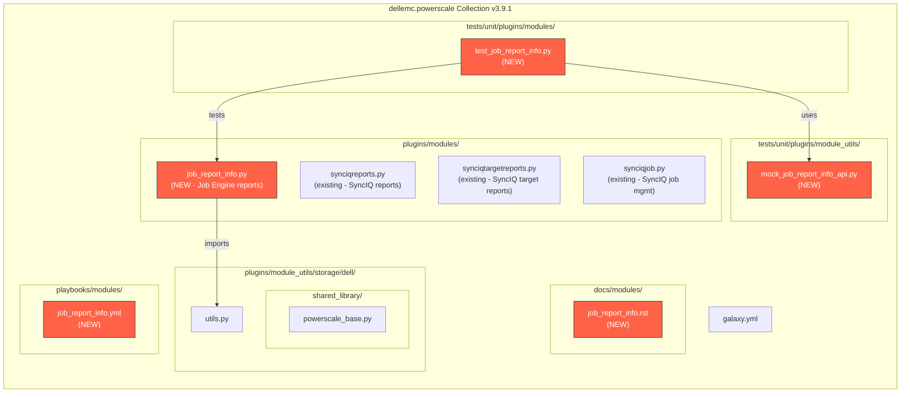
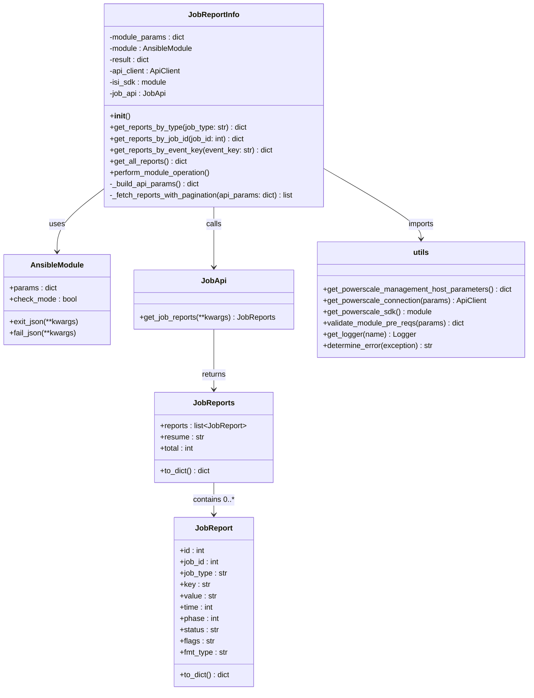
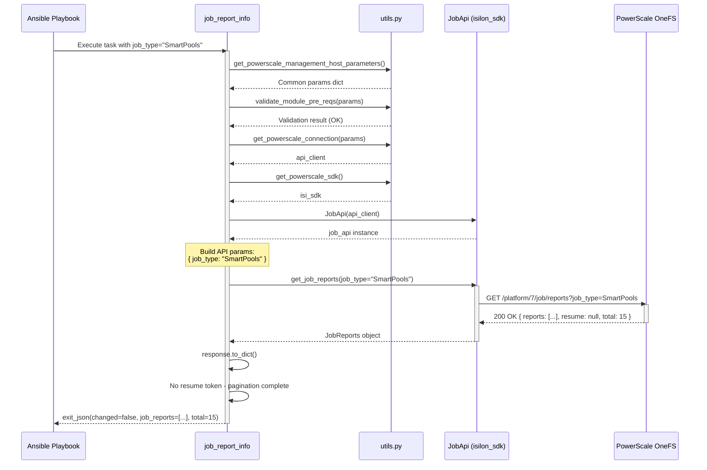
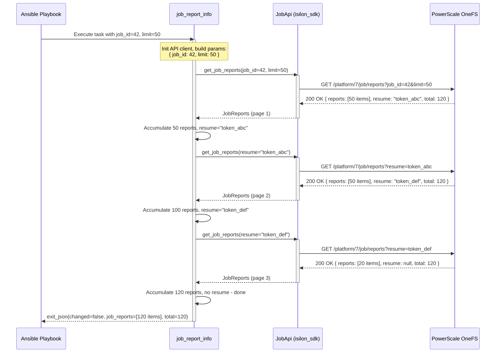
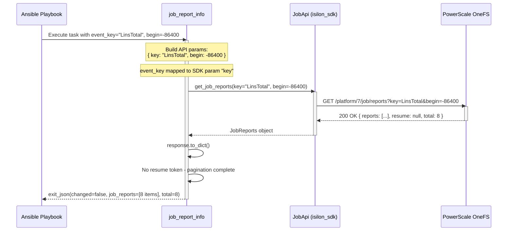
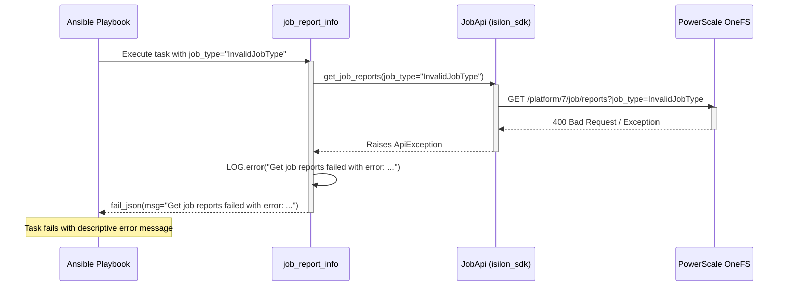
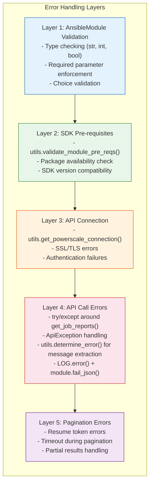

# Design Document: dellemc.powerscale.job_report_info Module

| Field            | Value                                                                 |
|------------------|-----------------------------------------------------------------------|
| **Version**      | 1.0                                                                   |
| **Date**         | 2026-04-07                                                            |
| **Author**       | Dell Technologies Ansible Team <ansible.team@dell.com>                |
| **JIRA Story**   | ECS02C-842 - Implement powerscale_job_report_info                     |
| **JIRA Epic**    | ECS02-77 - Ansible - PowerScale - Deliver support for Job management  |
| **Collection**   | dellemc.powerscale v3.9.1                                             |
| **GitHub Issue** | https://github.com/dell/ansible-powerscale/issues/134                 |
| **Module Name**  | `dellemc.powerscale.job_report_info`                                  |
| **Module Type**  | Read-only info module (no state changes)                              |

---

## Table of Contents

1. [Executive Summary](#1-executive-summary)
2. [Requirements](#2-requirements)
3. [Architecture Design](#3-architecture-design)
4. [Detailed Design](#4-detailed-design)
5. [Data Design](#5-data-design)
6. [Flow Charts](#6-flow-charts)
7. [Sequence Diagrams](#7-sequence-diagrams)
8. [Implementation Plan](#8-implementation-plan)
9. [Deployment Plan](#9-deployment-plan)
10. [DAR - Decision and Architectural Record](#10-dar---decision-and-architectural-record)

---

## 1. Executive Summary

This document describes the design for the `dellemc.powerscale.job_report_info` Ansible module, a **read-only information module** that retrieves completed Job Engine reports from Dell PowerScale OneFS clusters. The module enables Ansible administrators to query job execution reports for auditing, troubleshooting, and operational monitoring purposes.

The Job Engine on PowerScale OneFS runs background maintenance jobs (e.g., `SmartPools`, `FlexProtect`, `IntegrityScan`, `Collect`, `AutoBalance`, etc.). Each job execution produces report events that capture key-value metrics across phases. This module exposes the `GET /platform/7/job/reports` REST API endpoint through Ansible, allowing users to filter reports by job type, job ID, or event key, with full pagination support.

The module follows the established `dellemc.powerscale` collection patterns, using the traditional module class approach (direct `AnsibleModule`) consistent with the existing `synciqreports.py` info module, and integrates with the `isilon_sdk` Python SDK via the `JobApi.get_job_reports()` method.

### Key Goals

- Provide a declarative Ansible interface to retrieve OneFS Job Engine reports
- Support flexible filtering by `job_type`, `job_id`, and `event_key`
- Support time-range filtering with `begin` and `end` epoch parameters
- Handle API pagination transparently, returning complete result sets
- Return structured data suitable for downstream Ansible processing (e.g., `register`, `set_fact`, Jinja2 templates)
- Maintain full compatibility with collection conventions (logging, error handling, check mode)

---

## 2. Requirements

### 2.1 Functional Requirements

| ID     | Requirement                                                                                    | Source       |
|--------|-----------------------------------------------------------------------------------------------|--------------|
| FR-01  | The module SHALL retrieve Job Engine reports from OneFS via the Job Reports API                | ECS02C-842   |
| FR-02  | The module SHALL support filtering reports by `job_type` (e.g., `SmartPools`, `FlexProtect`)  | ECS02C-842   |
| FR-03  | The module SHALL support filtering reports by `job_id` (numeric job instance identifier)       | ECS02C-842   |
| FR-04  | The module SHALL support filtering reports by `event_key` (report key name)                   | ECS02C-842   |
| FR-05  | The module SHALL support time-range filtering via `begin` and `end` epoch timestamps          | API Spec     |
| FR-06  | The module SHALL support the `last_phase_only` flag to return only the last reported phase    | API Spec     |
| FR-07  | The module SHALL support the `verbose` flag for detailed framework statistics                 | API Spec     |
| FR-08  | The module SHALL support a `limit` parameter to control per-page result count                 | API Spec     |
| FR-09  | The module SHALL handle API pagination automatically, collecting all pages of results         | ECS02C-842   |
| FR-10  | The module SHALL return parsed report objects suitable for Ansible output processing          | ECS02C-842   |
| FR-11  | The module SHALL return all reports when no filter parameters are specified                   | ECS02C-842   |
| FR-12  | The module SHALL be a read-only module (never modify cluster state, `changed` always `false`) | Convention   |

### 2.2 Non-Functional Requirements

| ID     | Requirement                                                                                    |
|--------|-----------------------------------------------------------------------------------------------|
| NFR-01 | The module SHALL support Ansible check mode (return same results as normal mode)              |
| NFR-02 | The module SHALL log operations using the collection's standard logging framework             |
| NFR-03 | The module SHALL handle API errors gracefully and return descriptive error messages            |
| NFR-04 | The module SHALL support all standard PowerScale connection parameters                        |
| NFR-05 | The module SHALL have unit test coverage >= 90%                                               |

### 2.3 Acceptance Criteria (from JIRA ECS02C-842)

| #  | Criterion                                                                                               | Verification |
|----|--------------------------------------------------------------------------------------------------------|--------------|
| AC-1 | When `job_type` is specified, the module returns the latest (or all) report(s) for that type          | UT + FT      |
| AC-2 | When `job_id` is specified, the module returns the report for that specific job instance               | UT + FT      |
| AC-3 | When `event_key` is specified, the module returns reports matching that key                            | UT + FT      |
| AC-4 | Pagination is applied correctly - all pages are collected when results exceed one page                 | UT + FT      |
| AC-5 | The module returns `changed: false` in all cases                                                       | UT           |
| AC-6 | The module handles API errors and returns meaningful `fail_json` messages                              | UT           |
| AC-7 | Check mode is supported and returns the same result as normal execution                               | UT           |

---

## 3. Architecture Design

### 3.1 Component Architecture

The following diagram shows how the `job_report_info` module integrates within the Ansible execution pipeline and communicates with the PowerScale cluster:

```mermaid
graph LR
    subgraph "Ansible Controller"
        A["Ansible Playbook<br/>(YAML Task)"] -->|"invokes"| B["job_report_info<br/>Module (Python)"]
        B -->|"imports"| C["utils.py<br/>(Module Utilities)"]
        C -->|"initializes"| D["isilon_sdk<br/>(Python SDK)"]
    end

    subgraph "SDK Layer"
        D -->|"instantiates"| E["JobApi<br/>Client"]
        E -->|"calls"| F["get_job_reports()<br/>method"]
    end

    subgraph "PowerScale Cluster"
        F -->|"HTTPS REST"| G["OneFS REST API<br/>GET /platform/7/job/reports"]
        G -->|"queries"| H["Job Engine<br/>Report Store"]
    end

    H -->|"report data"| G
    G -->|"JSON response"| F
    F -->|"JobReports object"| E
    E -->|"to_dict()"| B
    B -->|"exit_json()"| A

    style A fill:#4a90d9,stroke:#333,color:#fff
    style B fill:#7b68ee,stroke:#333,color:#fff
    style C fill:#6495ed,stroke:#333,color:#fff
    style D fill:#6495ed,stroke:#333,color:#fff
    style E fill:#20b2aa,stroke:#333,color:#fff
    style F fill:#20b2aa,stroke:#333,color:#fff
    style G fill:#f4a460,stroke:#333,color:#fff
    style H fill:#f4a460,stroke:#333,color:#fff
```



### 3.2 Module Position within Collection Hierarchy



> **Legend**: Items in red are **new files** to be created for this module.

### 3.3 Design Pattern Selection

The module will follow the **traditional pattern** (direct `AnsibleModule` instantiation), consistent with the existing `synciqreports.py` module. This is preferred over the `PowerScaleBase` handler pattern because:

1. **Consistency**: The most closely related existing module (`synciqreports.py`) uses the traditional pattern
2. **Simplicity**: As a read-only info module, there is no need for the handler chain pattern (no create/modify/delete operations)
3. **Directness**: A single `perform_module_operation()` method is sufficient for the read-only flow

---

## 4. Detailed Design

### 4.1 Class Diagram



### 4.2 Input Parameters

| Parameter         | Type   | Required | Default | Description                                                                                                                                                |
|-------------------|--------|----------|---------|------------------------------------------------------------------------------------------------------------------------------------------------------------|
| `onefs_host`      | str    | Yes      | -       | IP address or FQDN of the PowerScale OneFS host. *(Common parameter)*                                                                                     |
| `port_no`         | str    | No       | `8080`  | Port number for the OneFS API. *(Common parameter)*                                                                                                        |
| `api_user`        | str    | Yes      | -       | Username for OneFS API authentication. *(Common parameter)*                                                                                                |
| `api_password`    | str    | Yes      | -       | Password for OneFS API authentication. *(Common parameter, no_log)*                                                                                        |
| `verify_ssl`      | bool   | Yes      | -       | Whether to verify SSL certificates. *(Common parameter)*                                                                                                   |
| `job_type`        | str    | No       | `None`  | Filter reports by job type (e.g., `SmartPools`, `FlexProtect`, `IntegrityScan`, `Collect`, `AutoBalance`, `MultiScan`, `SetProtectPlus`, `ShadowStoreDelete`). |
| `job_id`          | int    | No       | `None`  | Filter reports by a specific job instance ID.                                                                                                              |
| `event_key`       | str    | No       | `None`  | Filter reports by event key name (e.g., `LinsTotal`, `FilesLinked`, `ElapsedTime`).                                                                       |
| `begin`           | int    | No       | `None`  | Restrict to reports at or after this time. Positive = Unix epoch seconds; negative = seconds before current time.                                          |
| `end`             | int    | No       | `None`  | Restrict to reports before this time. Positive = Unix epoch seconds; negative = seconds before current time; zero = no end restriction.                    |
| `last_phase_only` | bool   | No       | `None`  | If `true`, return only the last reported phase for each job.                                                                                               |
| `verbose`         | bool   | No       | `None`  | If `true`, include detailed job engine framework statistics.                                                                                               |
| `limit`           | int    | No       | `None`  | Maximum number of results per API page (1 to 4294967295). Pagination is handled automatically across pages.                                                |

**Mutual Exclusivity**: None. All filter parameters can be combined.

**Parameter Validation Rules**:
- `job_id` must be a positive integer if provided
- `limit` must be in range [1, 4294967295] if provided
- `job_type`, `event_key` are free-form strings validated server-side

### 4.3 Output Schema

The module returns the following structure via `exit_json()`:

| Return Key             | Type         | Returned     | Description                                                    |
|------------------------|--------------|--------------|----------------------------------------------------------------|
| `changed`              | bool         | always       | Always `false` for this read-only module.                      |
| `job_reports`          | list[dict]   | always       | List of job report event objects.                              |
| `job_reports[].id`     | int          | always       | Unique event ID for this report entry.                         |
| `job_reports[].job_id` | int          | always       | The ID of the job instance that generated this report.         |
| `job_reports[].job_type`| str         | always       | Job type name (e.g., `SmartPools`, `FlexProtect`).             |
| `job_reports[].key`    | str          | always       | Event key name (e.g., `LinsTotal`, `ElapsedTime`).             |
| `job_reports[].value`  | str          | always       | Event value (string representation).                           |
| `job_reports[].time`   | int          | always       | Unix epoch timestamp when this event was recorded.             |
| `job_reports[].phase`  | int          | always       | Job phase number for this event.                               |
| `job_reports[].status` | str          | always       | Job status at the time of this event (e.g., `succeeded`).      |
| `job_reports[].flags`  | str          | always       | Event flags.                                                   |
| `job_reports[].fmt_type`| str         | always       | Value type hint for formatting the value field.                |
| `total`                | int          | always       | Total number of report entries available (from API response).  |

### 4.4 API Endpoint Mapping

| Module Operation            | SDK Method                     | REST Endpoint                          | HTTP Method | Query Parameters Used                                               |
|-----------------------------|-------------------------------|----------------------------------------|-------------|---------------------------------------------------------------------|
| Get reports by job type     | `JobApi.get_job_reports()`    | `GET /platform/7/job/reports`          | GET         | `job_type`, `begin`, `end`, `last_phase_only`, `verbose`, `limit`, `resume` |
| Get reports by job ID       | `JobApi.get_job_reports()`    | `GET /platform/7/job/reports`          | GET         | `job_id`, `begin`, `end`, `last_phase_only`, `verbose`, `limit`, `resume`   |
| Get reports by event key    | `JobApi.get_job_reports()`    | `GET /platform/7/job/reports`          | GET         | `key`, `begin`, `end`, `last_phase_only`, `verbose`, `limit`, `resume`      |
| Get all reports             | `JobApi.get_job_reports()`    | `GET /platform/7/job/reports`          | GET         | `begin`, `end`, `last_phase_only`, `verbose`, `limit`, `resume`             |
| Get reports (combined)      | `JobApi.get_job_reports()`    | `GET /platform/7/job/reports`          | GET         | All applicable parameters combined                                          |

> **Note**: All operations use the same SDK method and REST endpoint. The only variation is which query parameters are passed based on user-supplied filters. This is a single-endpoint info module.

---

## 5. Data Design

### 5.1 Input Data Model

The module accepts the following parameter structure from the Ansible playbook:

```yaml
# Ansible playbook task parameters
dellemc.powerscale.job_report_info:
  # Connection parameters (required)
  onefs_host: "192.168.1.100"
  port_no: "8080"
  api_user: "admin"
  api_password: "password"
  verify_ssl: false

  # Filter parameters (all optional)
  job_type: "SmartPools"          # Optional: filter by job type
  job_id: 42                      # Optional: filter by job instance ID
  event_key: "LinsTotal"          # Optional: filter by event key
  begin: 1712448000               # Optional: epoch start time
  end: 1712534400                 # Optional: epoch end time
  last_phase_only: true           # Optional: last phase only
  verbose: false                  # Optional: verbose output
  limit: 1000                     # Optional: page size
```

**Internal Parameter Mapping** (module param -> SDK kwarg):

| Module Parameter  | SDK `get_job_reports()` kwarg | Notes                          |
|-------------------|------------------------------|--------------------------------|
| `job_type`        | `job_type`                   | Direct passthrough             |
| `job_id`          | `job_id`                     | Direct passthrough             |
| `event_key`       | `key`                        | Renamed: `event_key` -> `key`  |
| `begin`           | `begin`                      | Direct passthrough             |
| `end`             | `end`                        | Direct passthrough             |
| `last_phase_only` | `last_phase_only`            | Direct passthrough             |
| `verbose`         | `verbose`                    | Direct passthrough             |
| `limit`           | `limit`                      | Direct passthrough             |

### 5.2 Output Data Model

The API returns a `JobReports` wrapper object. After calling `.to_dict()`, the raw structure is:

```json
{
  "reports": [
    {
      "id": 12345,
      "job_id": 42,
      "job_type": "SmartPools",
      "key": "LinsTotal",
      "value": "158302",
      "time": 1712480000,
      "phase": 1,
      "status": "succeeded",
      "flags": "",
      "fmt_type": "fmt_int"
    },
    {
      "id": 12346,
      "job_id": 42,
      "job_type": "SmartPools",
      "key": "ElapsedTime",
      "value": "120",
      "time": 1712480120,
      "phase": 1,
      "status": "succeeded",
      "flags": "",
      "fmt_type": "fmt_duration"
    }
  ],
  "resume": "eyJjb250aW51ZV9mcm9tIjo1MH0=",
  "total": 250
}
```

**Module Output** (returned via `exit_json`):

```json
{
  "changed": false,
  "job_reports": [
    {
      "id": 12345,
      "job_id": 42,
      "job_type": "SmartPools",
      "key": "LinsTotal",
      "value": "158302",
      "time": 1712480000,
      "phase": 1,
      "status": "succeeded",
      "flags": "",
      "fmt_type": "fmt_int"
    }
  ],
  "total": 250
}
```

### 5.3 Data Transformation Rules

| # | Rule                                                                                                         |
|---|--------------------------------------------------------------------------------------------------------------|
| 1 | SDK `JobReports` response is converted to dict via `.to_dict()`                                              |
| 2 | The `reports` list from each page is accumulated into a single flat list across all pagination pages          |
| 3 | The `resume` token is consumed internally for pagination; it is **not** exposed in module output              |
| 4 | The `total` field from the **first page** response is preserved and returned in the module output             |
| 5 | Each `JobReport` dict is passed through as-is without field renaming (SDK dict keys match output keys)       |
| 6 | If no reports match the filter criteria, the module returns an empty list: `"job_reports": []`                |
| 7 | The `event_key` module parameter is mapped to the `key` SDK parameter (the only rename in input processing)  |

---

## 6. Flow Charts

### 6.1 Main Operation Flow

```mermaid
flowchart TD
    START([Start: perform_module_operation]) --> VALIDATE[/"Validate input parameters<br/>(AnsibleModule handles type/choice validation)"/]
    VALIDATE --> BUILD["Build API parameters dict<br/>(_build_api_params)"]
    BUILD --> FILTER_CHECK{"Any filter<br/>params<br/>provided?"}

    FILTER_CHECK -->|"job_type set"| ADD_TYPE["Add job_type to API params"]
    FILTER_CHECK -->|"job_id set"| ADD_ID["Add job_id to API params"]
    FILTER_CHECK -->|"event_key set"| ADD_KEY["Add key to API params<br/>(event_key -> key)"]
    FILTER_CHECK -->|"None set"| NO_FILTER["No filter params<br/>(fetch all reports)"]

    ADD_TYPE --> OPTIONAL
    ADD_ID --> OPTIONAL
    ADD_KEY --> OPTIONAL
    NO_FILTER --> OPTIONAL

    OPTIONAL["Add optional params if set:<br/>begin, end, last_phase_only,<br/>verbose, limit"]

    OPTIONAL --> FETCH["Call _fetch_reports_with_pagination<br/>with built API params"]

    FETCH --> API_CALL["Call job_api.get_job_reports<br/>(**api_params)"]
    API_CALL --> API_SUCCESS{"API call<br/>successful?"}

    API_SUCCESS -->|"No"| ERROR["Log error<br/>module.fail_json(msg=error)"]
    ERROR --> STOP_ERR([End: Failed])

    API_SUCCESS -->|"Yes"| PARSE["Parse response.to_dict()<br/>Extract reports list and total"]
    PARSE --> ACCUMULATE["Append reports to<br/>accumulated results list"]

    ACCUMULATE --> HAS_RESUME{"Response has<br/>resume token?"}
    HAS_RESUME -->|"Yes"| SET_RESUME["Set api_params = &#123;resume: token&#125;<br/>(resume replaces all other params)"]
    SET_RESUME --> API_CALL

    HAS_RESUME -->|"No"| PREPARE["Prepare result dict:<br/>changed=false<br/>job_reports=accumulated list<br/>total=total count"]

    PREPARE --> EXIT["module.exit_json(**result)"]
    EXIT --> STOP_OK([End: Success])

    style START fill:#4caf50,stroke:#333,color:#fff
    style STOP_OK fill:#4caf50,stroke:#333,color:#fff
    style STOP_ERR fill:#f44336,stroke:#333,color:#fff
    style ERROR fill:#f44336,stroke:#333,color:#fff
```



### 6.2 Pagination Detail Flow

```mermaid
flowchart TD
    START([Start: _fetch_reports_with_pagination]) --> INIT["Initialize:<br/>all_reports = []<br/>total = 0<br/>page = 1"]
    INIT --> CALL["Call job_api.get_job_reports(**params)"]
    CALL --> SUCCESS{"Success?"}
    SUCCESS -->|"Exception"| FAIL["Raise/handle error"]
    FAIL --> END_FAIL([Return error])

    SUCCESS -->|"OK"| DICT["response_dict = response.to_dict()"]
    DICT --> EXTRACT["page_reports = response_dict.get('reports', [])<br/>total = response_dict.get('total', 0)"]
    EXTRACT --> EXTEND["all_reports.extend(page_reports)"]
    EXTEND --> LOG["LOG.info('Fetched page %d: %d reports', page, len(page_reports))"]
    LOG --> CHECK_RESUME{"response_dict.get<br/>('resume')<br/>is not None?"}

    CHECK_RESUME -->|"Yes"| NEXT["page += 1<br/>params = &#123;'resume': resume_token&#125;"]
    NEXT --> CALL

    CHECK_RESUME -->|"No"| DONE["LOG.info('Total reports collected: %d', len(all_reports))"]
    DONE --> RETURN(["Return (all_reports, total)"])

    style START fill:#2196f3,stroke:#333,color:#fff
    style RETURN fill:#4caf50,stroke:#333,color:#fff
    style END_FAIL fill:#f44336,stroke:#333,color:#fff
```



---

## 7. Sequence Diagrams

### 7.1 Scenario 1: Get Reports by Job Type



### 7.2 Scenario 2: Get Reports by Job ID (with Pagination)



### 7.3 Scenario 3: Get Reports by Event Key



### 7.4 Scenario 4: Error Handling - API Failure



---

## 8. Implementation Plan

### 8.1 Files to Create/Modify

| # | File Path                                                                                         | Action   | Description                                                  |
|---|---------------------------------------------------------------------------------------------------|----------|--------------------------------------------------------------|
| 1 | `plugins/modules/job_report_info.py`                                                             | **Create** | Main module implementation                                   |
| 2 | `tests/unit/plugins/modules/test_job_report_info.py`                                             | **Create** | Unit tests                                                   |
| 3 | `tests/unit/plugins/module_utils/mock_job_report_info_api.py`                                    | **Create** | Mock API data for unit tests                                 |
| 4 | `docs/modules/job_report_info.rst`                                                               | **Create** | Module documentation (reStructuredText)                      |
| 5 | `playbooks/modules/job_report_info.yml`                                                          | **Create** | Sample playbook                                              |
| 6 | `plugins/modules/__init__.py`                                                                    | Verify   | Ensure module is discoverable (no change expected)           |

### 8.2 Module Implementation Skeleton

```python
#!/usr/bin/python
# Copyright: (c) 2024-2026, Dell Technologies

# GNU General Public License v3.0+ (see COPYING or
# https://www.gnu.org/licenses/gpl-3.0.txt)

"""Ansible module for retrieving Job Engine reports on PowerScale"""
from __future__ import (absolute_import, division, print_function)
__metaclass__ = type

# DOCUMENTATION, EXAMPLES, RETURN strings ...

from ansible.module_utils.basic import AnsibleModule
from ansible_collections.dellemc.powerscale.plugins.module_utils.storage.dell \
    import utils

LOG = utils.get_logger('job_report_info')


class JobReportInfo(object):
    """Class with Job Report Info operations"""

    def __init__(self):
        self.module_params = utils.get_powerscale_management_host_parameters()
        self.module_params.update(get_job_report_info_parameters())

        self.module = AnsibleModule(
            argument_spec=self.module_params,
            supports_check_mode=True
        )

        self.result = {"changed": False}

        PREREQS_VALIDATE = utils.validate_module_pre_reqs(self.module.params)
        if PREREQS_VALIDATE \
                and not PREREQS_VALIDATE["all_packages_found"]:
            self.module.fail_json(
                msg=PREREQS_VALIDATE["error_message"])

        self.api_client = utils.get_powerscale_connection(self.module.params)
        self.isi_sdk = utils.get_powerscale_sdk()
        LOG.info('Got python SDK instance for provisioning on PowerScale')
        self.job_api = self.isi_sdk.JobApi(self.api_client)

    def _build_api_params(self):
        """Build API parameters from module params."""
        # ... parameter mapping logic ...

    def _fetch_reports_with_pagination(self, api_params):
        """Fetch all reports handling pagination."""
        # ... pagination loop ...

    def get_reports_by_type(self, job_type):
        """Get reports filtered by job type."""
        # ...

    def get_reports_by_job_id(self, job_id):
        """Get reports filtered by job ID."""
        # ...

    def get_reports_by_event_key(self, event_key):
        """Get reports filtered by event key."""
        # ...

    def get_all_reports(self):
        """Get all reports without type/id/key filter."""
        # ...

    def perform_module_operation(self):
        """Main entry point."""
        # ...


def get_job_report_info_parameters():
    return dict(
        job_type=dict(required=False, type='str'),
        job_id=dict(required=False, type='int'),
        event_key=dict(required=False, type='str'),
        begin=dict(required=False, type='int'),
        end=dict(required=False, type='int'),
        last_phase_only=dict(required=False, type='bool'),
        verbose=dict(required=False, type='bool'),
        limit=dict(required=False, type='int'),
    )


def main():
    obj = JobReportInfo()
    obj.perform_module_operation()


if __name__ == '__main__':
    main()
```

### 8.3 Dependencies

| Dependency                     | Version       | Purpose                                       |
|-------------------------------|---------------|-----------------------------------------------|
| `ansible-core`                | >= 2.15.0     | Ansible framework                             |
| `isilon-sdk` (PowerScale SDK)| >= 0.2.13     | Python SDK for OneFS REST API                 |
| `python`                      | >= 3.9        | Runtime environment                           |

### 8.4 Check Mode Support

The module fully supports Ansible check mode (`supports_check_mode=True`). Since this is a read-only module that never modifies cluster state:

- **Normal mode**: Queries the API and returns report data. `changed` is always `false`.
- **Check mode**: Queries the API and returns the exact same report data. `changed` is always `false`.

There is no behavioral difference between check mode and normal mode for this info module. This is consistent with how other read-only modules in the collection operate.

### 8.5 Error Handling Strategy



**Error message format** (consistent with collection conventions):
```python
error_message = (
    "Get job reports failed with error: %s"
    % (utils.determine_error(e))
)
LOG.error(error_message)
self.module.fail_json(msg=error_message)
```

### 8.6 Pagination Handling

The OneFS Job Reports API supports cursor-based pagination using the `resume` token pattern:

1. **First request**: Pass all filter parameters + optional `limit`
2. **Response**: Contains `reports` (list), `resume` (token or `null`), `total` (int)
3. **Subsequent requests**: Pass **only** `resume=<token>` (all other params are encoded in the token)
4. **Termination**: When `resume` is `null` or absent, all pages have been fetched

**Implementation approach**:
```python
def _fetch_reports_with_pagination(self, api_params):
    all_reports = []
    total = 0
    page = 1

    while True:
        try:
            response = self.job_api.get_job_reports(**api_params)
            response_dict = response.to_dict()
        except Exception as e:
            error_message = (
                "Get job reports failed with error: %s"
                % (utils.determine_error(e))
            )
            LOG.error(error_message)
            self.module.fail_json(msg=error_message)

        reports = response_dict.get('reports', [])
        if page == 1:
            total = response_dict.get('total', 0)

        all_reports.extend(reports)
        LOG.info('Fetched page %d: %d reports (accumulated: %d)',
                 page, len(reports), len(all_reports))

        resume = response_dict.get('resume')
        if not resume:
            break

        # For subsequent pages, only pass the resume token
        api_params = {'resume': resume}
        page += 1

    return all_reports, total
```

---

## 9. Deployment Plan

### 9.1 Unit Test Plan

Unit tests will use the established `PowerScaleUnitBase` framework with mocked API responses.

**Test file**: `tests/unit/plugins/modules/test_job_report_info.py`

| Test ID   | Test Case                                                            | Method Under Test                | Expected Result                          |
|-----------|----------------------------------------------------------------------|----------------------------------|------------------------------------------|
| UT-01     | Get all reports - no filters                                        | `perform_module_operation()`     | Returns all reports, `changed=false`     |
| UT-02     | Get reports by job_type="SmartPools"                                | `get_reports_by_type()`          | Returns filtered reports                 |
| UT-03     | Get reports by job_id=42                                            | `get_reports_by_job_id()`        | Returns reports for job ID 42            |
| UT-04     | Get reports by event_key="LinsTotal"                                | `get_reports_by_event_key()`     | Returns reports matching key             |
| UT-05     | Get reports with combined filters (job_type + begin + end)          | `perform_module_operation()`     | Returns reports matching all filters     |
| UT-06     | Get reports with last_phase_only=true                               | `perform_module_operation()`     | Returns only last-phase reports          |
| UT-07     | Get reports with verbose=true                                       | `perform_module_operation()`     | Returns verbose reports                  |
| UT-08     | Pagination - multi-page response                                    | `_fetch_reports_with_pagination()` | All pages collected                    |
| UT-09     | Empty result set - no matching reports                              | `perform_module_operation()`     | Returns empty list, `changed=false`      |
| UT-10     | API error - get_job_reports raises exception                        | `perform_module_operation()`     | `fail_json` called with error message    |
| UT-11     | API error during pagination (second page fails)                     | `_fetch_reports_with_pagination()` | `fail_json` called with error message  |
| UT-12     | SDK prerequisites validation failure                                | `__init__()`                     | `fail_json` called                       |
| UT-13     | Check mode returns same result                                      | `perform_module_operation()`     | Same result as normal mode               |

**Mock data file**: `tests/unit/plugins/module_utils/mock_job_report_info_api.py`

```python
class MockJobReportInfoApi:
    MODULE_NAME = 'job_report_info'

    COMMON_ARGS = {
        'onefs_host': '10.10.10.10',
        'api_user': 'admin',
        'api_password': 'password',
        'verify_ssl': False,
    }

    SAMPLE_REPORT = {
        "id": 12345,
        "job_id": 42,
        "job_type": "SmartPools",
        "key": "LinsTotal",
        "value": "158302",
        "time": 1712480000,
        "phase": 1,
        "status": "succeeded",
        "flags": "",
        "fmt_type": "fmt_int"
    }

    SAMPLE_REPORTS_RESPONSE = {
        "reports": [SAMPLE_REPORT],
        "resume": None,
        "total": 1
    }

    SAMPLE_PAGINATED_RESPONSE_PAGE1 = {
        "reports": [SAMPLE_REPORT],
        "resume": "resume_token_page2",
        "total": 2
    }

    SAMPLE_PAGINATED_RESPONSE_PAGE2 = {
        "reports": [{**SAMPLE_REPORT, "id": 12346, "key": "ElapsedTime"}],
        "resume": None,
        "total": 2
    }

    @staticmethod
    def get_error_message(operation):
        return f"Get job reports failed with error"
```

### 9.2 Functional Test (FT) Plan

FT tests will be created in the `ansible-powerscale-qe` directory following the existing pattern.

**Test directory**: `ansible-powerscale-qe/job_report_info/`

| Test ID   | Test Case                                                                   | Playbook File                                           |
|-----------|----------------------------------------------------------------------------|--------------------------------------------------------|
| FT-01     | Get all job reports without any filters                                    | `TC-XXXX_get_all_job_reports.yml`                       |
| FT-02     | Get job reports by job_type (SmartPools)                                   | `TC-XXXX_get_job_reports_by_type.yml`                   |
| FT-03     | Get job reports by job_id                                                  | `TC-XXXX_get_job_reports_by_job_id.yml`                 |
| FT-04     | Get job reports by event_key                                               | `TC-XXXX_get_job_reports_by_event_key.yml`              |
| FT-05     | Get job reports with time range (begin + end)                              | `TC-XXXX_get_job_reports_with_time_range.yml`           |
| FT-06     | Get job reports with last_phase_only=true                                  | `TC-XXXX_get_job_reports_last_phase_only.yml`           |
| FT-07     | Get job reports with verbose=true                                          | `TC-XXXX_get_job_reports_verbose.yml`                   |
| FT-08     | Get job reports with pagination (limit=10)                                 | `TC-XXXX_get_job_reports_with_pagination.yml`           |
| FT-09     | Get job reports with combined filters                                      | `TC-XXXX_get_job_reports_combined_filters.yml`          |
| FT-10     | Get job reports with invalid job_type (negative test)                      | `TC-XXXX_get_job_reports_invalid_type_negative.yml`     |
| FT-11     | Get job reports with non-existent job_id (empty result)                    | `TC-XXXX_get_job_reports_nonexistent_id.yml`            |
| FT-12     | Verify changed is always false                                             | `TC-XXXX_verify_changed_always_false.yml`               |

### 9.3 Documentation Plan

**Module documentation file**: `docs/modules/job_report_info.rst`

The `.rst` file will be auto-generated from the `DOCUMENTATION`, `EXAMPLES`, and `RETURN` strings in the module source using the standard Ansible documentation build process. Content will include:

- Module synopsis and description
- All parameters with types, defaults, and descriptions
- Usage examples covering all filter scenarios
- Return value documentation
- Notes on check mode support

**Sample playbook**: `playbooks/modules/job_report_info.yml`

```yaml
---
- name: Job Report Info Module Operations on PowerScale
  hosts: localhost
  connection: local
  vars:
    onefs_host: "10.10.10.10"
    port_no: "8080"
    api_user: "admin"
    api_password: "password"
    verify_ssl: false

  tasks:
    - name: Get all job reports
      dellemc.powerscale.job_report_info:
        onefs_host: "{{ onefs_host }}"
        port_no: "{{ port_no }}"
        api_user: "{{ api_user }}"
        api_password: "{{ api_password }}"
        verify_ssl: "{{ verify_ssl }}"
      register: all_reports

    - name: Get reports for SmartPools jobs
      dellemc.powerscale.job_report_info:
        onefs_host: "{{ onefs_host }}"
        port_no: "{{ port_no }}"
        api_user: "{{ api_user }}"
        api_password: "{{ api_password }}"
        verify_ssl: "{{ verify_ssl }}"
        job_type: "SmartPools"
      register: smartpools_reports

    - name: Get reports for a specific job instance
      dellemc.powerscale.job_report_info:
        onefs_host: "{{ onefs_host }}"
        port_no: "{{ port_no }}"
        api_user: "{{ api_user }}"
        api_password: "{{ api_password }}"
        verify_ssl: "{{ verify_ssl }}"
        job_id: 42
      register: job_42_reports

    - name: Get reports by event key with time range (last 24 hours)
      dellemc.powerscale.job_report_info:
        onefs_host: "{{ onefs_host }}"
        port_no: "{{ port_no }}"
        api_user: "{{ api_user }}"
        api_password: "{{ api_password }}"
        verify_ssl: "{{ verify_ssl }}"
        event_key: "LinsTotal"
        begin: -86400
      register: lins_reports
```

---

## 10. DAR - Decision and Architectural Record

### DAR-001: Report Output Structure - Flat List vs. Grouped by Job ID

| Aspect          | Detail                                                                                             |
|-----------------|---------------------------------------------------------------------------------------------------|
| **Decision**    | Return reports as a **flat list** of report event objects                                         |
| **Status**      | Accepted                                                                                          |
| **Date**        | 2026-04-07                                                                                        |
| **Context**     | The OneFS Job Reports API returns individual report events, where each event is a key-value pair tied to a job_id, phase, and timestamp. When multiple events exist for the same job (e.g., `LinsTotal`, `ElapsedTime`, `BytesTransferred`), we had to decide whether to: (A) return them as a flat list preserving the API's native structure, or (B) group them into objects keyed by `job_id`. |

**Options Considered**:

| Option | Description                      | Pros                                                                                          | Cons                                                                                     |
|--------|----------------------------------|-----------------------------------------------------------------------------------------------|------------------------------------------------------------------------------------------|
| A      | **Flat list** (direct API mirror)| Simple; 1:1 mapping with API; consistent with `synciqreports`; no data loss; easy pagination | Users must group manually with Jinja2 `groupby`; more verbose for per-job views          |
| B      | **Grouped by job_id**            | More intuitive per-job view; pre-organized for auditing                                       | Adds transformation complexity; may lose ordering semantics; inconsistent with API        |

**Decision Rationale**:

1. **Consistency with API**: The flat list directly mirrors the OneFS REST API response, avoiding impedance mismatch and making it predictable for users familiar with the API
2. **Consistency with collection**: The existing `synciqreports.py` module returns report objects directly as received from the API without restructuring
3. **No data loss**: Grouping could hide ordering information (chronological event sequence) that may be important for troubleshooting
4. **Flexibility**: Users can easily group via Ansible's `groupby` filter: `{{ job_reports | groupby('job_id') }}`
5. **Simplicity**: Avoids complex transformation logic in the module that would need to be tested and maintained

### DAR-002: Module Pattern - Traditional vs. PowerScaleBase Handler Chain

| Aspect          | Detail                                                                                             |
|-----------------|---------------------------------------------------------------------------------------------------|
| **Decision**    | Use the **traditional pattern** (direct `AnsibleModule`, single class with `perform_module_operation`) |
| **Status**      | Accepted                                                                                          |
| **Date**        | 2026-04-07                                                                                        |
| **Context**     | The collection has two patterns: (1) Traditional - used by `synciqreports.py`, `info.py`, and older modules; (2) PowerScaleBase with Handler chain - used by newer modules like `alert_settings.py`, `alert_channel.py`. |

**Decision Rationale**:

1. **Read-only nature**: The Handler chain pattern (ExitHandler, ModifyHandler, CreateHandler) is designed for CRUD operations. This module only reads data.
2. **Closest precedent**: `synciqreports.py` is the closest existing module (also a report retrieval module) and uses the traditional pattern
3. **Simplicity**: A single `perform_module_operation()` method with straightforward logic is clearer for a read-only info module
4. **No state management**: The Handler chain provides value when state transitions need to be managed. This module has no state transitions.

### DAR-003: Parameter Naming - `event_key` vs. `key`

| Aspect          | Detail                                                                                             |
|-----------------|---------------------------------------------------------------------------------------------------|
| **Decision**    | Use `event_key` as the module parameter name, mapped internally to the SDK's `key` parameter       |
| **Status**      | Accepted                                                                                          |
| **Date**        | 2026-04-07                                                                                        |
| **Context**     | The OneFS API and SDK use `key` as the parameter name for filtering by report key. However, `key` is a very generic term in Ansible/Python contexts and could be confusing. |

**Decision Rationale**:

1. **Clarity**: `event_key` is more descriptive and self-documenting than `key`
2. **Avoids confusion**: `key` is commonly used in Ansible for dictionary operations; `event_key` is unambiguous
3. **Consistent with JIRA**: The JIRA story references "event_key" as the parameter name
4. **Simple mapping**: The internal mapping `event_key` -> `key` is trivial and well-documented

### DAR-004: Pagination Strategy - Automatic vs. User-Controlled

| Aspect          | Detail                                                                                             |
|-----------------|---------------------------------------------------------------------------------------------------|
| **Decision**    | **Automatic pagination** - the module collects all pages internally and returns the complete result set |
| **Status**      | Accepted                                                                                          |
| **Date**        | 2026-04-07                                                                                        |
| **Context**     | The API supports pagination with `limit` and `resume` tokens. We could either: (A) handle pagination internally and return all results, or (B) expose the `resume` token and let users paginate manually across playbook tasks. |

**Decision Rationale**:

1. **Ansible convention**: Ansible info modules typically return complete result sets; manual pagination across tasks is anti-pattern
2. **User experience**: Users expect `register: result` to contain the complete data set
3. **Simplicity**: Users don't need to write pagination loops in playbooks
4. **`limit` as page size**: The `limit` parameter controls per-API-call page size for performance tuning, not total result count
5. **Safety**: For extremely large result sets, users can use `begin`/`end` time range filters or `job_type`/`job_id` filters to constrain results

---

*End of Design Document*
