# Design Document: `dellemc.powerscale.job_type_info` Module

| Field | Value |
|-------|-------|
| **Version** | 1.0 |
| **Date** | 2026-04-07 |
| **Author** | Shrinidhi Rao |
| **GitHub Issue** | [#134](https://github.com/dell/ansible-powerscale/issues/134) — *[FEATURE]: Add Support for job type management* |
| **Collection** | `dellemc.powerscale` v3.9.1 |
| **Target OneFS** | 9.5.0+ (API v1 `/platform/1/job/types`) |
| **SDK** | `isilon_sdk` v0.7.0 (`isilon_sdk.v9_7_0`) |

---

## Table of Contents

1. [Executive Summary](#1-executive-summary)
2. [Requirements](#2-requirements)
3. [Architecture Design](#3-architecture-design)
4. [Detailed Design](#4-detailed-design)
5. [Data Design](#5-data-design)
6. [Flow Charts](#6-flow-charts)
7. [Sequence Diagrams](#7-sequence-diagrams)
8. [Implementation Plan](#8-implementation-plan)
9. [Deployment Plan](#9-deployment-plan)
10. [DAR — Decision and Action Record](#10-dar--decision-and-action-record)

---

## 1. Executive Summary

This document describes the design for the `dellemc.powerscale.job_type_info` Ansible module — a **read-only** information-gathering module that lists OneFS Job Engine job types from a Dell PowerScale cluster.

The OneFS Job Engine manages background system jobs (e.g., `FlexProtect`, `FSAnalyze`, `SmartPools`, `TreeDelete`). Each cluster exposes 31+ visible job types and up to 10 additional hidden/internal types. This module provides Ansible automation users with a way to:

- **List all job types** with their configuration (enabled state, priority, policy, schedule)
- **Optionally include hidden/internal types** via the `include_hidden` parameter
- **Retrieve a single job type** by ID for targeted inspection
- **Support sorting** via `sort` and `dir` parameters

The module is purely informational (`changed` is always `false`), fully supports `check_mode`, and follows all established `dellemc.powerscale` collection patterns including the handler-based architecture, `PowerScaleBase` inheritance, and `PowerScaleUnitBase` test framework.

**Key SDK methods used:**
- `JobApi.get_job_types(show_all=bool, sort=str, dir=str)` — list all types
- `JobApi.get_job_type(job_type_id=str)` — get a single type

**API validation status:** Both endpoints have been validated against a live PowerScale 9.13 cluster (10.230.24.246:8080) in the [API Validation Report](../job_mgmt_api_validation/Job_Management_API_Validation_Report.md) — HTTP 200, correct schema confirmed.

---

## 2. Requirements

### 2.1 Functional Requirements

| ID | Requirement | Priority | Source |
|----|-------------|----------|--------|
| FR-01 | List all visible job types from a PowerScale cluster | Must | Requirements |
| FR-02 | Optionally include hidden/internal job types via `include_hidden` flag | Must | Requirements |
| FR-03 | Retrieve a single job type by its ID | Should | Design decision — enables targeted lookups |
| FR-04 | Return normalized job type objects with standardized field names | Must | Requirements |
| FR-05 | Support sort order (`sort` field, `dir` direction) for list operations | Could | API capability pass-through |
| FR-06 | Never modify cluster state (`changed` always `false`) | Must | Info module convention |
| FR-07 | Full `check_mode` support (identical behavior to normal mode) | Must | Requirements |
| FR-08 | Idempotent — repeated calls with same params return same results | Must | Requirements |

### 2.2 Non-Functional Requirements

| ID | Requirement | Details |
|----|-------------|---------|
| NFR-01 | Follow `dellemc.powerscale` collection coding patterns | Handler chain, `PowerScaleBase`, logger |
| NFR-02 | Unit test coverage ≥ 90% | Using `PowerScaleUnitBase` framework |
| NFR-03 | Ansible documentation standards | `DOCUMENTATION`, `EXAMPLES`, `RETURN` blocks |
| NFR-04 | Error handling with graceful failure | `module.fail_json()` with descriptive messages |
| NFR-05 | Python 3.9+ compatibility | Match collection minimum |

### 2.3 Acceptance Criteria

1. **AC-1:** Lists all job types with optional inclusion of hidden types via `include_hidden` flag
2. **AC-2:** Unit testing should be done (≥ 90% coverage)
3. **AC-3:** Idempotency should be maintained (read-only, inherently idempotent)
4. **AC-4:** Should return normalized job type items containing: name, is_hidden, category, description, capabilities (start/pause/resume/cancel, impact policy, priority)

### 2.4 Out of Scope

| Item | Reason |
|------|--------|
| Modifying job types (enable/disable, priority, schedule, policy) | Separate `job_type` CRUD module — see [DAR](#10-dar--decision-and-action-record) |
| Creating or deleting job types | Job types are system-defined; no create/delete API exists |
| Job instance management (start, pause, resume, cancel jobs) | Separate `job` module scope |
| Job events, reports, policies | Separate modules in the epic |

---

## 3. Architecture Design

### 3.1 Component Architecture

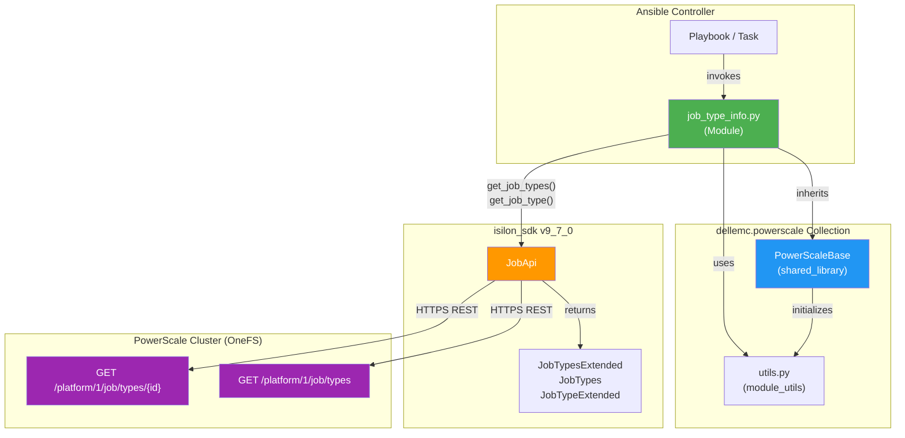

### 3.2 Module Position within Collection

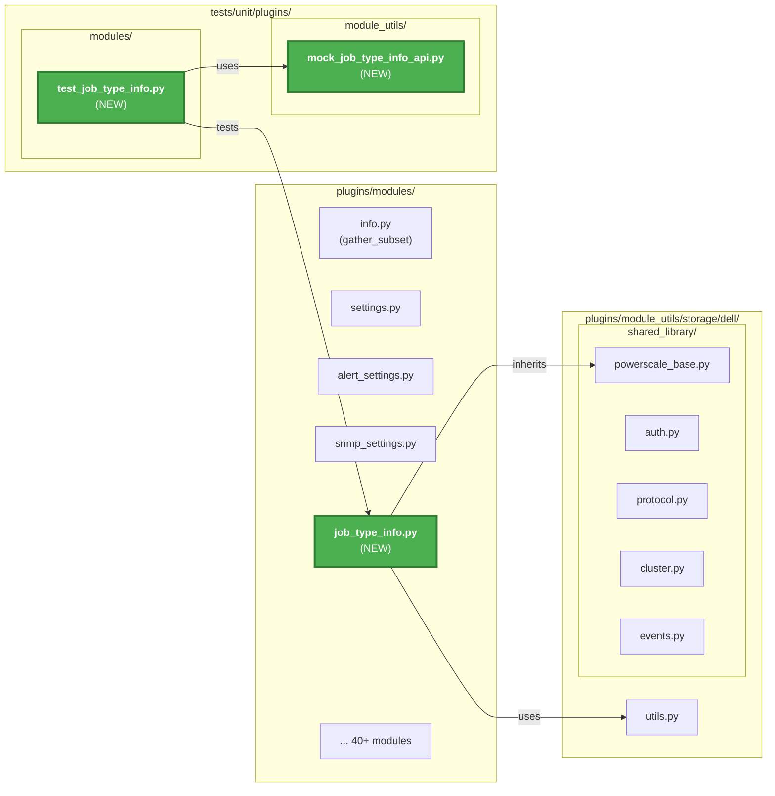

---

## 4. Detailed Design

### 4.1 Class Diagram

```mermaid
classDiagram
 class PowerScaleBase {
 +module: AnsibleModule
 +result: dict
 +api_client: ApiClient
 +isi_sdk: module
 +protocol_api: ProtocolsApi
 +auth_api: AuthApi
 +cluster_api: ClusterApi
 +event_api: EventApi
 +snapshot_api: SnapshotApi
 +__init__(ansible_module, ansible_module_params)
 }

 class JobTypeInfo {
 -job_api: JobApi
 +__init__()
 +get_all_job_types(include_hidden: bool, sort: str, dir: str) list~dict~
 +get_single_job_type(job_type_id: str) dict
 +normalize_job_type(raw_type: dict) dict
 +perform_module_operation() None
 -_get_job_type_parameters() dict
 }

 class JobTypeInfoFetchHandler {
 +handle(job_type_info_obj, params) None
 }

 class JobTypeInfoExitHandler {
 +handle(job_type_info_obj, job_types_result) None
 }

 class AnsibleModule {
 +params: dict
 +check_mode: bool
 +exit_json(**kwargs) None
 +fail_json(**kwargs) None
 }

 PowerScaleBase <|-- JobTypeInfo : inherits
 JobTypeInfo --> AnsibleModule : uses
 JobTypeInfo --> JobTypeInfoFetchHandler : delegates to
 JobTypeInfoFetchHandler --> JobTypeInfoExitHandler : chains to
 JobTypeInfo ..> "isi_sdk.JobApi" : creates

 note for JobTypeInfo "Module file: plugins/modules/job_type_info.py\nHandler pattern matches alert_settings.py, snmp_settings.py"
```

### 4.2 Input Parameters

| Parameter | Type | Required | Default | Description | Validation |
|-----------|------|----------|---------|-------------|------------|
| `onefs_host` | str | Yes | — | PowerScale cluster FQDN/IP | Inherited from `powerscale` doc fragment |
| `port_no` | str | No | `8080` | HTTPS port | Inherited |
| `api_user` | str | Yes | — | OneFS API username | Inherited |
| `api_password` | str | Yes | — | OneFS API password | Inherited |
| `verify_ssl` | bool | No | `true` | Verify SSL certificate | Inherited |
| `job_type_id` | str | No | `None` | Specific job type ID to retrieve (e.g., `FSAnalyze`, `TreeDelete`). When provided, returns only that single type. When omitted, returns all types. | Must match an existing job type ID. Case-sensitive. |
| `include_hidden` | bool | No | `false` | Include hidden/internal job types in the results. Only applicable when `job_type_id` is not specified. Maps to API `show_all` query parameter. | — |
| `sort` | str | No | `None` | Field name to sort results by (e.g., `id`, `priority`). Only applicable when listing all types. | Valid sort field name |
| `dir` | str | No | `None` | Sort direction. Only applicable when `sort` is specified. | `ASC` or `DESC` |

### 4.3 Output Schema — Normalized Job Type Object

Each job type in the output is normalized from the raw API response to a consistent structure:

| Output Field | Type | Source API Field | Description |
|-------------|------|------------------|-------------|
| `id` | str | `id` | Job type identifier (e.g., `FSAnalyze`) |
| `name` | str | `id` | Alias of `id` — human-friendly reference (same value as `id`) |
| `description` | str | `description` | Brief description of the job type |
| `is_hidden` | bool | `hidden` | Whether this is a hidden/internal type (renamed from `hidden`) |
| `enabled` | bool | `enabled` | Whether the job type is currently enabled |
| `priority` | int | `priority` | Default priority (1-10, lower = higher precedence) |
| `policy` | str | `policy` | Default impact policy name (e.g., `LOW`, `MEDIUM`, `HIGH`) |
| `schedule` | str/null | `schedule` | Human-readable schedule expression or `null` |
| `allow_multiple_instances` | bool | `allow_multiple_instances` | Whether concurrent instances are permitted |
| `exclusion_set` | str | `exclusion_set` | Mutually-exclusive sets (obsolete, typically empty) |

**Derived fields (AC-4 — capabilities):**

| Output Field | Type | Derivation Logic | Description |
|-------------|------|------------------|-------------|
| `capabilities.can_start` | bool | Always `true` if `enabled` is `true` | Whether the job type can be started |
| `capabilities.can_pause` | bool | Always `true` (all OneFS jobs support pause) | Whether running jobs of this type can be paused |
| `capabilities.can_resume` | bool | Always `true` (all OneFS jobs support resume) | Whether paused jobs of this type can be resumed |
| `capabilities.can_cancel` | bool | Always `true` (all OneFS jobs support cancel) | Whether running/paused jobs of this type can be cancelled |
| `capabilities.supports_multiple_instances` | bool | Copied from `allow_multiple_instances` | Whether multiple instances can run concurrently |
| `capabilities.default_impact_policy` | str | Copied from `policy` | The default impact policy for this job type |
| `capabilities.default_priority` | int | Copied from `priority` | The default priority for this job type |

### 4.4 API Endpoint Mapping

| Module Operation | SDK Method | REST Endpoint | Query Params | Response Model |
|-----------------|------------|---------------|--------------|----------------|
| List all types (visible only) | `job_api.get_job_types()` | `GET /platform/1/job/types` | — | `JobTypesExtended` |
| List all types (incl. hidden) | `job_api.get_job_types(show_all=True)` | `GET /platform/1/job/types?show_all=true` | `show_all=true` | `JobTypesExtended` |
| List with sort | `job_api.get_job_types(sort=field, dir=direction)` | `GET /platform/1/job/types?sort=field&dir=ASC` | `sort`, `dir` | `JobTypesExtended` |
| Get single type | `job_api.get_job_type(job_type_id)` | `GET /platform/1/job/types/{TypeId}` | — | `JobTypes` |

### 4.5 Complete Return Value Structure

```yaml
# Module return structure
changed: false # Always false for info module
job_types:
 - id: "FSAnalyze"
 name: "FSAnalyze"
 description: "Gather information about the file system."
 is_hidden: false
 enabled: true
 priority: 6
 policy: "LOW"
 schedule: null
 allow_multiple_instances: false
 exclusion_set: ""
 capabilities:
 can_start: true
 can_pause: true
 can_resume: true
 can_cancel: true
 supports_multiple_instances: false
 default_impact_policy: "LOW"
 default_priority: 6
 - id: "FlexProtect"
 name: "FlexProtect"
 description: "Scan the file system after a device failure..."
 is_hidden: false
 enabled: true
 priority: 1
 policy: "MEDIUM"
 schedule: null
 allow_multiple_instances: false
 exclusion_set: ""
 capabilities:
 can_start: true
 can_pause: true
 can_resume: true
 can_cancel: true
 supports_multiple_instances: false
 default_impact_policy: "MEDIUM"
 default_priority: 1
```

---

## 5. Data Design

### 5.1 Input Data Model

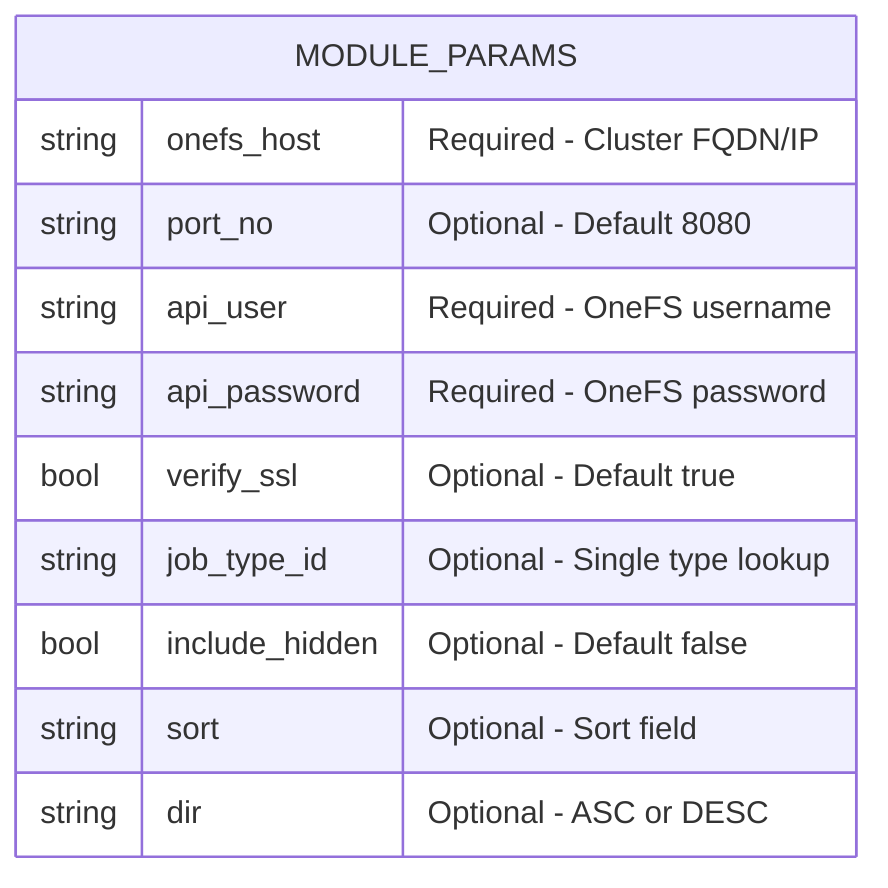

### 5.2 Output Data Model

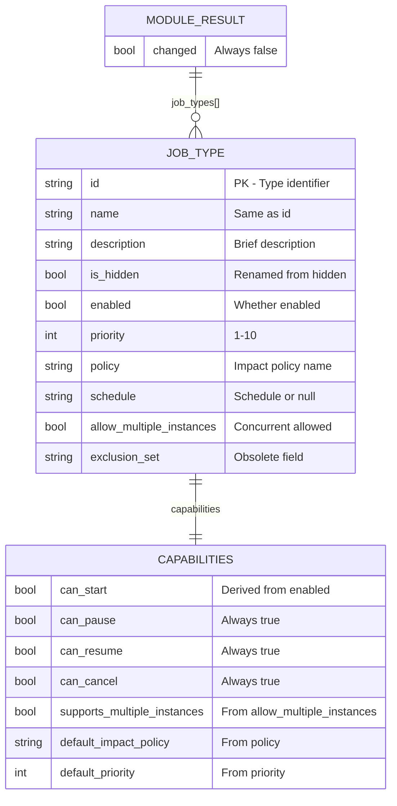

### 5.3 Data Transformation

The module performs the following transformations from the raw API response to the normalized output:

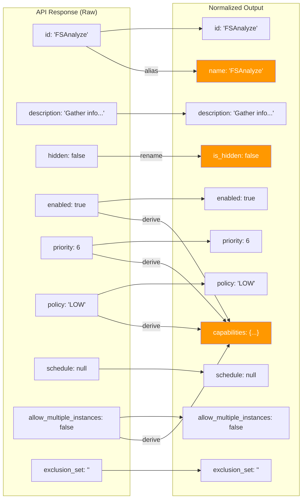

**Transformation rules:**

| # | Transformation | From | To | Logic |
|---|---------------|------|----|-------|
| 1 | Rename field | `hidden` | `is_hidden` | Direct rename — avoids Python keyword confusion and improves clarity |
| 2 | Add alias | `id` | `name` | Copy `id` value to `name` — satisfies AC-4 requirement for `name` field |
| 3 | Derive capabilities | Multiple fields | `capabilities` dict | Structured capability object per AC-4 |
| 4 | `can_start` | `enabled` | `capabilities.can_start` | `True` if `enabled` is `True`, else `False` |
| 5 | `can_pause` | — | `capabilities.can_pause` | Always `True` (all OneFS jobs support pause) |
| 6 | `can_resume` | — | `capabilities.can_resume` | Always `True` (all OneFS jobs support resume) |
| 7 | `can_cancel` | — | `capabilities.can_cancel` | Always `True` (all OneFS jobs support cancel) |
| 8 | `supports_multiple_instances` | `allow_multiple_instances` | `capabilities.supports_multiple_instances` | Direct copy |
| 9 | `default_impact_policy` | `policy` | `capabilities.default_impact_policy` | Direct copy |
| 10 | `default_priority` | `priority` | `capabilities.default_priority` | Direct copy |

### 5.4 Normalize Function Pseudocode

```python
def normalize_job_type(self, raw_type):
 """
 Transform a raw API job type dict into a normalized output dict.
 
 :param raw_type: dict from API response (to_dict())
 :return: Normalized job type dict matching output schema
 """
 return {
 "id": raw_type.get("id"),
 "name": raw_type.get("id"), # Alias
 "description": raw_type.get("description"),
 "is_hidden": raw_type.get("hidden"), # Rename
 "enabled": raw_type.get("enabled"),
 "priority": raw_type.get("priority"),
 "policy": raw_type.get("policy"),
 "schedule": raw_type.get("schedule"),
 "allow_multiple_instances": raw_type.get("allow_multiple_instances"),
 "exclusion_set": raw_type.get("exclusion_set"),
 "capabilities": { # Derived
 "can_start": raw_type.get("enabled", False),
 "can_pause": True,
 "can_resume": True,
 "can_cancel": True,
 "supports_multiple_instances": raw_type.get("allow_multiple_instances", False),
 "default_impact_policy": raw_type.get("policy"),
 "default_priority": raw_type.get("priority"),
 }
 }
```

---

## 6. Flow Charts

### 6.1 Main Module Flow

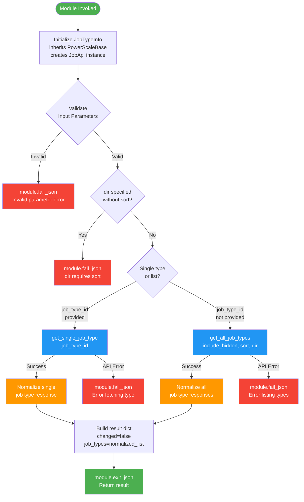

### 6.2 Handler Chain Flow

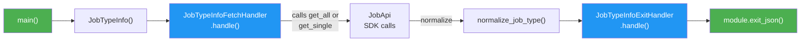

---

## 7. Sequence Diagrams

### 7.1 Scenario 1: List All Job Types (Default — No Hidden)

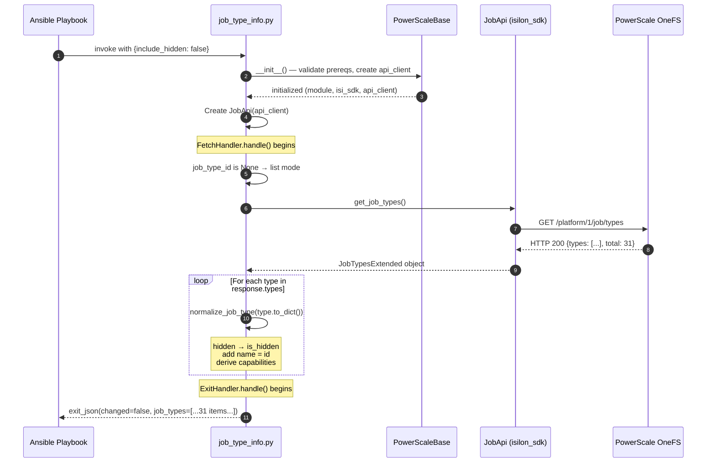

### 7.2 Scenario 2: List All Job Types Including Hidden

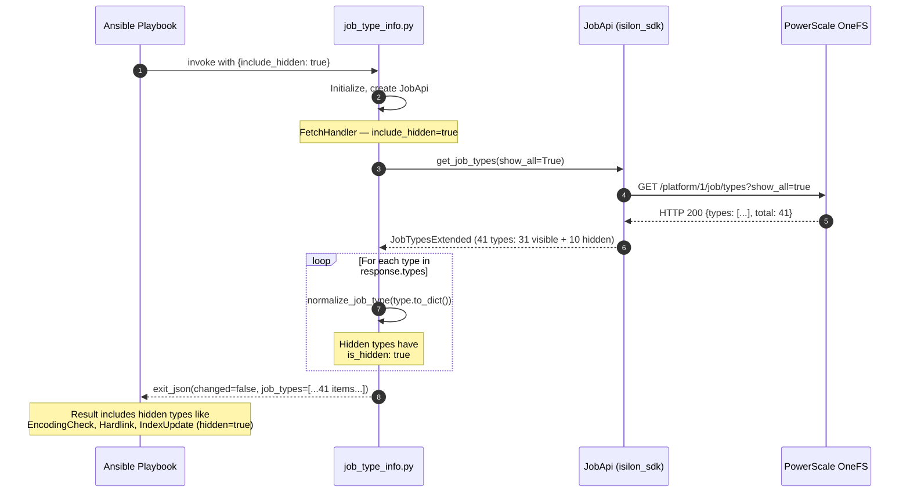

### 7.3 Scenario 3: Get Single Job Type by ID

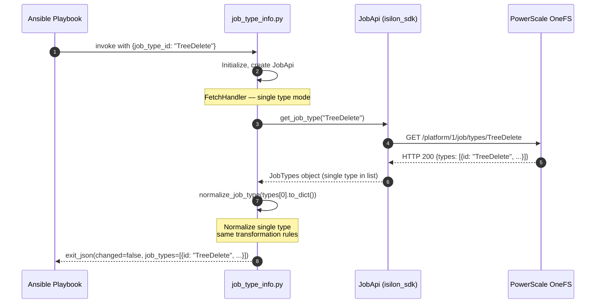

### 7.4 Scenario 4: Error — Invalid Job Type ID

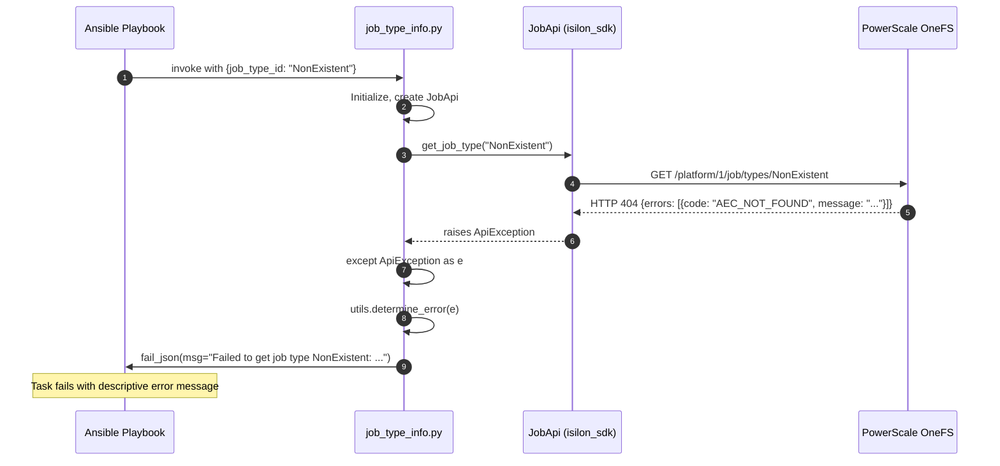

---

## 8. Implementation Plan

### 8.1 Files to Create/Modify

| # | File Path | Action | Description |
|---|-----------|--------|-------------|
| 1 | `plugins/modules/job_type_info.py` | **CREATE** | Main module file with `DOCUMENTATION`, `EXAMPLES`, `RETURN`, `JobTypeInfo` class, handlers, `main()` |
| 2 | `tests/unit/plugins/module_utils/mock_job_type_info_api.py` | **CREATE** | Mock API response data for unit tests |
| 3 | `tests/unit/plugins/modules/test_job_type_info.py` | **CREATE** | Unit test class extending `PowerScaleUnitBase` |
| 4 | `plugins/module_utils/storage/dell/shared_library/powerscale_base.py` | **MODIFY** | Add `job_api` lazy property for `JobApi` if not already present |
| 5 | `docs/modules/job_type_info.rst` | **CREATE** | Auto-generated or hand-written RST documentation |
| 6 | `meta/runtime.yml` | **MODIFY** | Register `job_type_info` module |
| 7 | `playbooks/modules/job_type_info.yml` | **CREATE** | Sample playbook for documentation |

### 8.2 Dependencies

| Dependency | Type | Version | Notes |
|------------|------|---------|-------|
| `ansible-core` | Runtime | ≥ 2.15.0 | Ansible module framework |
| `isilon-sdk` | Runtime | 0.7.0 | `isilon_sdk.v9_7_0.JobApi` |
| `python` | Runtime | ≥ 3.9 | Collection minimum |
| `pytest` | Test | ≥ 7.0 | Unit test framework |
| `mock` | Test | — | Mocking framework |
| `PowerScaleBase` | Internal | — | Base class from shared_library |
| `PowerScaleUnitBase` | Internal | — | Test base class |

### 8.3 Check Mode Support

Since this is a **read-only info module**, `check_mode` behavior is identical to normal mode:

```python
ansible_module_params = {
 'argument_spec': self._get_job_type_parameters(),
 'supports_check_mode': True, # Declare support
}
```

No conditional logic is needed for `check_mode` since the module never modifies state. The `changed` flag is always `false`.

### 8.4 Error Handling Strategy

| Error Scenario | HTTP Code | SDK Exception | Module Behavior |
|----------------|-----------|---------------|-----------------|
| Invalid job type ID | 404 | `ApiException` | `fail_json(msg="Failed to get job type {id}: {error}")` |
| Authentication failure | 401 | `ApiException` | `fail_json(msg="Authentication failed: {error}")` |
| Connection timeout | — | `ConnectionError` | `fail_json(msg="Failed to connect to PowerScale cluster: {error}")` |
| SDK not installed | — | `ImportError` | `fail_json(msg=...)` via `validate_module_pre_reqs()` |
| Invalid sort field | 400 | `ApiException` | `fail_json(msg="Failed to list job types: {error}")` |
| Invalid dir value | — | `ValueError` | Client-side validation: `choices: ['ASC', 'DESC']` |
| Permission denied | 403 | `ApiException` | `fail_json(msg="Permission denied: {error}")` |

**Error handling pattern (matching collection conventions):**

```python
def get_all_job_types(self, include_hidden, sort, dir):
 """Get all job types from the cluster."""
 try:
 msg = "Getting all job types"
 LOG.info(msg)
 kwargs = {}
 if include_hidden:
 kwargs['show_all'] = True
 if sort:
 kwargs['sort'] = sort
 if dir:
 kwargs['dir'] = dir
 api_response = self.job_api.get_job_types(**kwargs)
 return api_response.types if api_response else []
 except Exception as e:
 error_msg = (
 f"Failed to get job types from PowerScale cluster "
 f"with error: {utils.determine_error(e)}"
 )
 LOG.error(error_msg)
 self.module.fail_json(msg=error_msg)
```

### 8.5 PowerScaleBase Enhancement — JobApi Property

Add to `plugins/module_utils/storage/dell/shared_library/powerscale_base.py`:

```python
# In __init__:
self._job_api = None

# New property:
@property
def job_api(self):
 """
 Returns the job API object.

 :return: The job API object.
 :rtype: isi_sdk.JobApi
 """
 if self._job_api is None:
 self._job_api = self.isi_sdk.JobApi(self.api_client)
 return self._job_api
```

### 8.6 Module Skeleton

```python
#!/usr/bin/python
# Copyright: (c) 2026, Dell Technologies

# GNU General Public License v3.0+ (see COPYING or
# https://www.gnu.org/licenses/gpl-3.0.txt)

"""Ansible module for gathering job type information from PowerScale"""

from __future__ import absolute_import, division, print_function
__metaclass__ = type

DOCUMENTATION = r'''
---
module: job_type_info
version_added: '3.9.1'
short_description: List Job Engine job types on PowerScale
description:
 - Retrieves information about OneFS Job Engine job types.
 - Lists all job types with optional inclusion of hidden types.
 - Can retrieve a single job type by ID.
extends_documentation_fragment:
 - dellemc.powerscale.powerscale
author:
 - Shrinidhi Rao (@ShrinidhiRao15)
options:
 job_type_id:
 description: ...
 include_hidden:
 description: ...
 sort:
 description: ...
 dir:
 description: ...
'''

EXAMPLES = r'''...'''
RETURN = r'''...'''

from ansible.module_utils.basic import AnsibleModule
from ansible_collections.dellemc.powerscale.plugins.module_utils.storage.dell.shared_library.powerscale_base \
 import PowerScaleBase
from ansible_collections.dellemc.powerscale.plugins.module_utils.storage.dell \
 import utils

LOG = utils.get_logger('job_type_info')


class JobTypeInfo(PowerScaleBase):
 """Class with Job Type info operations"""

 def __init__(self):
 ansible_module_params = {
 'argument_spec': self._get_job_type_parameters(),
 'supports_check_mode': True,
 }
 super().__init__(AnsibleModule, ansible_module_params)
 self.result.update({"job_types": []})

 def get_all_job_types(self, include_hidden, sort, dir):
 ...

 def get_single_job_type(self, job_type_id):
 ...

 def normalize_job_type(self, raw_type):
 ...

 def _get_job_type_parameters(self):
 return dict(
 job_type_id=dict(type='str'),
 include_hidden=dict(type='bool', default=False),
 sort=dict(type='str'),
 dir=dict(type='str', choices=['ASC', 'DESC']),
 )


class JobTypeInfoFetchHandler:
 def handle(self, job_type_info_obj, params):
 ... # Determine list vs single, call API, normalize
 JobTypeInfoExitHandler().handle(job_type_info_obj, normalized_types)


class JobTypeInfoExitHandler:
 def handle(self, job_type_info_obj, job_types_result):
 job_type_info_obj.result["job_types"] = job_types_result
 job_type_info_obj.module.exit_json(**job_type_info_obj.result)


def main():
 obj = JobTypeInfo()
 JobTypeInfoFetchHandler().handle(obj, obj.module.params)


if __name__ == '__main__':
 main()
```

---

## 9. Deployment Plan

### 9.1 Unit Tests

**Test file:** `tests/unit/plugins/modules/test_job_type_info.py`

| # | Test Case | Description | Input | Expected |
|---|-----------|-------------|-------|----------|
| 1 | `test_get_all_job_types_default` | List all visible types (default params) | `{}` | `exit_json` called, `job_types` has 31 items, all `is_hidden=false` |
| 2 | `test_get_all_job_types_include_hidden` | List all types including hidden | `{include_hidden: true}` | `exit_json` called, `job_types` has 41 items, 10 have `is_hidden=true` |
| 3 | `test_get_single_job_type` | Get single type by ID | `{job_type_id: "TreeDelete"}` | `exit_json` called, `job_types` has 1 item with `id="TreeDelete"` |
| 4 | `test_get_single_job_type_not_found` | Invalid type ID | `{job_type_id: "NonExistent"}` | `fail_json` called with error message |
| 5 | `test_get_all_job_types_with_sort` | List with sort/dir | `{sort: "id", dir: "ASC"}` | SDK called with `sort="id"`, `dir="ASC"` |
| 6 | `test_get_all_job_types_api_error` | API exception on list | `{}` (mock API error) | `fail_json` called with error message |
| 7 | `test_normalize_job_type` | Verify normalization logic | Raw API dict | Normalized dict with `is_hidden`, `name`, `capabilities` |
| 8 | `test_changed_always_false` | Info module never changes | Any params | `result["changed"]` is `False` |
| 9 | `test_check_mode` | Check mode returns same result | `check_mode=True` | Same behavior as normal mode |
| 10 | `test_main` | Test `main()` entry point | Mocked module | `main()` completes without error |

**Mock file:** `tests/unit/plugins/module_utils/mock_job_type_info_api.py`

```python
class MockJobTypeInfoApi:

 JOB_TYPE_COMMON_ARGS = {
 "job_type_id": None,
 "include_hidden": False,
 "sort": None,
 "dir": None,
 }

 JOB_TYPE_LIST_RESPONSE = [
 {
 "id": "AutoBalance",
 "description": "Balance free space in a cluster.",
 "enabled": True,
 "hidden": False,
 "policy": "LOW",
 "priority": 4,
 "schedule": None,
 "allow_multiple_instances": False,
 "exclusion_set": ""
 },
 {
 "id": "FSAnalyze",
 "description": "Gather information about the file system.",
 "enabled": True,
 "hidden": False,
 "policy": "LOW",
 "priority": 6,
 "schedule": None,
 "allow_multiple_instances": False,
 "exclusion_set": ""
 },
 {
 "id": "TreeDelete",
 "description": "Delete a specified file path in the /ifs directory.",
 "enabled": True,
 "hidden": False,
 "policy": "MEDIUM",
 "priority": 4,
 "schedule": None,
 "allow_multiple_instances": False,
 "exclusion_set": ""
 }
 ]

 SINGLE_JOB_TYPE_RESPONSE = {
 "id": "TreeDelete",
 "description": "Delete a specified file path in the /ifs directory.",
 "enabled": True,
 "hidden": False,
 "policy": "MEDIUM",
 "priority": 4,
 "schedule": None,
 "allow_multiple_instances": False,
 "exclusion_set": ""
 }

 HIDDEN_JOB_TYPE = {
 "id": "EncodingCheck",
 "description": "Check file encoding.",
 "enabled": False,
 "hidden": True,
 "policy": "LOW",
 "priority": 8,
 "schedule": None,
 "allow_multiple_instances": False,
 "exclusion_set": ""
 }

 @staticmethod
 def get_job_type_exception_response(response_type):
 err_msg_dict = {
 'get_all': "Failed to get job types from PowerScale cluster with error",
 'get_single': "Failed to get job type",
 'not_found': "Job type NonExistent does not exist",
 }
 return err_msg_dict.get(response_type)
```

### 9.2 Functional Tests (FT)

| # | FT Scenario | Playbook Task | Verification |
|---|-------------|---------------|--------------|
| 1 | List all types | `job_type_info: {}` | Assert `job_types` is list, length ≥ 31 |
| 2 | Include hidden | `job_type_info: {include_hidden: true}` | Assert length > default list length |
| 3 | Single type | `job_type_info: {job_type_id: "FSAnalyze"}` | Assert single result, id matches |
| 4 | Idempotency | Run same task twice | Assert identical output both runs |
| 5 | Check mode | Run with `--check` | Assert identical output to normal |
| 6 | Sort ascending | `job_type_info: {sort: "id", dir: "ASC"}` | Assert first type alphabetically before last |
| 7 | Invalid type | `job_type_info: {job_type_id: "NonExistent"}` | Assert task fails with error |

### 9.3 Documentation

| File | Contents |
|------|----------|
| `docs/modules/job_type_info.rst` | Auto-generated RST from `DOCUMENTATION`, `EXAMPLES`, `RETURN` blocks |
| `playbooks/modules/job_type_info.yml` | Sample playbook demonstrating all use cases |
| `CHANGELOG.rst` | Entry for v3.9.1 — "Added `job_type_info` module for listing Job Engine job types" |

### 9.4 Sample Playbook

```yaml
---
- name: PowerScale Job Type Info Examples
 hosts: localhost
 connection: local
 vars:
 onefs_host: "10.230.24.246"
 port_no: "8080"
 api_user: "admin"
 api_password: "password"
 verify_ssl: false

 tasks:
 - name: List all visible job types
 dellemc.powerscale.job_type_info:
 onefs_host: "{{ onefs_host }}"
 port_no: "{{ port_no }}"
 api_user: "{{ api_user }}"
 api_password: "{{ api_password }}"
 verify_ssl: "{{ verify_ssl }}"
 register: visible_types

 - name: Display visible job types
 ansible.builtin.debug:
 var: visible_types.job_types

 - name: List all job types including hidden
 dellemc.powerscale.job_type_info:
 onefs_host: "{{ onefs_host }}"
 port_no: "{{ port_no }}"
 api_user: "{{ api_user }}"
 api_password: "{{ api_password }}"
 verify_ssl: "{{ verify_ssl }}"
 include_hidden: true
 register: all_types

 - name: Show hidden types only
 ansible.builtin.debug:
 msg: "{{ all_types.job_types | selectattr('is_hidden', 'equalto', true) | list }}"

 - name: Get details for a specific job type
 dellemc.powerscale.job_type_info:
 onefs_host: "{{ onefs_host }}"
 port_no: "{{ port_no }}"
 api_user: "{{ api_user }}"
 api_password: "{{ api_password }}"
 verify_ssl: "{{ verify_ssl }}"
 job_type_id: "FSAnalyze"
 register: fsanalyze_type

 - name: Display FSAnalyze capabilities
 ansible.builtin.debug:
 var: fsanalyze_type.job_types[0].capabilities

 - name: List all types sorted by priority (ascending)
 dellemc.powerscale.job_type_info:
 onefs_host: "{{ onefs_host }}"
 port_no: "{{ port_no }}"
 api_user: "{{ api_user }}"
 api_password: "{{ api_password }}"
 verify_ssl: "{{ verify_ssl }}"
 sort: "priority"
 dir: "ASC"
 register: sorted_types

 - name: Show highest priority types (priority 1)
 ansible.builtin.debug:
 msg: "{{ sorted_types.job_types | selectattr('priority', 'equalto', 1) | list }}"
```

---

## 10. DAR — Decision and Action Record

### DAR-001: Info-Only Module vs. Combined CRUD Module

| Field | Details |
|-------|---------|
| **Decision ID** | DAR-001 |
| **Date** | 2026-04-07 |
| **Status** | **RESOLVED** |
| **Context** | Should the `job_type_info` module also support modifying job types (enable/disable, priority, schedule, impact policy)? The spike report confirmed that PUT operations on job types are fully supported via `JobApi.update_job_type()`. |
| **Options** | **Option A:** Single combined module `job_type` that handles both read and write operations (like `alert_settings.py`). **Option B:** Separate info module `job_type_info` (read-only) and CRUD module `job_type` (write operations). |
| **Decision** | **Option B — Separate modules.** |
| **Rationale** | 1. **Collection convention:** The `dellemc.powerscale` collection uses the `_info` suffix pattern for read-only modules (e.g., the existing `info.py` module). Separate read/write modules are the established convention. 2. **Single Responsibility:** An info module should only gather information. Mixing read and write creates confusion about idempotency semantics. 3. **Story scope:** The story explicitly requests an info module to "list job types." Modification is a separate story. 4. **Testability:** Read-only modules are simpler to test (no state changes to verify/reverse). 5. **Ansible best practices:** Ansible documentation recommends `_info` modules for gathering facts/information. |
| **Consequences** | A separate `job_type` CRUD module (story TBD) will be needed for enable/disable, priority, schedule, and policy modification. This is part of the broader epic. |
| **Future Scope** | `dellemc.powerscale.job_type` module — CRUD operations on job types (enable/disable, set priority, configure schedule, set impact policy). Design will follow the handler pattern from `alert_settings.py` with idempotency, check_mode, and diff support as documented in the spike report. |

### DAR-002: Field Renaming — `hidden` to `is_hidden`

| Field | Details |
|-------|---------|
| **Decision ID** | DAR-002 |
| **Date** | 2026-04-07 |
| **Status** | **RESOLVED** |
| **Context** | The API returns a field named `hidden` (boolean). Should it be passed through as-is or renamed? |
| **Decision** | **Rename to `is_hidden`.** |
| **Rationale** | 1. `hidden` is a Python builtin function name — using it as a dict key is confusing. 2. `is_hidden` follows Python boolean naming conventions (`is_` prefix). 3. AC-4 explicitly specifies `is_hidden` in the expected output. 4. Clearer semantic meaning in playbook Jinja2 filters: `selectattr('is_hidden', 'equalto', true)`. |

### DAR-003: Capabilities Derivation

| Field | Details |
|-------|---------|
| **Decision ID** | DAR-003 |
| **Date** | 2026-04-07 |
| **Status** | **RESOLVED** |
| **Context** | AC-4 requires "capabilities (start/pause/resume/cancel, impact policy, priority)" in the output. The raw API does not expose a capabilities object. |
| **Decision** | **Derive a `capabilities` sub-object from existing fields.** |
| **Rationale** | 1. All OneFS job types support pause/resume/cancel once running — these are universal Job Engine capabilities. 2. `can_start` is derived from `enabled` — a disabled type cannot start new jobs. 3. `supports_multiple_instances`, `default_impact_policy`, `default_priority` are directly mapped from existing fields but grouped logically. 4. This provides a consumer-friendly interface where playbooks can inspect capabilities without knowing field-level details. |

### DAR-004: JobApi Lazy Property Location

| Field | Details |
|-------|---------|
| **Decision ID** | DAR-004 |
| **Date** | 2026-04-07 |
| **Status** | **RESOLVED** |
| **Context** | The `PowerScaleBase` class does not currently have a `job_api` property. Where should the `JobApi` instance be created? |
| **Options** | **Option A:** Add `job_api` property to `PowerScaleBase` (consistent with `event_api`, `cluster_api`, etc.). **Option B:** Create `JobApi` directly in the `JobTypeInfo.__init__()`. |
| **Decision** | **Option A — Add to `PowerScaleBase`.** |
| **Rationale** | 1. Future job management modules (`job_type`, `job`, `job_policy`, `job_event_info`, `job_report_info`) will all need `JobApi`. 2. The lazy property pattern is already established for 8 other APIs in `PowerScaleBase`. 3. Adding it once avoids code duplication across all job management modules. |

---

## Appendix A: Known Job Types on PowerScale 9.13

From the [API Validation Report](../job_mgmt_api_validation/Job_Management_API_Validation_Report.md), the test cluster exposes 31 visible types:

| # | Job Type ID | Priority | Policy | Scheduled | Multiple Instances |
|---|-------------|----------|--------|-----------|-------------------|
| 1 | AutoBalance | 4 | LOW | No | No |
| 2 | AutoBalanceLin | 4 | LOW | No | No |
| 3 | AVScan | 6 | LOW | No | Yes |
| 4 | ChangelistCreate | 5 | LOW | No | No |
| 5 | Collect | 4 | LOW | No | No |
| 6 | ComplianceStoreDelete | 6 | LOW | Yes | No |
| 7 | Dedupe | 4 | LOW | No | No |
| 8 | DedupeAssessment | 6 | LOW | No | No |
| 9 | DomainMark | 5 | LOW | No | No |
| 10 | DomainTag | 6 | LOW | No | No |
| 11 | EsrsMftDownload | 6 | LOW | No | No |
| 12 | FilePolicy | 6 | LOW | Yes | No |
| 13 | FlexProtect | 1 | MEDIUM | No | No |
| 14 | FlexProtectLin | 1 | MEDIUM | No | No |
| 15 | FSAnalyze | 6 | LOW | No | No |
| 16 | IndexUpdate | 6 | LOW | No | No |
| 17 | IntegrityScan | 4 | LOW | No | No |
| 18 | LinCount | 6 | LOW | Yes | No |
| 19 | MediaScan | 6 | LOW | Yes | No |
| 20 | MultiScan | 4 | LOW | No | No |
| 21 | PermissionRepair | 6 | LOW | No | No |
| 22 | QuotaScan | 6 | LOW | No | No |
| 23 | SetProtectPlus | 6 | LOW | No | No |
| 24 | ShadowStoreDelete | 2 | LOW | Yes | No |
| 25 | ShadowStoreProtect | 6 | LOW | Yes | No |
| 26 | SmartPools | 6 | LOW | Yes | No |
| 27 | SmartPoolsTree | 6 | LOW | No | No |
| 28 | SnapRevert | 4 | LOW | No | No |
| 29 | SnapshotDelete | 2 | LOW | No | No |
| 30 | TreeDelete | 4 | MEDIUM | No | No |
| 31 | WormQueue | 5 | LOW | Yes | No |

Plus ~10 hidden types accessible via `show_all=true` (e.g., `EncodingCheck`, `Hardlink`, `MakeProtected`, etc.).

---

## Appendix B: API Response Samples

### B.1 List All Types (Truncated)

```json
{
 "total": 31,
 "types": [
 {
 "allow_multiple_instances": false,
 "description": "Balance free space in a cluster. AutoBalance is most efficient in clusters that contain only HDDs.",
 "enabled": true,
 "exclusion_set": "",
 "hidden": false,
 "id": "AutoBalance",
 "policy": "LOW",
 "priority": 4,
 "schedule": null
 },
 {
 "allow_multiple_instances": false,
 "description": "Gather information about the file system.",
 "enabled": true,
 "exclusion_set": "",
 "hidden": false,
 "id": "FSAnalyze",
 "policy": "LOW",
 "priority": 6,
 "schedule": null
 }
 ]
}
```

### B.2 Single Type

```json
{
 "types": [
 {
 "allow_multiple_instances": false,
 "description": "Delete a specified file path in the /ifs directory.",
 "enabled": true,
 "exclusion_set": "",
 "hidden": false,
 "id": "TreeDelete",
 "policy": "MEDIUM",
 "priority": 4,
 "schedule": null
 }
 ]
}
```

### B.3 Error Response (Not Found)

```json
{
 "errors": [
 {
 "code": "AEC_NOT_FOUND",
 "message": "Job type NonExistentType does not exist"
 }
 ]
}
```

---

*End of Design Document*
